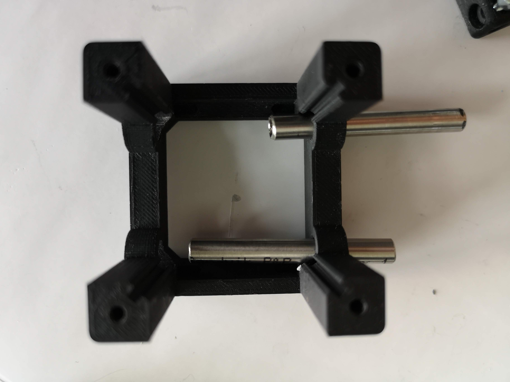

# BASE CUBE
This is the repository for the base-cube design. The design-files can be found in the folder [INVENTOR](./INVENTOR).

A 3D-printing quick-start-guide can be found [here](./STL).
The Base-Cube consists of only 3 components.

1. **The Base** where the ball magnets will be fed in. [More about baseplates.](../CAD/ASSEMBLY_Baseplate_v2)
2. **The Lid** where the Arduino + Electronics finds its place
3. **The Cube** which will be screwed to the Lid. Here all the functions (i.e. Mirrors, LED's etc.) find their place
<p align="center">

</p>

The function which fits into the cube is not necessarily bound to optics. It can be everything!
An example of a mirror or raspi-cam adapter can be found in the In-Incubator Folder.
<p align="center">

</p>


## 3D Printing:

A quick printing tutorial can be found here:
[](https://www.youtube.com/watch?v=JswW8BexnC4&feature=youtu.be)


## Assembly-Tutorial with images (Cube)

1. All parts for this model
<p align="center">

</p>

2. Widen the holes to <~5.9mm with a drillin-tool
<p align="center">

</p>

3. Insert the lens inside the part (don't touch it!)
<p align="center">

</p>

4. Add the fixation ring
<p align="center">

</p>

5. Fix the ring so that the lens is not loose - don't touch the lens!
<p align="center">

</p>

6. Insert rods inside the cube
<p align="center">

</p>

7. Mount the lens on the rods
<p align="center">

</p>

8. Fasten the rods
<p align="center">

</p>

9. Add the lid to the cube and screw it
<p align="center">

</p>

10. Check if it's tilting - if so: Align screws!
<p align="center">

</p>

11. Done!
<p align="center">

</p>


# CAD Design
Please also see the Module developer kit ([MDK](./MDK)) for further design instructions on how you sould adapt to the UC2 cubes.

## OpenSCAD files
Open-Souce also means, that one should be able to modify the files with open-source software. Therefore we provide the basic cube as an ```.scad```-file in the [OPENSCAD](./OPENSCAD)-folder.  The Inventor-files will follow soon!


## Tutorial on how to design an insert in Inventor
This should represent an examplary tutoria on how an insert for any function you like should look like. We are eager to see your results! Feel free to file a pull-request or share it via mail or [@openUC2 on Twitter](twitter.com/openUC2) .


#### 1. Open Autodesk Inventor 2019 (Student) and open the UC2 project
<p align="center">

</p>

#### 2. Create a new Assembly
<p align="center">

</p>

#### 3. Place the UC2 base cube
<p align="center">

</p>

#### 4. Select the file. and pPlace the UC2 base cube
<p align="center">

</p>

#### 5. Ground the cube so that this is the reference for the insert
<p align="center">

</p>

#### 6. Create a new part which should hold a mirror
<p align="center">

</p>

#### 7. Give it a name and save everything
<p align="center">

</p>

#### 8. Select a reference plane for the new part to start a drawing
<p align="center">

</p>

#### 9. Start the drawing
<p align="center">

</p>

#### 10. Start the drawing II
<p align="center">

</p>

#### 11. Select the reference plane for the drawing
<p align="center">

</p>

#### 12. Derive the CAD-Drawings from the base cube
<p align="center">

</p>

#### 13. Have a look at the reference design for the cube insert
We want to design an insert which basically fits inside the cube. Thus, it has to be ```53.8mm``` in diagonal and ```6.28mm```at the edges as shown below:

<p align="center">

</p>

#### 14. Create a rectangular sketch
<p align="center">

</p>

#### 15. Create a rectangular sketch
The dimensions are derived from the CAD-drawing in 13.
<p align="center">

</p>

#### 16. Add some support to make it 'slidable'
This is examplary. You can add any shape you want as long as you can slide it inside the cube and keep dimensions in step 13 in your mind.
<p align="center">

</p>

#### 17. Extrude the sketch
It can be any value so that the part fits inside the cube. It has to be less than ```32mm```though (see step 13.)
<p align="center">

</p>

#### 18. Look up the external devices Parameters (CAD Dimenisons)
Here we review a Thorlabs silver mirror with 1 inch in diameter and 6mm in thickness
<p align="center">

</p>

#### 19. Create a sketch which represents a hole for the Thorlabs mirror
<p align="center">

</p>

#### 20. Extrude the hole so that a mirror fits in there
Add some inprecision boundary (e.g. .1-.2 mm)
<p align="center">

</p>

#### 21. Create a rectangular sketch
<p align="center">

</p>

#### 22. You'Re done! :)
Add any modifications to your design to make it work and share it - please! :-)
[@openUC2 on Twitter](twitter.com/openUC2) and as a github pull request :-)

<p align="center">

</p>

# Electronics
The Arduino can be introduced with hot-glue or some screws.


### Devices features:

* Click-Mount via Ball-Magnets/Screws
* Possible electic connection
* Fill in whatever function you want
* modularized design
* Low-cost production
* Very precise
* Open-Source
* Mount it in all possible directions
