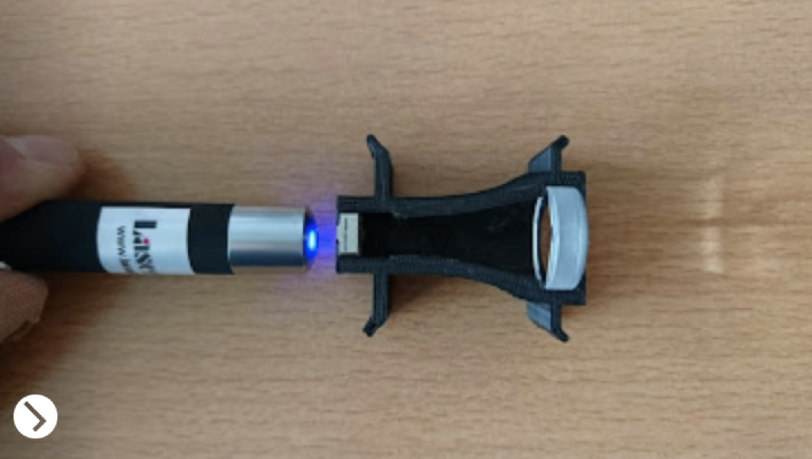
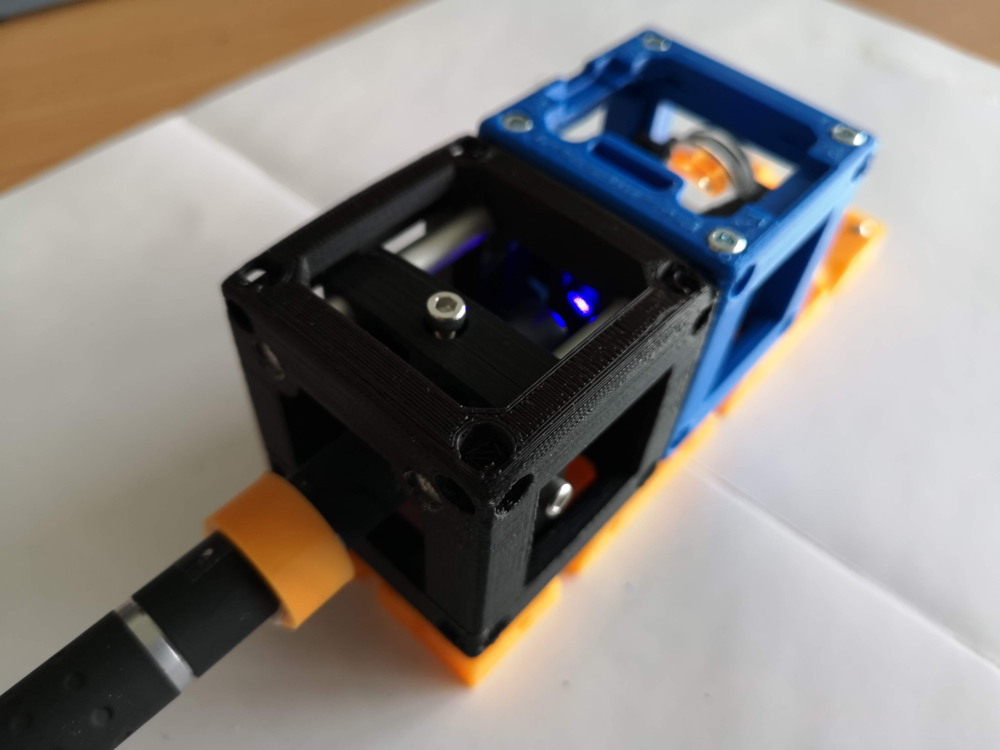
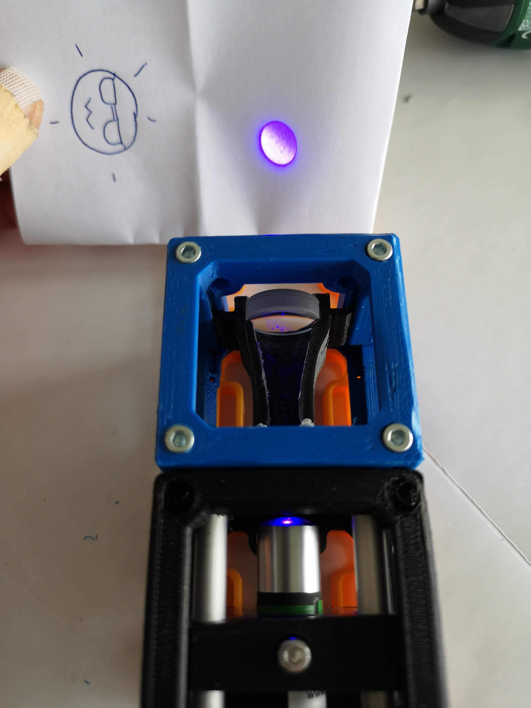

# Integrated Telescope/Beam-Expander Cube
This is the repository for the Integrated Telescope Cube.

To acquire the STL-files use the [UC2-Configurator](https://uc2configurator.netlify.app/). The files themselves are in the [RAW](../RAW/STL) folder. The module can be built using injection-moulded (IM) or 3D-printed (3DP) cubes.

## Purpose
It adapts a very small beam-expander to the UC2 system.

Sometimes one need to increase the diameter of an illuminating beam. This is necessary for the Light-sheet microscopy setup for example. Here we have a laser-pointer which comes with a relatively small beam-diameter of about 2mm. By using a telescope, this can be magnified by a factor of e.g. 8 which results in a beam-dimeter of 16 mm. This is necessary to overfill the aperture of the following illumination objective lens.

In order to achieve this, we first need to focus the beam with a low focal length lens (e.g. cellphone lens, f'=3mm) and then re-collimate the lens with a second lens with a larger focal length e.g. f'=25 mm.

We designed a telescope where an iPhone 5 lens and an ordinary 25mm lens can be inserted in an adapter, which finds its place inside an ordinary UC2-cube as visualized in the image above.

### Properties
* design is derived from the base-cube
* the adapter for the telescope can be adjusted for different magnifications and lenses
* the beam height can be adjusted by sliding the telescope along the axis
* the degree of collimation can be adjusted beforehand  * very cost-efficient beam-expander at a fairly good quality as the cellphone lens is diffraction limited (overall costs ~15€)
* Magnification : m=ftl/fep = 25/3 = 8.33

## Parts
The [Bill of Materials](https://docs.google.com/spreadsheets/d/1U1MndGKRCs0LKE5W8VGreCv9DJbQVQv7O6kgLlB6ZmE/edit?usp=sharing) is always the most up-to-date version!

###  3D printing parts
* No support needed in all designs
* Carefully remove all support structures (if applicable)

The Cube consists of the following components.

#### Default:
* **IM Cube** which houses the insert and adapts it into a UC2 setup.
* **The Telescope** which holds the two lenses  adapts it to the base cube ([20_Cube_Insert_Beamexpander_v3.stl](../RAW/STL))
* **The Lens Adapter** which is suitable for a lens with 12,7 mm diameter listed in the additional parts ([20_Beamexpander_Lens_Adapter.stl](../RAW/STL))

#### Alternatives:
* **3DP Cube** which will be screwed to the Lid. Here all the functions (i.e. Mirrors, LED's etc.) find their place ([10_Cube_1x1_v3.stl](../RAW/STL)) and **3DP Lid** which closes the Cube ([10_Lid_1x1_v3.stl](../RAW/STL)) - find the details in [ASSEMBLY_CUBE_Base](../ASSEMBLY_CUBE_Base)
* **Custom Lens Adapter**  You might need a custom one or none at all, depending on the lens you use.

###  Additional parts
* Check out the [RESOURCES](../../TUTORIALS/RESOURCES) for more information!
* iPhone 5 lens (separated from an iPhone camera spare part), f'=3mm [🢂](https://www.amazon.de/BisLinks%C2%AE-Facing-Kamera-Ersatz-Repair/dp/B01M9K9RVN/ref=sr_1_10?__mk_de_DE=%C3%85M%C3%85%C5%BD%C3%95%C3%91&keywords=lg+g3+camera&qid=1565005739&s=gateway&sr=8-10)
* biconvex/plan-convex lens, f'=20mm, diameter=12,7mm, thickness=4mm (Artikel 2107) [🢂](https://optikbaukasten.de/)

##  Assembly
* Remove the iPhone lens from the camera (a dedicated tutorial can be found in the [UC2 Tutorial-Section](../../TUTORIALS/DOCUMENTS/v0/TUTORIALS_SETUP/TUT_Assembly_Cellphonelens.pdf) (page 6).
* Insert the lenses inside the telescope adapter (orientation of the iPhone has to be the way, that the small aperture - hole - has to face the other bigger lens as indicated by the photo)
* Put the telescope inside the cube
* Close the cube accordingly (IM/3DP)
* Done!

### Tutorial with images
Don't insert batteries in the laser yet!!

:grey_exclamation: This tutorial shows a UC2_v2 cube but the assembly of the insert is still the same. For assembly of the cube (IM/3DP) check the [ASSEMBLY_CUBE_Base](../ASSEMBLY_CUBE_Base).

1. All parts to build the beam-expander:

2. Put both lenses into the beam-expander insert. Use the Lens adapter if necessary.

3. Put the pre-assembled (and optically aligned) insert in the base-cube and add the screws:

## Alignment
:grey_exclamation: This tutorial shows a UC2_v0 cube and insert but the alignment procedure of the telescpe is still the same.

* Take the laser-pointer
* Point the laser towards the iPhone Lens
* Adjust the distance between the two lenses, so that the beam is collimated (=the beam diameter right after the telescope should not change over any distance)

#### Finetune the lens-distance (collimate the beam)

1. Add the centered laser to the grid like so:

2. Turn on the laser:

3. Optional: Align the laser (center with the screws)

4. Check the beam on a white piece of paper

5. Mark the position and diameter of the beam on the white piece of paper

6. Compare distance and diameter of laser spot at a distance far away

7. Adjust the position of the cellphone lens in the rail so that both spots have the same position and diameter (iterate - start at step 5 - until you're satisfied)

## Safety
Attention, don't cut your fingers while removing the lens from the iPhone sensor!

Never (!) look into the laser pointer! It will damage your eye immediately!

* ATTENTION: NEVER WATCH DIRECTLY INTO THE LASER! EYE WILL BE DAMAGED DIRECTLY
* NEVER SWITCH ON THE LASER WITHOUT INTEDED USE
* BEAM HAS TO GO AWAY FROM ONESELF - ALWAYS!
