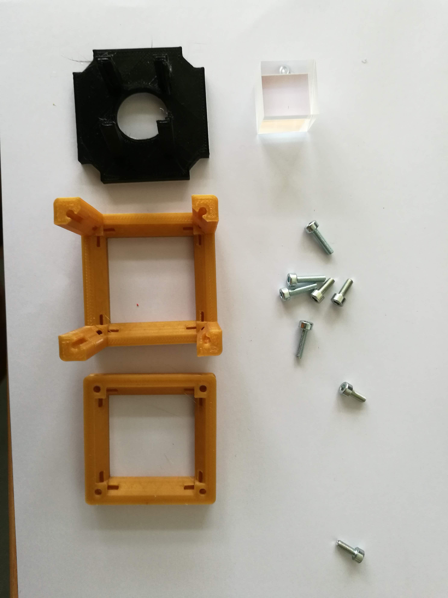
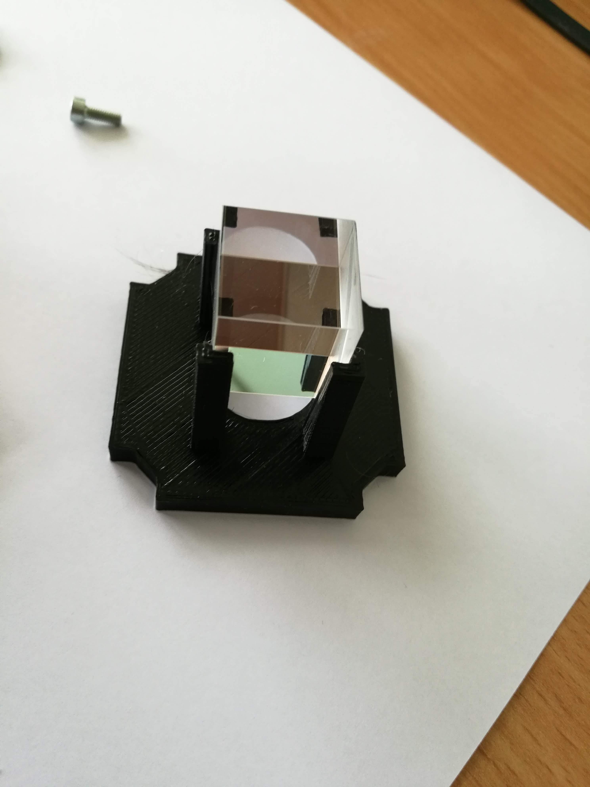
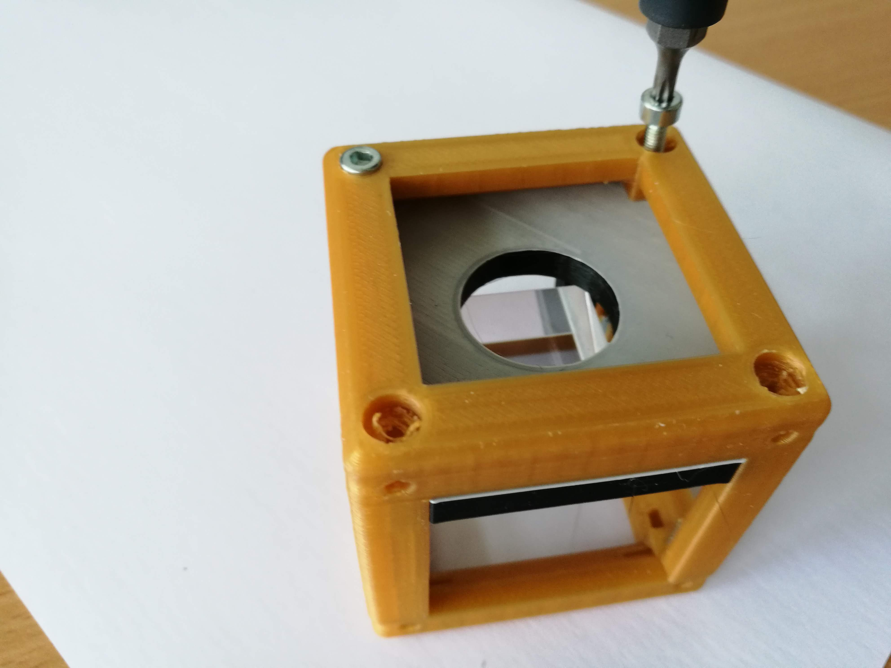
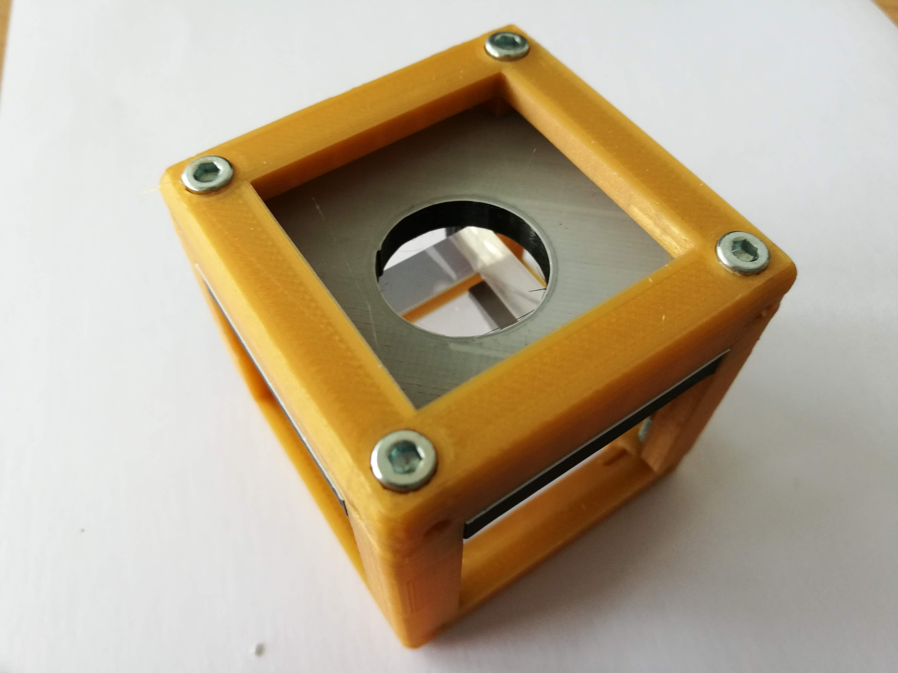

# Beam splitter Cube
This is the repository for the Beam splitter Cube.

To acquire the STL-files use the [UC2-Configurator](). The files themselves are in the [RAW](../RAW/STL) folder. The module can be built using injection-moulded (IM) or 3D-printed (3DP) cubes.

## Purpose
It adapts a beam splitter cube to the UC2 system.

### Properties
* design is derived from the base-cube

## Parts
The [Bill of Materials](https://docs.google.com/spreadsheets/d/1U1MndGKRCs0LKE5W8VGreCv9DJbQVQv7O6kgLlB6ZmE/edit?usp=sharing) is always the most up-to-date version!

###  3D printing parts
* No support needed in all designs
* Carefully remove all support structures (if applicable)

The Cube consists of the following components.

#### Default:
* **IM Cube** which houses the insert and adapts it into a UC2 setup.
* **The Beam splitter Insert** which holds a glass beam splitter cube and adapts it to the base cube ([20_Cube_Insert_Beamsplitter_v3.stl](../RAW/STL))

#### Alternatives:
* **3DP Cube** which will be screwed to the Lid. Here all the functions (i.e. Mirrors, LED's etc.) find their place ([10_Cube_1x1_v3.stl](../RAW/STL)) and **3DP Lid** which closes the Cube ([10_Lid_1x1_v3.stl](../RAW/STL)) - find the details in [ASSEMBLY_CUBE_Base](../ASSEMBLY_CUBE_Base)

###  Additional parts
* Check out the [RESOURCES](../../TUTORIALS/RESOURCES) for more information!
* 1x Beam splitter cube (20×20 mm²) (Artikel 2137) [🢂](https://optikbaukasten.de/)

##  Assembly
* Remove any support and clean the part
* Insert the glass beam splitter inside its holder
* Slide the beam splitter holder into the Cube Body
* Close the cube accordingly (IM/3DP)
* Done!

### Tutorial with images
:grey_exclamation: This tutorial shows a UC2_v2 cube but the assembly of the insert is still the same. For assembly of the cube (IM/3DP) check the [ASSEMBLY_CUBE_Base](../ASSEMBLY_CUBE_Base).

1. All parts for this model

2. Mount the glass block

3. Put the insert into the cube

4. Add the lid and the screws

5. Screw it!

6. Done!

## Safety
Don't touch the smooth glass surfaces, only the sanded ones!
