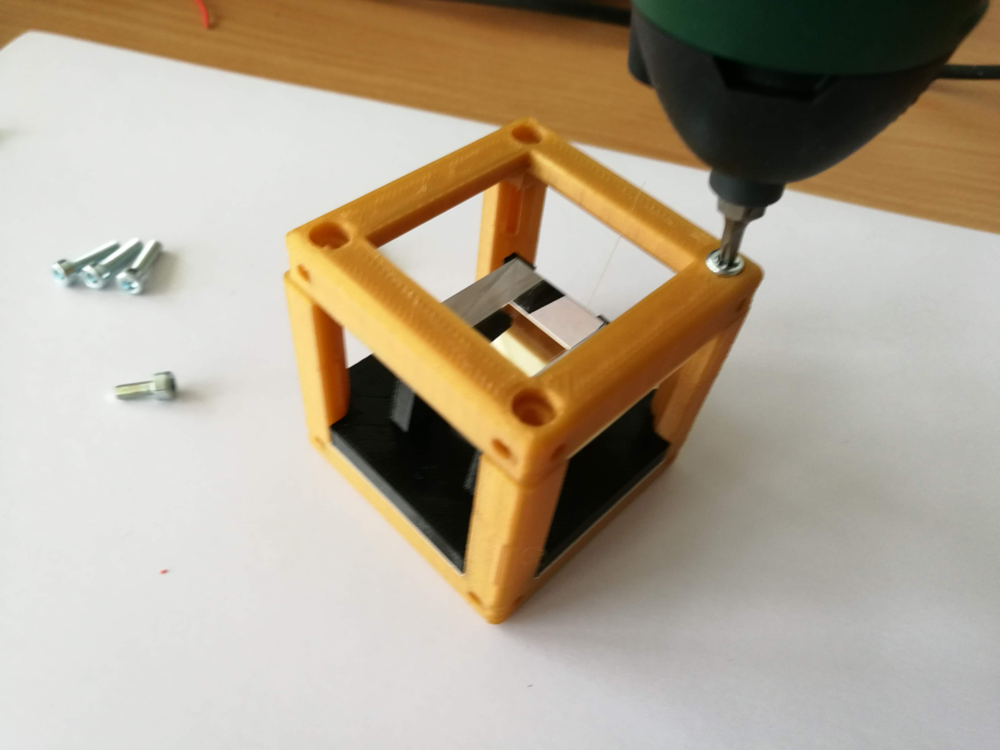

# Beamsplitter Cube
This is the repository for the Beamsplitter Cube.

The stl-files can be found in the folder [STL](./STL).

### Purpose
It adapts a beamsplitter cube to the UC2 system.

## Properties
* design is derived from the base-cube

## Parts

### 3D printing parts
The Part consists of the following components.

* **The Lid** where the Arduino + Electronics finds its place ([LID](./STL/Assembly_Cube_Beamsplitter_10_Lid_1x1_v2.stl))
* **The Cube** which will be screwed to the Lid. Here all the functions (i.e. Mirrors, LED's etc.) find their place ([BASE](./STL/Assembly_Cube_Beamsplitter_10_Cube_1x1_v2.stl))
* **The Beamsplitter Insert** which holds a glass beamsplitter cube and adapts it to the base cube ([Beamsplitter](./STL/Assembly_Cube_Beamsplitter_20_Cube_Insert_Beamsplitter.stl))

### Additional parts
* 4x DIN912 M3*12 screws (non stainless steel)
* 1x Beamsplitter cube (20×20 mm²)

## Remarks and Tips
### 3D Printing:
* No support required in all designs
* Carefully remove all support structures (if applicable)

## Assembly
* Remove any support and clean the part
* Insert the glass beamsplitter inside its holder
* Slide the beamsplitter holder into the Cube Body
* Add the lid and fix it using a set of M3 screws
* Done!

### Tutorial with images
Don't insert batteries in the laser yet!!

1. All parts for this model

2. Mount the glass block

3. Put the insert into the cube

4. Add the lid and the screws

5. Screw it!

6. Done!

## Safety
Don't touch the smooth glass surfaces, only the opaque ones!

Never (!) look into the laser pointer! It will damage your eye immediately!

* ATTENTION: NEVER WATCH DIRECTLY INTO THE LASER! EYE WILL BE DAMAGED DIRECTLY
* NEVER SWITCH ON THE LASER WITHOUT INTEDED USE
* BEAM HAS TO GO AWAY FROM ONESELF - ALWAYS!
