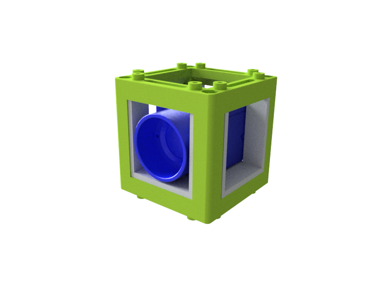
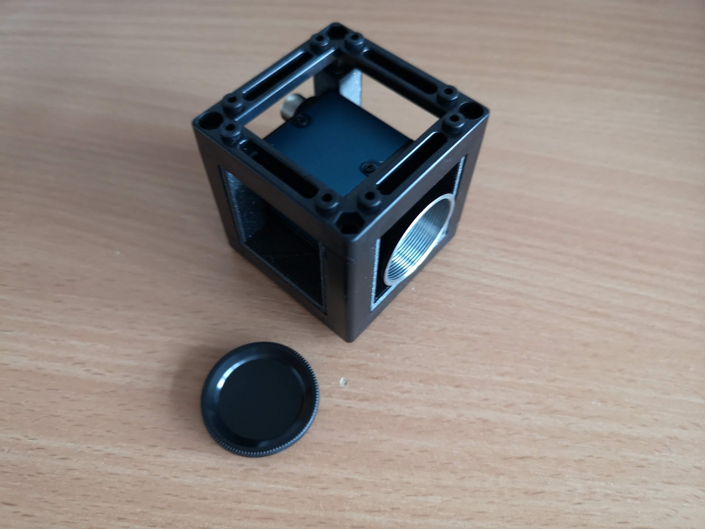

# Camera Cube (Allied Vision Alvium)
This is the repository for the Camera Cube which hosts an embedded vision camera from Daheng Vision.

To acquire the STL-files use the [UC2-Configurator](https://uc2configurator.netlify.app/) (***Please look for Allied Vision camera - It is the same***). The files themselves are in the [RAW](../RAW/STL) folder. The module can be built using injection-moulded (IM) or 3D-printed (3DP) cubes.

## Purpose
It adapts an Daheng Vision Camera to the UC2 system.

The sensor is put into an adapter which holds the camera in the center of the cube. The height can be varied by sliding the adapter along the slides.

### Properties
* design is derived from the base-cube
* camera adapter can be adjusted to individual needs

## Parts
The [Bill of Materials](https://docs.google.com/spreadsheets/d/1U1MndGKRCs0LKE5W8VGreCv9DJbQVQv7O6kgLlB6ZmE/edit?usp=sharing) is always the most up-to-date version!

For EU users, please have a look at the [https://www.get-cameras.com/](https://www.get-cameras.com/) website. 

We make use of this camera:
[Daheng, Sony IMX174, MER-230-168U3C-L](https://www.machinevisionkamera.de/Industriekamera-USB3-Vision-Sony-IMX174-MER-230-168U3C-L)

###  3D printing parts
* No support needed in all designs
* Carefully remove all support structures (if applicable)

The Cube consists of the following components.

#### Default:
* **IM Cube** which houses the insert and adapts it into a UC2 setup.
* **The Camera Insert** which holds the camera and makes it adaptable to the base-cube ([20_Cube_insert_AlliedVision_Alvium_v3.stl](../RAW/STL))

#### Alternatives:
* **3DP Cube** which will be screwed to the Lid. Here all the functions (i.e. Mirrors, LED's etc.) find their place ([10_Cube_1x1_v3.stl](../RAW/STL)) and **3DP Lid** which closes the Cube ([10_Lid_1x1_v3.stl](../RAW/STL)) - find the details in [ASSEMBLY_CUBE_Base](../ASSEMBLY_CUBE_Base)
* **The Adjustable Camera Insert** which holds the camera and makes it adaptable to the base-cube and makes it possible to slide it through the cube and fix its position with screws ([20_Cube_insert_AlliedVision_Alvium_adjustable.stl](../RAW/STL))

###  Additional parts
* Check out the [RESOURCES](../../TUTORIALS/RESOURCES) for more information!
* 3× DIN912 M3×12 screws (galvanized steel) [🢂](https://eshop.wuerth.de/Zylinderschraube-mit-Innensechskant-SHR-ZYL-ISO4762-88-IS25-A2K-M3X12/00843%20%2012.sku/de/DE/EUR/)
* Allied Vision Camera: CSI ALVIUM 1800 C-158

##  Assembly
* Mount the camera to the insert using three M3 screws
* Take the mounted camera adapter inlet and slide it into the base-cube
* Close the cube accordingly (IM/3DP)
* Done!

Once it's done it looks like this:

# Software

## ImSwitch

We incorporated the Python API into `ImSwitch`. Please find our fork [here](https://github.com/beniroquai/ImSwitch/blob/master/README.md#option-c-install-from-github-uc2-version)

## OctoPi

A nice solution that also runs on the Jetson Nano can be found in the `OctoPi` microscopy software by the Prakash Lab developed by Hongquan Li [here](https://github.com/hongquanli/octopi-research/blob/master/software/drivers%20and%20libraries/).
