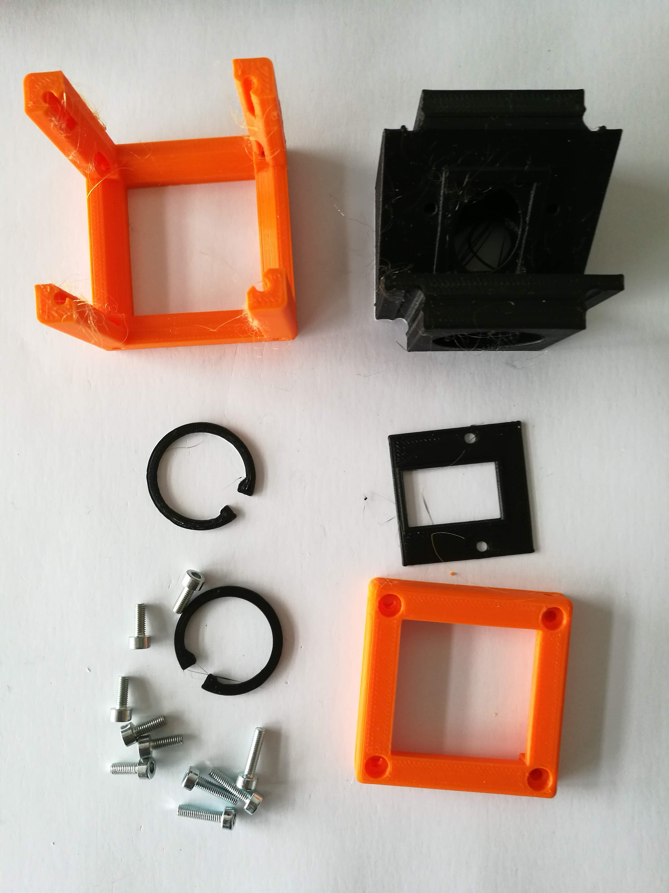
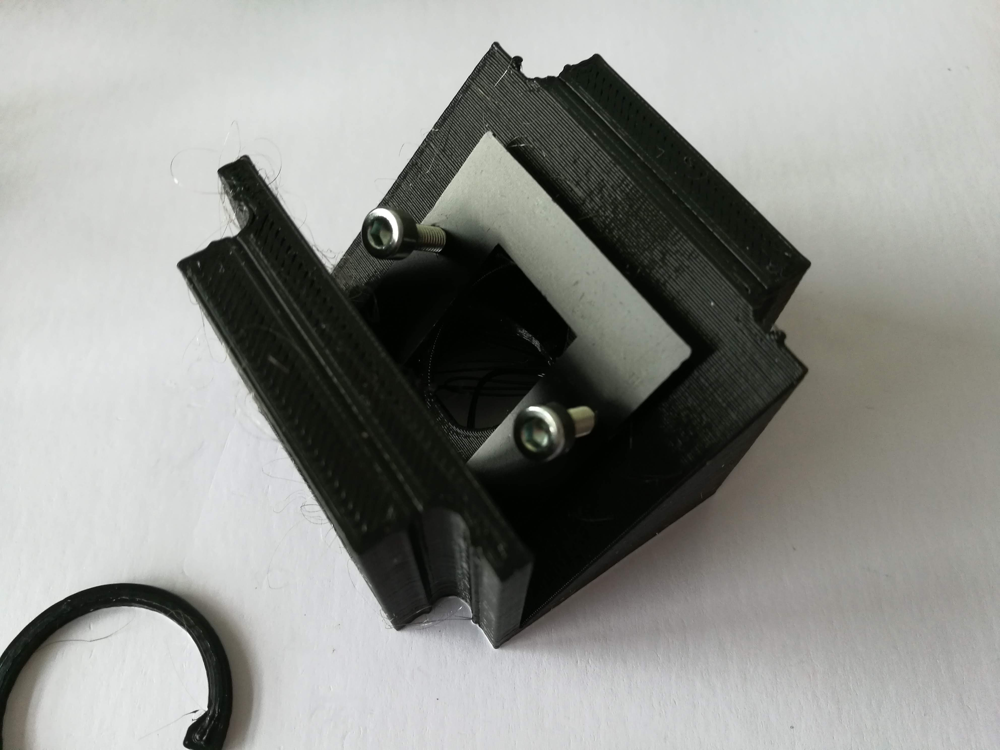
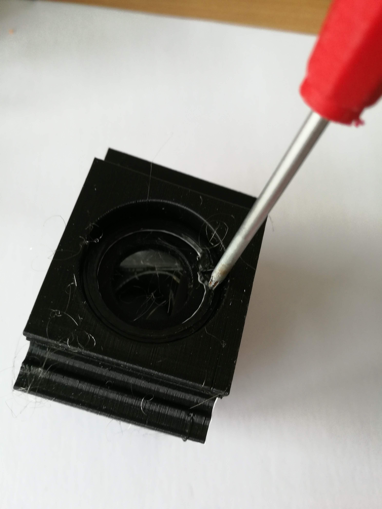
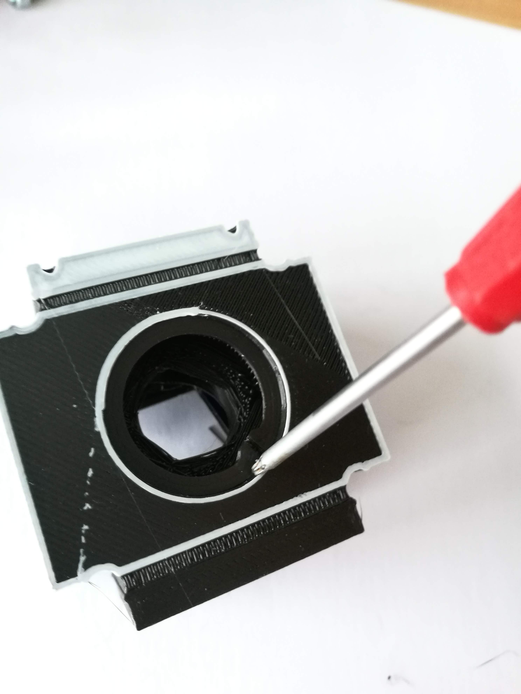
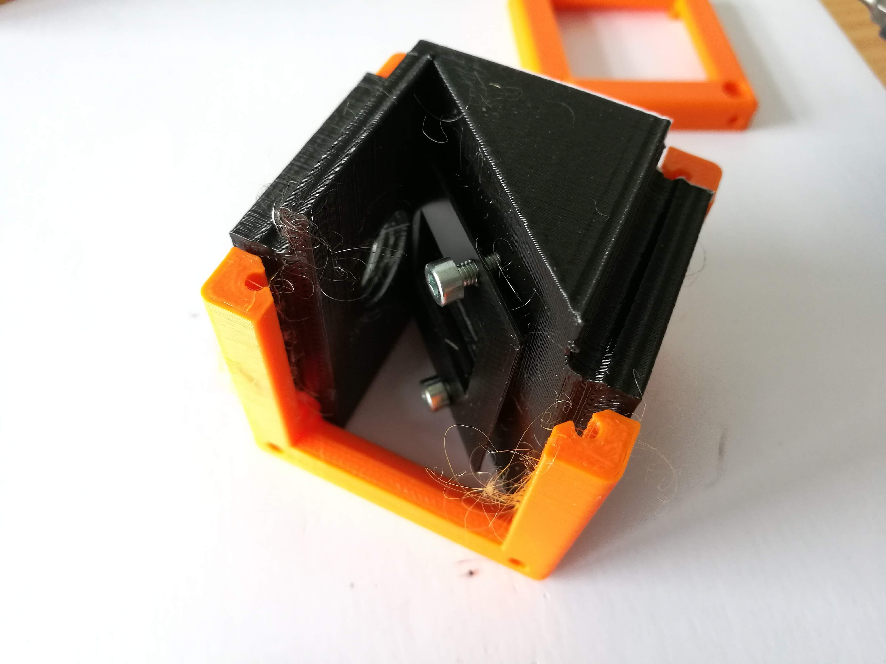

# Dichroic Beamsplitter Cube
This is the repository for the Dichroic Beamsplitter Cube.

The stl-files can be found in the folder [STL](./STL).

### Purpose
This is meant to be used for fluorescence microscopic imaging setups. The cube can hold an emission and excitation filter as well as a dichroic mirror. The idea is to low-pass filter light e.g. coming from an LED which gets reflected onto the sample plane by a bandpass dichroic mirror. The emitted fluorescent signal is shifted towards the lower frequencies and gets filtered by the emission filter.

## Properties
* design is derived from the base-cube

## Parts

### 3D printing parts
The Part consists of the following components.

* **The Lid** where the Arduino + Electronics finds its place
* **The Cube** which will be screwed to the Lid. Here all the functions (i.e. Mirrors, LED's etc.) find their place
* **The Dichroic Beamsplitter Insert** which holds the three different filters
* 2x **The Retain Rings** which fixes the emission and excitation filters#
* 1x **The Retain Plate** which holds the dichroic filter

### Additional parts
* 10x DIN912 M3*12 screws (non stainless steel)
* 1x Dichroic Mirror (16mmx25mm, rectangular, e.g. COMAR optics)
* 1x Excitation filter (25mm Diameter, e.g. COMAR optics)
* 1x Emission filter (25mm Diameter, e.g. COMAR optics)

## Remarks and Tips
### 3D Printing:
* No support required in all designs
* Carefully remove all support structures (if applicable)

## Assembly
* Remove any support and clean the part
* Insert the dichroic filter inside its place
* Mount the Retain Plate with 2x M3 Screws
* Insert the excitation filter inside its place
* Mount the Retain Ring so that the filter is fixed
* Insert the emission filter inside its place
* Mount the Retain Ring so that the filter is fixed
* Slide the dichroic beamsplitter holder into the Cube Body
* Add the lid and fix it using a set of M3 screws
* Done!

### Tutorial with images
Don't insert batteries in the laser yet!!

1. All parts for this model

2. Mount the dichroic + retain plate

3. Add the excitation/emission filter + retain rings

4. Fix everything

5. Place the Insert into the Cube and add all screws 

6. Done!

## Safety
Don't touch the smooth glass surfaces, only the opaque ones!

Never (!) look into the laser pointer! It will damage your eye immediately!

* ATTENTION: NEVER WATCH DIRECTLY INTO THE LASER! EYE WILL BE DAMAGED DIRECTLY
* NEVER SWITCH ON THE LASER WITHOUT INTEDED USE
* BEAM HAS TO GO AWAY FROM ONESELF - ALWAYS!
