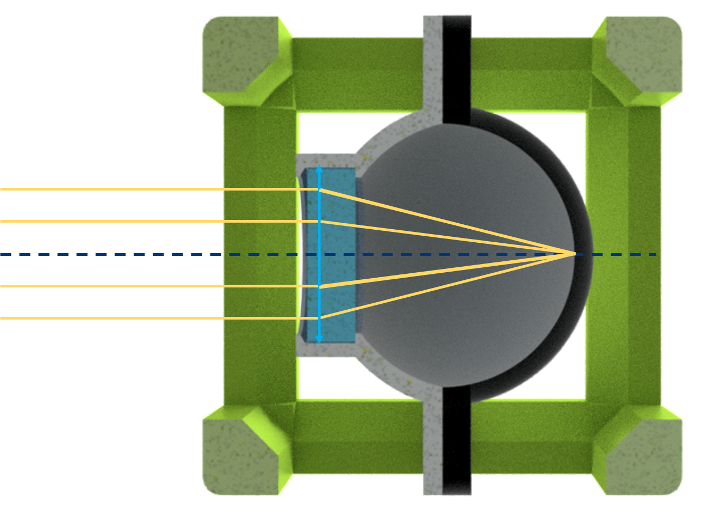
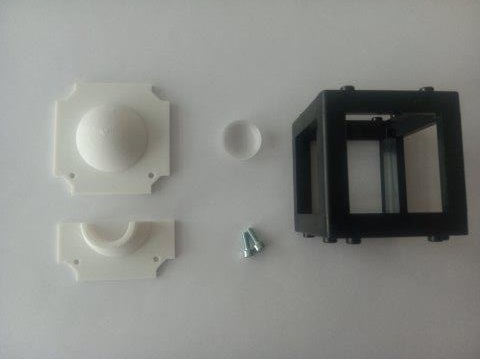
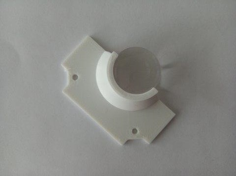
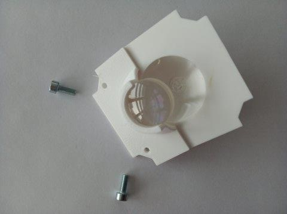
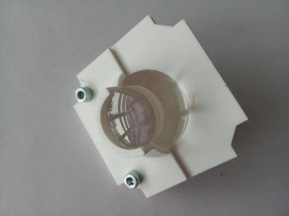
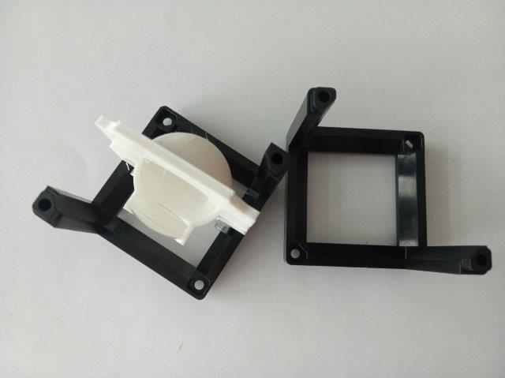
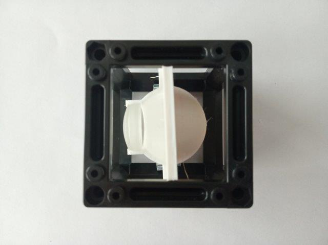

# Eyeball Cube
This is the repository for the Eyeball Cube.

To acquire the STL-files use the [UC2-Configurator](https://uc2configurator.netlify.app/). The files themselves are in the [RAW](../RAW/STL) folder. The module can be built using injection-moulded (IM) or 3D-printed (3DP) cubes.

### Purpose
It can serve as an aid for demonstrations and experiments done with the [SimpleBOX](../../TheBOX/SimpleBOX) or [CourseBOX](../../TheBOX/CourseBOX).

The lens holder holds a lens in a fixed distance from the back of the "eye". This distance equals the focal length of this lens. Therefore this simplified "eye" just focusses any image from infinity on the back side. It works best when printed using white material.

You can nicely see the magnification effect of a telescope when you "look" out of the window using the Eyeball cube alone and then placing in [behind a telescope](../../APPLICATIONS/APP_SIMPLE-Telescope).

## Properties
* design is derived from the base-cube
* in principle, any short *f'* can be used, if the distance is adjusted for it. The design is optimised for the lens listed in Additional parts

## Parts
The [Bill of Materials](https://docs.google.com/spreadsheets/d/1U1MndGKRCs0LKE5W8VGreCv9DJbQVQv7O6kgLlB6ZmE/edit?usp=sharing) is always the most up-to-date version!

###  3D printing parts
* No support needed in all designs
* Carefully remove all support structures (if applicable)

The Cube consists of the following components.

#### Default:
* **IM Cube** which houses the insert and adapts it into a UC2 setup.
* **The Eye Insert** which serves as the back of the eye - it works bes when printed using white material ([INSERT EYE](./STL/Assembly_Cube_Eyeball_v2_20_Cube_Insert_Eye_1.stl))
* **The Lens Insert** which holds the lens ([INSERT LENS](./STL/Assembly_Cube_Eyeball_v2_20_Cube_Insert_Eye_Lens_2.stl)) and adapts it to the base cube

#### Alternatives:
* **3DP Cube** which will be screwed to the Lid. Here all the functions (i.e. Mirrors, LED's etc.) find their place ([10_Cube_1x1_v3.stl](../RAW/STL)) and **3DP Lid** which closes the Cube ([10_Lid_1x1_v3.stl](../RAW/STL)) - find the details in [ASSEMBLY_CUBE_Base](../ASSEMBLY_CUBE_Base)

###  Additional parts
* Check out the [RESOURCES](../../TUTORIALS/RESOURCES) for more information!
* 1× Lens, *f' = 26,5 mm*, *d = 18 mm*, Artikel 551.OA.51 [🢂](https://astromedia.ch/produkt/achromat-265mm-o-180mm/)
* 2× M3×8 screws [🢂](https://eshop.wuerth.de/Zylinderschraube-mit-Innensechskant-SHR-ZYL-ISO4762-88-IS25-A2K-M3X8/00843%20%208.sku/de/DE/EUR/)

##  Assembly
* Add the lens to the Lens Insert
* Attach the two parts of the insert together using two M3×8 screws
* Place the inserts inside the Cube
* Close the cube accordingly (IM/3DP)
* Done!

### Tutorial with images
1. All parts for this model

2. Insert the lens into its position in the holder

3. Attach the two parts of the insert together using two M3×8 screws.

3. Place the insert inside the cube and close the cube accordingly - done!

