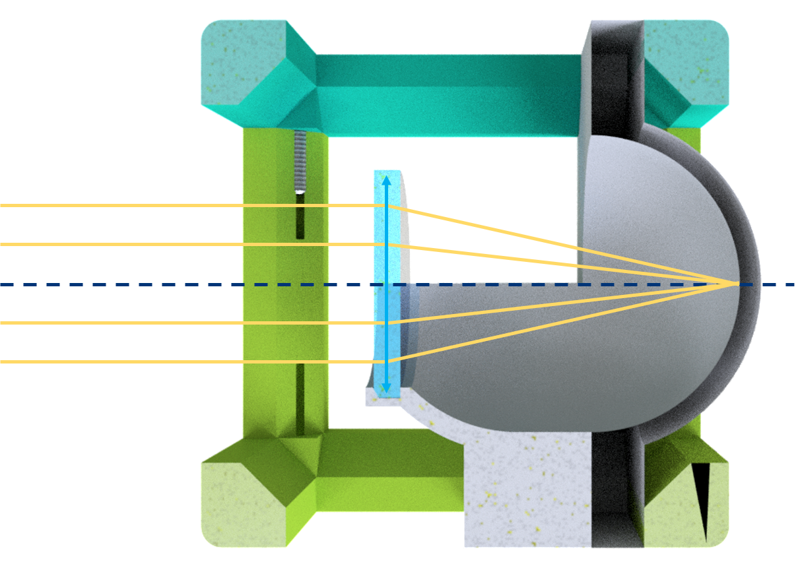

# Eyeball Cube
This is the repository for the Eyeball Cube.

The stl-files can be found in the folder [STL](./STL).

### Purpose
It can serve as an aid for demonstrations and experiments done with the [SimpleBOX](../../TheBOX/SimpleBOX) or [CourseBOX](../../TheBOX/CourseBOX).

The lens holder holds a lens in a fixed distance from the back of the "eye". This distance equals the focal length of this lens. Therefore this simplified "eye" just focusses any image from infinity on the back side. It works best when printed using white material.

You can nicely see the magnification effect of a telescope when you "look" out of the window using the Eyeball cube alone and then placing in [behind a telescope](../../APPLICATIONS/APP_SIMPLE-Telescope).

## Properties
* design is derived from the base-cube
* in principle, any short *f'* can be used, if the distance is adjusted for it

## Parts

###  3D printing parts
* No support needed in all designs
* Carefully remove all support structures (if applicable)

The Cube consists of the following components.

* **The Lid** where the Arduino + Electronics finds its place ([LID](./STL/10_Lid_1x1_v2.stl))
* **The Cube** which will be screwed to the Lid. Here all the functions (i.e. Mirrors, LED's etc.) find their place ([BASE](./STL/10_Cube_1x1_v2.stl))
* **The Eye Insert** which serves as the back of the eye - it works bes when printed using white material ([INSERT EYE](./STL/Assembly_Cube_Eyeball_v2_20_Cube_Insert_Eye_1.stl))
* **The Lens Insert** which holds the lens ([INSERT LENS](./STL/Assembly_Cube_Eyeball_v2_20_Cube_Insert_Eye_Lens_2.stl)) and adapts it to the base cube

###  Additional parts
* Check out the [RESOURCES](../../TUTORIALS/RESOURCES) for more information!
* 8× DIN912 M3×12 screws (galvanized steel) [🢂](https://eshop.wuerth.de/Zylinderschraube-mit-Innensechskant-SHR-ZYL-ISO4762-88-IS25-A2K-M3X12/00843%20%2012.sku/de/DE/EUR/)
* 1× Lens, *f' = 25 mm**

##  Assembly
* Add the lens to the Lens Insert
* Glue the Lens insert to the back of the eye
* Place the inserts inside the Cube
* Close the lid using the screws
* Done!
