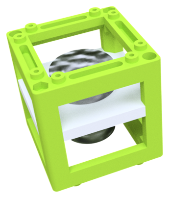
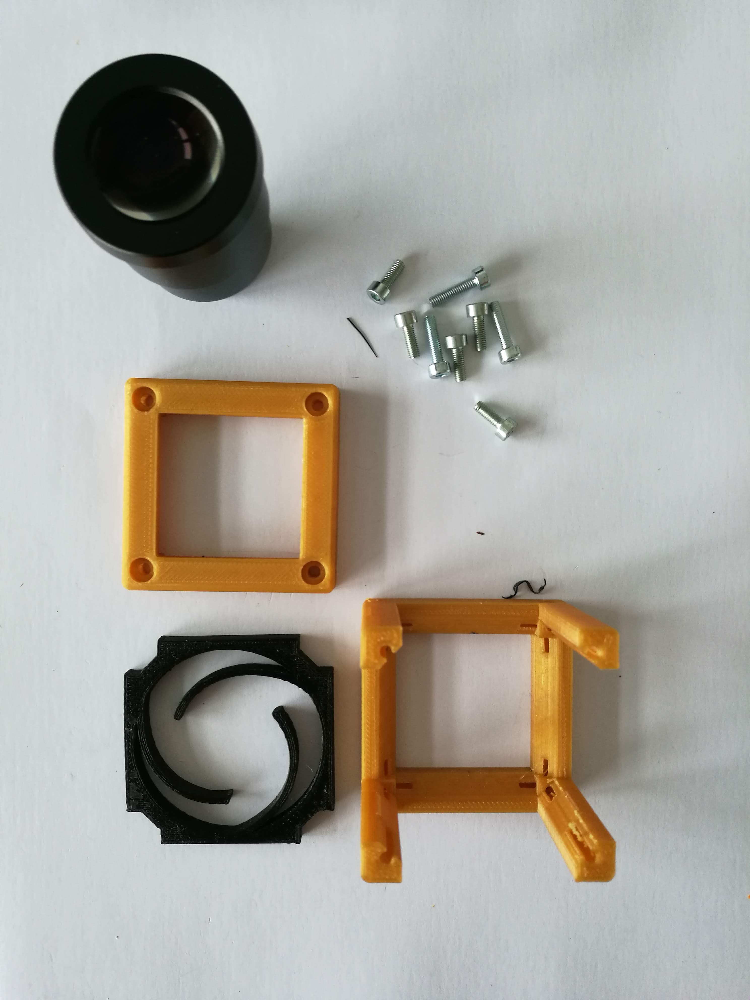

# Eyepiece Cube with Smartphone Holder
This is the repository for the Eyepiece Cube and the Smartphone Holder.

To acquire the STL-files use the [UC2-Configurator](). The files themselves are in the [RAW](../RAW/STL) folder. The module can be built using injection-moulded (IM) or 3D-printed (3DP) cubes.

## Purpose
It adapts an eyepiece to the UC2 cube. Further, a plate for holding a smartphone can be added.

### Properties
* design is derived from the base-cube

## Parts
The [Bill of Materials](https://docs.google.com/spreadsheets/d/1U1MndGKRCs0LKE5W8VGreCv9DJbQVQv7O6kgLlB6ZmE/edit?usp=sharing) is always the most up-to-date version!

###  3D printing parts
* No support needed in all designs
* Carefully remove all support structures (if applicable)

The Cube consists of the following components.

#### Default:
* **IM Cube** which houses the insert and adapts it into a UC2 setup.
* **The Eyepiece holder** which connects the eyepiece to the Cube. The default one fits the eyepiece listed in Additional parts ([20_Insert_Eyepiece_v3.stl](../RAW/STL))
* **The Smartphone holder**, on which the phone will be placed ([30_Smartphone_Holder_v3.stl](../RAW/STL))

#### Alternatives:
* **3DP Cube** which will be screwed to the Lid. Here all the functions (i.e. Mirrors, LED's etc.) find their place ([10_Cube_1x1_v3.stl](../RAW/STL)) and **3DP Lid** which closes the Cube ([10_Lid_1x1_v3.stl](../RAW/STL)) - find the details in [ASSEMBLY_CUBE_Base](../ASSEMBLY_CUBE_Base)
* **Custom Eyepiece holder** which connects the eyepiece to the Cube. For any other eyepiece, generate a holder on [Thingiverse](https://www.thingiverse.com/thing:4712041)
* **Generic Eyepiece holder** which connects the eyepiece to the Cube. If you have multiple eyepiece you wish to switch between or if you are unsure which to use, you can use the generic holder ([UC2_v3_20_Cube_Insert_Holder-okular+flashlight_v3.stl](../RAW/STL))

###  Additional parts
* Check out the [RESOURCES](../../TUTORIALS/RESOURCES) for more information!
* 1× Eyepiece (20×) [🢂](https://de.aliexpress.com/item/32965050204.html?spm=a2g0o.productlist.0.0.7aa657eeefLUfu&algo_pvid=cd60fca0-3fa5-4191-9ce9-303815e2afa7&algo_expid=cd60fca0-3fa5-4191-9ce9-303815e2afa7-1&btsid=76036b58-6717-4d1f-a4a0-c3d4bacd0450&ws_ab_test=searchweb0_0,searchweb201602_2,searchweb201603_52)

##  Assembly (Attention: Parts have been updated)
* Insert the eyepiece into the Insert
* Place the insert inside the cube
* Close the cube accordingly (IM/3DP)
* Attach the smartphone holder
* Done!

### Tutorial with images
    This tutorial needs an update!

1. All parts for this model

2. Add the eyepiece to the spiral holder which auto-centers the optics inside the cube. Put the Insert into the cube and add all screws before fixing them.

3. Attach the smartphone holder using four M3×8 screws

## Safety
Don't touch the surfaces of the lenses!
