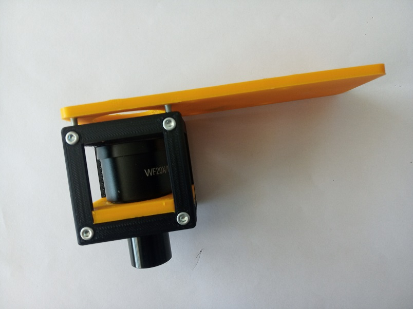

# Eyepiece Cube with Smartphone Holder
This is the repository for the Eyepiece Cube and the Smartphone Holder.

The stl-files can be found in the folder [STL](./STL).

## Purpose
It adapts an eyepiece to the UC2 cube. Further, a plate for holding a smartphone can be added.

### Properties
* design is derived from the base-cube

## Parts

###  3D printing parts
* No support needed in all designs
* Carefully remove all support structures (if applicable)

The Cube consists of the following components.

* **The Lid** where the Arduino + Electronics finds its place ([LID](./STL/10_Lid_1x1_v2.stl))
* **The Cube** which will be screwed to the Lid. Here all the functions (i.e. Mirrors, LED's etc.) find their place ([BASE](./STL/10_Cube_1x1_v2.stl))
* **The Eyepiece holder** which connects the objective to the Cube ([INSERT](./STL/20_Cube_Insert_Holder-okular_v2.stl))
* **The Smartphone holder**, on which the phone will be placed ([SMARTPHONE](./STL/30_Smartphone_Holder.stl))

###  Additional parts
* Check out the [RESOURCES](../../TUTORIALS/RESOURCES) for more information!
* 8× DIN912 M3×12 screws (galvanized steel) [🢂](https://eshop.wuerth.de/Zylinderschraube-mit-Innensechskant-SHR-ZYL-ISO4762-88-IS25-A2K-M3X12/00843%20%2012.sku/de/DE/EUR/)
* 4× DIN912 M3×8 screws
* 1× Eyepiece [🢂](https://de.aliexpress.com/item/32965050204.html?spm=a2g0o.productlist.0.0.7aa657eeefLUfu&algo_pvid=cd60fca0-3fa5-4191-9ce9-303815e2afa7&algo_expid=cd60fca0-3fa5-4191-9ce9-303815e2afa7-1&btsid=76036b58-6717-4d1f-a4a0-c3d4bacd0450&ws_ab_test=searchweb0_0,searchweb201602_2,searchweb201603_52)

##  Assembly (Attention: Parts have been updated)
* Remove any support and clean the part
* Insert the eyepiece into the Insert
* Place the insert inside the cube
* Close the lid using four M3×12 screws
* Attach the smartphone holder using four M3×8 screws
* Done!

### Tutorial with images
Don't insert batteries in the laser yet!!

1. All parts for this model

1. Add the eyepiece to the spiral holder which auto-centers the optics inside the cube. Put the Insert into the cube and add all screws before fixing them.

1. Attach the smartphone holder using four M3×8 screws

## Safety
Don't touch the surfaces of the lenses!
