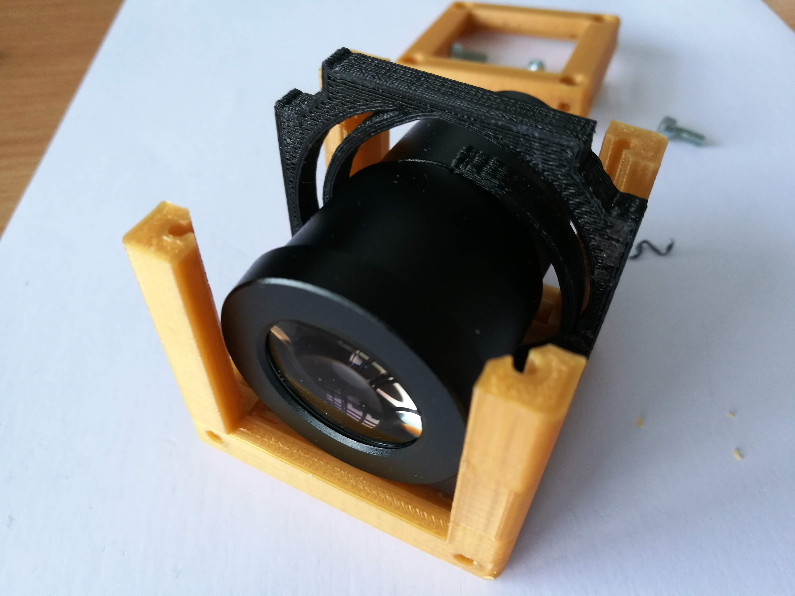

# Eyepiece Cube
This is the repository for the Eyepiece Cube.

The stl-files can be found in the folder [STL](./STL).

### Purpose
It adapts an eyepiece to the UC2 cube. A half-cube is used here, because then it works well with the [Cellphonemount](./CAD/ASSEMBLY_CUBE_Cellphonemount). Using a standard cube is also possible.

## Properties
* design is derived from the base-cube

## Parts

### 3D printing parts
The Part consists of the following components.

* **The Lid** where the Arduino + Electronics finds its place
* **The Half-Cube** which will be screwed to the Lid. The adapter plate will attach to it. Alternatively, use the standard 1×1 cube
* **The Eyepiece Adapterplate** which connects the objective to the Cube

### Additional parts
* 4× DIN912 M3*12 screws (non stainless steel)
* 4× DIN912 M3*8 screws (non stainless steel)
* 1× Eyepiece

## Remarks and Tips
### 3D Printing:
* No support required in all designs
* Carefully remove all support structures (if applicable)

## Assembly (Attention: Parts have been updated)
* Remove any support and clean the part
* Insert M3 screws (8 mm) into the Half-cube
* Add the lid and fix it using a set of M3 screws (12 mm)
* Press magnets into the holes of the Adapterplate
* Insert the eyepiece into the Adapterplate
* Attach the eyepiece to the half-cube
* Done!

### Tutorial with images
Don't insert batteries in the laser yet!!

1. All parts for this model

2. Add the eyepiece to the spiral holder which auto-centers the optics inside the cube. Put the Insert into the cube and add all screws before fixing them.

## Safety
If you are working with lasers! Never (!) look into the laser pointer! It will damage your eye immediately!
