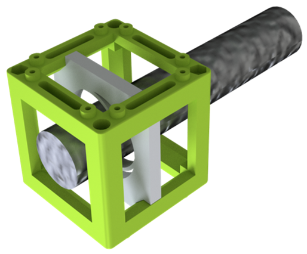

# Flashlight Cube
This is the repository for the Generic Lens Holder Cube.

To acquire the STL-files use the [UC2-Configurator](https://uc2configurator.netlify.app/). The files themselves are in the [RAW](../RAW/STL) folder. The module can be built using injection-moulded (IM) or 3D-printed (3DP) cubes.

## Purpose
RMS Objective holder: It adapts a objective with a RMS threading to the UC2 system.

### Properties
* design is derived from the base-cube
* the adapter can hold a flashlight on the optical axis, so you have your hands free for the experiments

## Parts
The [Bill of Materials](https://docs.google.com/spreadsheets/d/1U1MndGKRCs0LKE5W8VGreCv9DJbQVQv7O6kgLlB6ZmE/edit?usp=sharing) is always the most up-to-date version!

###  3D printing parts
* No support needed in all designs
* Carefully remove all support structures (if applicable)

The Cube consists of the following components.

#### Default:
* **IM Cube** which houses the insert and adapts it into a UC2 setup.
* **The Flashlight Holder** which holds an objective or a lens with varying diameter and adapts it to the base cube. It is not optimal for a bare lens. ([20_Cube_Insert_Holder-okular+flashlight_v3.stl](../RAW/STL))

#### Alternatives:
* **3DP Cube** which will be screwed to the Lid. Here all the functions (i.e. Mirrors, LED's etc.) find their place ([10_Cube_1x1_v3.stl](../RAW/STL)) and **3DP Lid** which closes the Cube ([10_Lid_1x1_v3.stl](../RAW/STL)) - find the details in [ASSEMBLY_CUBE_Base](../ASSEMBLY_CUBE_Base)

###  Additional parts
* Check out the [RESOURCES](../../TUTORIALS/RESOURCES) for more information!
* Flashlight [🢂](https://www.pollin.de/p/led-taschenlampe-alu-5-w-cree-led-3xmicro-schwarz-b-ware-535448)

##  Assembly of the Spiral Lens Holder
* Mount the flashlight inside the insert
* Put the Insert inside the Cube
* Close the cube accordingly (IM/3DP)
* Done!

## Safety
Don't shine the light in your or anybody's eyes - it's a strong light source!
