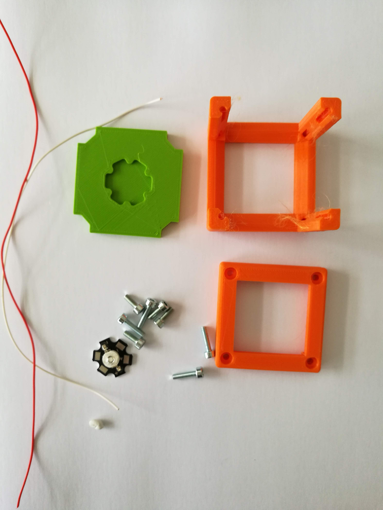
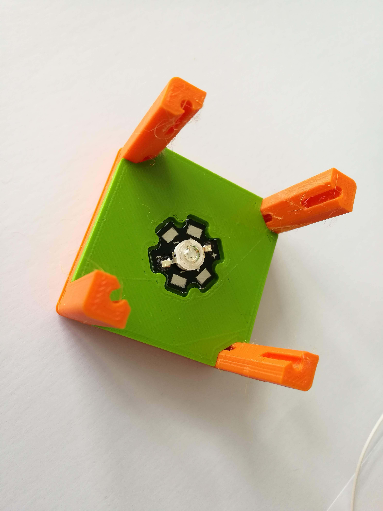
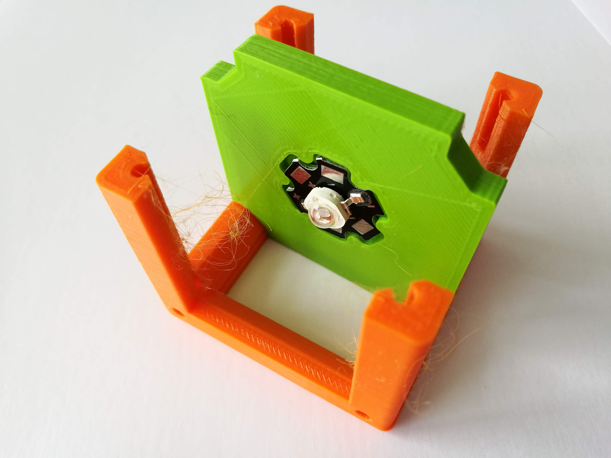
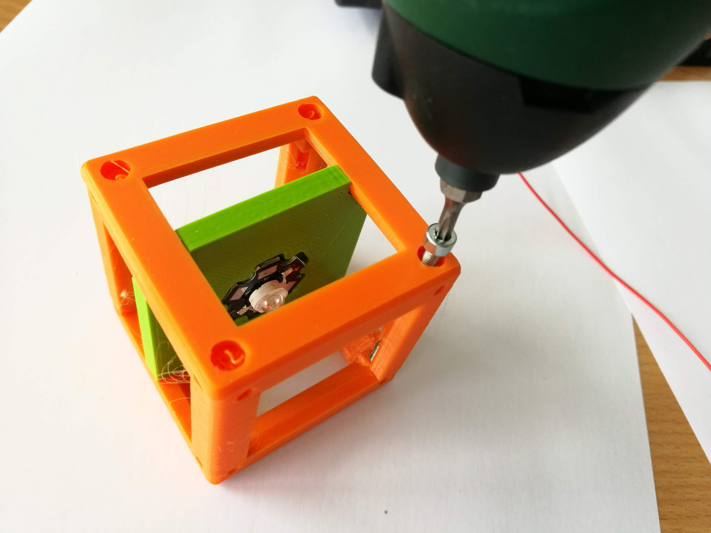
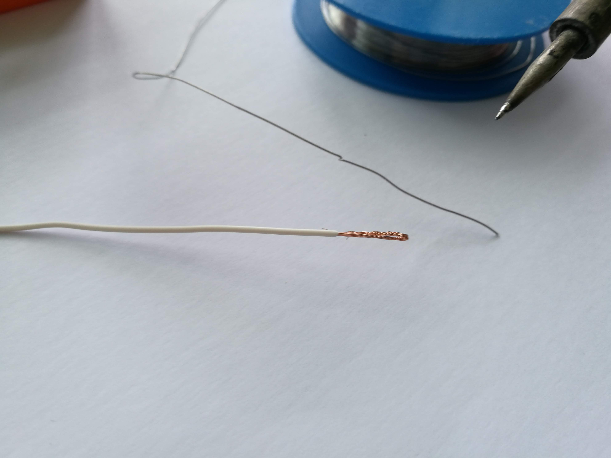
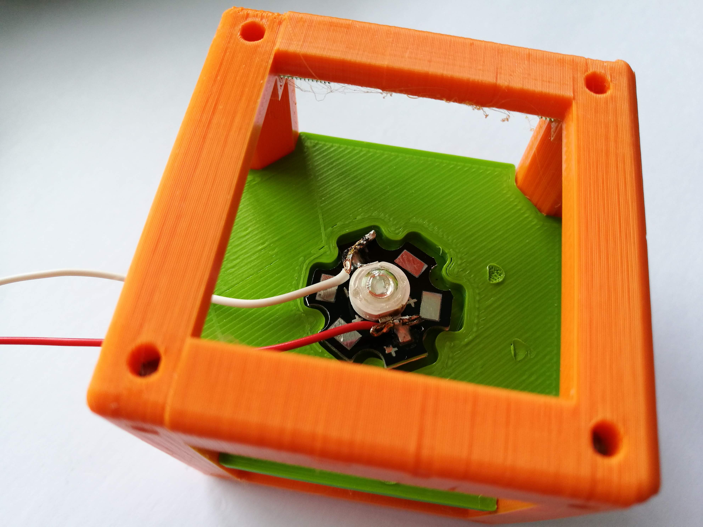

# LED Cube (+ Pinhole)
This is the repository for the design of the LED Cube.

To acquire the STL-files use the [UC2-Configurator](). The files themselves are in the [RAW](../RAW/STL) folder. The module can be built using injection-moulded (IM) or 3D-printed (3DP) cubes.

## Purpose
This cube holds a single LED. Optionally, A generic sample holder can be added to hold a pinhole directly in front of the LED.

### Properties
* design is derived from the Base Cube

## Parts
The [Bill of Materials](https://docs.google.com/spreadsheets/d/1U1MndGKRCs0LKE5W8VGreCv9DJbQVQv7O6kgLlB6ZmE/edit?usp=sharing) is always the most up-to-date version!

###  3D printing parts
* No support needed in all designs
* Carefully remove all support structures (if applicable)

The Cube consists of the following components.

#### Default:
* **IM Cube** which houses the insert and adapts it into a UC2 setup.
* **The LED holder Insert** that holds the LED ([20_Cube_insert_LED_holder_v3.stl](../RAW/STL))
* **The Sample holder Insert** that can hold the pinhole in front of the LED ([20_Cube_insert_Sample_holder_v3.stl](../RAW/STL))
* **The Sample holder clamp** that fixes the pinhole in its position ([20_Cube_Insert_Sample_clamp.stl](../RAW/STL))

#### Alternatives:
* **3DP Cube** which will be screwed to the Lid. Here all the functions (i.e. Mirrors, LED's etc.) find their place ([10_Cube_1x1_v3.stl](../RAW/STL)) and **3DP Lid** which closes the Cube ([10_Lid_1x1_v3.stl](../RAW/STL)) - find the details in [ASSEMBLY_CUBE_Base](../ASSEMBLY_CUBE_Base)
* The **Sample Holder** might not be always necessary but it is used in most of the applications that request this module.

###  Additional parts
* Check out the [RESOURCES](../../TUTORIALS/RESOURCES) for more information!
* Hi-Power LED 1W/3W UV STAR Blue for the Holography experiment [🢂](https://www.ebay.de/itm/Hi-Power-LED-1W-3W-UV-STAR-Ultraviolet-/131326525056?var=)
* Any LED STAR if you plan to use it for another application
* wires
* Resistor to down-convert the 5V supply-voltage to 2.5V for the LED; e.g. 180R @ 0.5W

#### Pinhole
An easy way to make your own pinhole from aluminium foil is described [here](https://www.jpl.nasa.gov/edu/learn/project/how-to-make-a-pinhole-camera/) and [here](https://www.fi.edu/space/eclipse/pinhole-camera).

##  Assembly
* Solder the wires to the LED
* Insert the LED in its holder
* Slide the LED holder into the Cube Body
* Press the Clamp on the sample holder, slide the holder into the Cube Body in front of the LED
* Close the cube accordingly (IM/3DP)
* Done!

### Tutorial with images
:grey_exclamation: This tutorial shows a UC2_v2 cube but the assembly of the insert is still the same. For assembly of the cube (IM/3DP) check the [ASSEMBLY_CUBE_Base](../ASSEMBLY_CUBE_Base).

1. All parts for this model

2. Add some glue or poster-fix/blutek to the LED insert

3. Mount the LED inside the insert; Add the insert to the cube

4.  Add the insert to the cube

5. Close the cube by adding screws and the lied

6. Mount everything

7. Prepare wires and resistors for the LED. Make sure it suits the supply-voltage (e.g. 5V)

8. Add the wires to the LED - Done!

9. Check the [Sample Holder Module](../ASSEMBLY_CUBE_Sample_Holder) for its assembly tutorial.

## Safety
Never (!) look into the LED directly! It may damage your eye immediately!

* ATTENTION: NEVER WATCH DIRECTLY INTO THE LED! EYE WILL BE DAMAGED DIRECTLY
* NEVER SWITCH ON THE LED WITHOUT INTEDED USE
