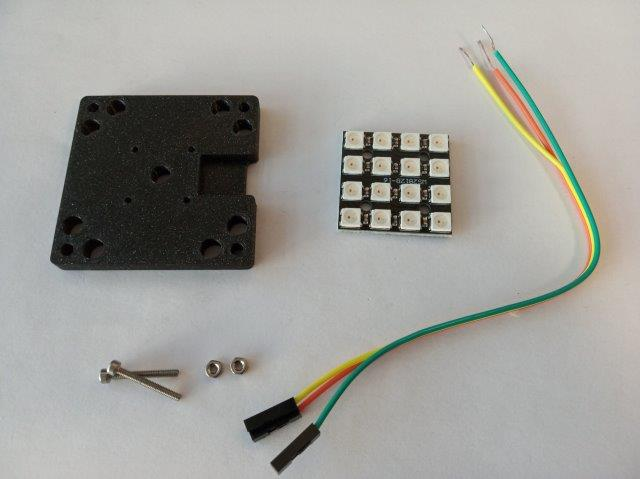
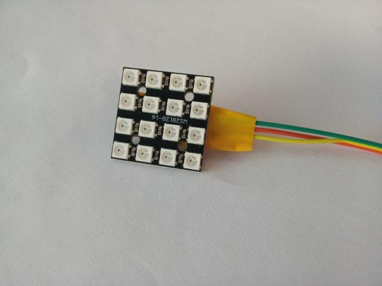
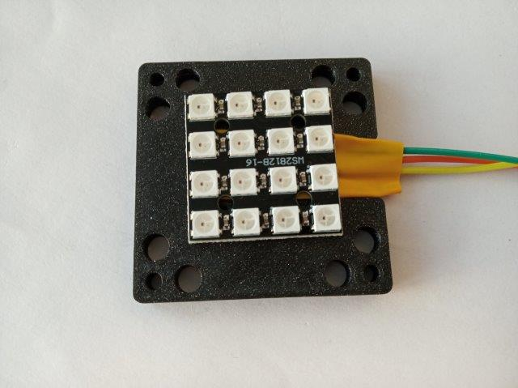
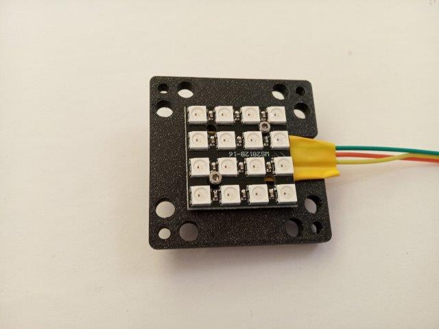

# Cube LED Matrix
This parts adapt a LED matrix to the UC2 cubes. Electric control is done by an ESP32.

To acquire the STL-files use the [UC2-Configurator](https://uc2configurator.netlify.app/). The files themselves are in the [RAW](../RAW/STL) folder. The module can be built using injection-moulded (IM) or 3D-printed (3DP) cubes.

<p align="center">

</p>

## Purpose
It can be used for Fourier Ptychographic Microscopy (FPM, Horstmeyer 2014), quantitative differential phase-contrast (qDPC, Tian&Waller 2015) or oblique illumination, etc.

### Properties
The basic properties/features of the assembly go here.

## Parts

###  3D printing parts
* No support needed in all designs
* Carefully remove all support structures (if applicable)

The Cube consists of the following components.

1. **The LED-Matrix Adapter** which adapts to the Neopixel LED Matrix display. ([UC2_30_IM_LED_holder_v3.stl](../RAW/STL))


###  Additional parts
* Check out the [RESOURCES](../../TUTORIALS/RESOURCES) for more information!
* 2× M2 screws with nuts for connecting the LED matrix to the adapter, alternatively use hot glue
* 1× ESP32 [🢂](https://www.amazon.de/AZDelivery-NodeMCU-Development-Nachfolgermodell-ESP8266/dp/B074RGW2VQ/ref=sr_1_3?__mk_de_DE=%C3%85M%C3%85%C5%BD%C3%95%C3%91&keywords=esp32&qid=1565008313&s=gateway&sr=8-3)
* 1× LED-Array, 4×4 [🢂](https://www.ebay.de/itm/401601053552)
* 3× Female-Female Jumper Wire, 0.14 mm² [🢂](https://www.amazon.de/AZDelivery-NodeMCU-Development-Nachfolgermodell-ESP8266/dp/B074RGW2VQ/ref=sr_1_3?__mk_de_DE=%C3%85M%C3%85%C5%BD%C3%95%C3%91&keywords=esp32&qid=1565008313&s=gateway&sr=8-3)
* 1× Power cable for ESP32 - USB-microUSB [🢂](https://www.amazon.de/dp/B0778FV6K4/ref=sr_1_2?dchild=1&fst=as%3Aoff&qid=1586361990&refinements=p_89%3AGritin&rnid=669059031&s=computers&sr=1-2)


## Electronics
Not yet done

##  Assembly
The assembly of this part is straight forward. Just solder the wires to the matrix and connect it to the plate that adapts it to the cubes.

The ```DIN```, ```5V``` and ```Gnd```-Pin have to be connected to the ESP32. The ESP32 connects to the supply voltage (5V).


### Tutorial with images
1. All parts for this model
<p align="center">

</p>

2. Solder the 3xpinhead to the LED-Matrix. Cover the exposed wires with electrical tape to avoid short cicuit.
<p align="center">

</p>

3. Place the LED matrix on the holder. The little slot is for the wires.
<p align="center">

</p>

4. Using the two M2 screws, attach the matrix to the holder
<p align="center">


</p>

5. Fix the screws with nut. Connect the electronics - Done!
<p align="center">

</p>


## Safety
Don't burn yourself if you solder the part!

- Open Electronic Contacts can deduce a shortcut!
