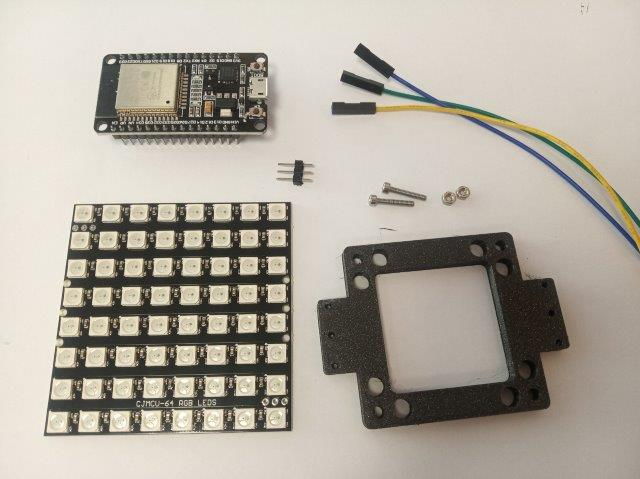
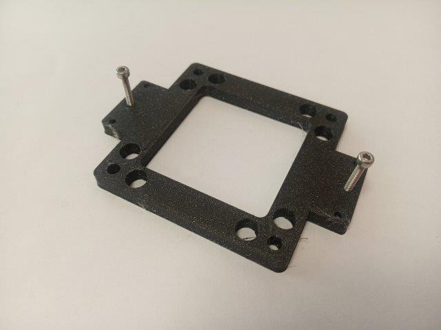
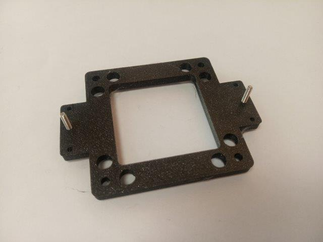
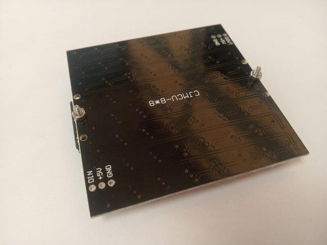
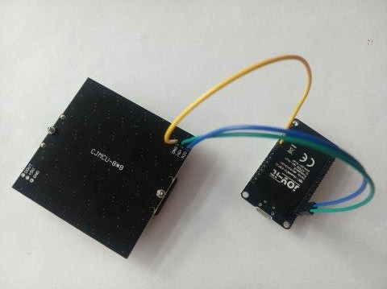
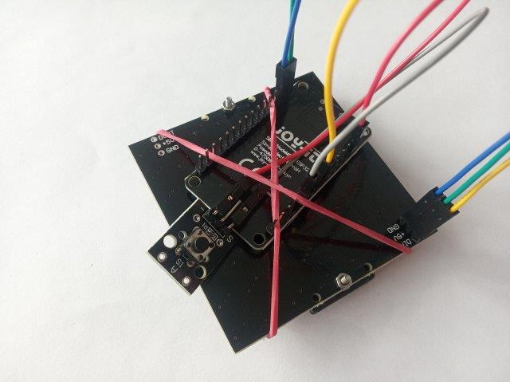
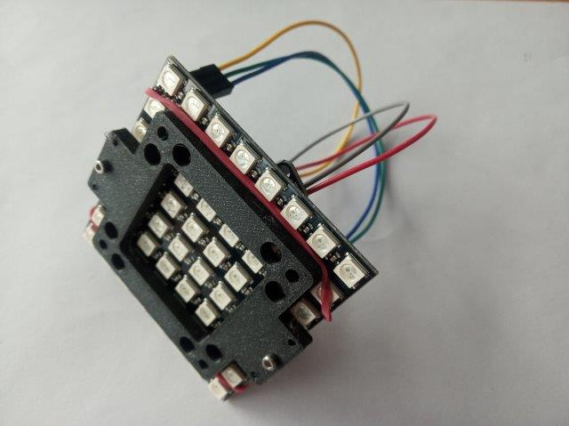
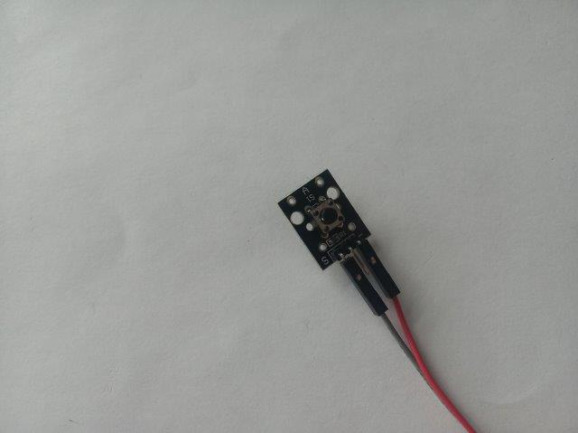
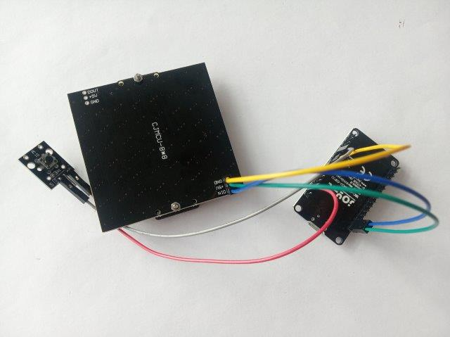

# Cube LED Matrix (64 LEDs) - simple version
([TUT07 of TUTORIALS](../../TUTORIALS) )

This parts adapt a LED matrix to the UC2 cubes. Electric control is done by an ESP32.

To acquire the STL-files use the [UC2-Configurator](https://uc2configurator.netlify.app/). The files themselves are in the [RAW](../RAW/STL) folder. The module can be built using injection-moulded (IM) or 3D-printed (3DP) cubes.

## Purpose
The LED matrix serves as a light source. Using the code you find in [CODE](./CODE) you can change the illumination intensity by simply clicking the button and going through three different brightness level.

**Note:** We know this is not optimal, it would be better to solder everything or even better to used the [LED matrix (16 LEDs)](../ASSEMBLY_CUBE_LED_Matrix). But with this one you can completely avoid the soldering, which makes the assembly much easier.

## Parts

###  3D printing parts
* No support needed in all designs
* Carefully remove all support structures (if applicable)

The Cube consists of the following components.

* **The LED-Matrix Adapter** which adapts to the Neopixel LED Matrix display. ([30_IM_LED_holder_8x8_v3.stl](../RAW/STL))

###  Additional parts
* 2× M2 screws with nuts for connecting the LED matrix to the adapter, alternatively use hot glue
* 1× ESP32 [🢂](https://www.amazon.de/AZDelivery-NodeMCU-Development-Nachfolgermodell-ESP8266/dp/B074RGW2VQ/ref=sr_1_3?__mk_de_DE=%C3%85M%C3%85%C5%BD%C3%95%C3%91&keywords=esp32&qid=1565008313&s=gateway&sr=8-3)
* 1× LED-Array, Neopixel, 8x8 [🢂](https://www.amazon.de/Adafruit-NeoPixel-NeoMatrix-8x8-64-Matrix/dp/B00FA9JDEU)
* 3× Female-Female Jumper Wire, 0.14 mm² [🢂](https://www.amazon.de/AZDelivery-NodeMCU-Development-Nachfolgermodell-ESP8266/dp/B074RGW2VQ/ref=sr_1_3?__mk_de_DE=%C3%85M%C3%85%C5%BD%C3%95%C3%91&keywords=esp32&qid=1565008313&s=gateway&sr=8-3)
* 1× Power cable for ESP32 - USB-microUSB [🢂](https://www.amazon.de/dp/B0778FV6K4/ref=sr_1_2?dchild=1&fst=as%3Aoff&qid=1586361990&refinements=p_89%3AGritin&rnid=669059031&s=computers&sr=1-2)

##  Assembly
### Tutorial with images

1. All parts for this model

2. Ad the two M2 screws to the 3D-printed frame

3. Screw them all the way in and turn the frame

4. Place the LED matrix on the screws, LEDs facing the frame

5. Fix the array to the frame using the M2 nuts

6. Connect all the electronics - details below

7. Mount everything

## Electronics
Careful - open electronic contact can cause shortcuts!

Don't have much experience with electronics? It's actually really simple:

* When using jumper wires you can avoid soldering.
* LED array - 3 wires + 2 wires for the button

1. Three wires connect to the little trident which goes into the LED array

2. Their other ends connect to the ESP32 according to the scheme above

3. Two wires connect the button to the ESP32

##  Code
In the [CODE](./CODE) folder you find a simple code for the [LED array](./CODE/ESP32_ledarr_simple).

Have a look in the [TUTORIALS](../../TUTORIALS) for a beginners guide to UC2 hardware controls.

Prerequisities:
* [Arduino IDE](https://www.arduino.cc/en/main/software) installed
* ESP32 libraries - [Installation guide here](https://randomnerdtutorials.com/installing-the-esp32-board-in-arduino-ide-windows-instructions/)
* [FastLED.h](https://www.arduinolibraries.info/libraries/fast-led) library

**Where next?**  
Find out more about the electronics in the [Electronics section](../../ELECTRONICS)  
Find out more about the code for this part in our dedicated [UC2-Software-GIT](https://github.com/bionanoimaging/UC2-Software-GIT)   
Or return to the [TUTORIALS](../../TUTORIALS)

##  Participate!

Do you want to show your own results? Do you have ideas for improvements? Let us know!
