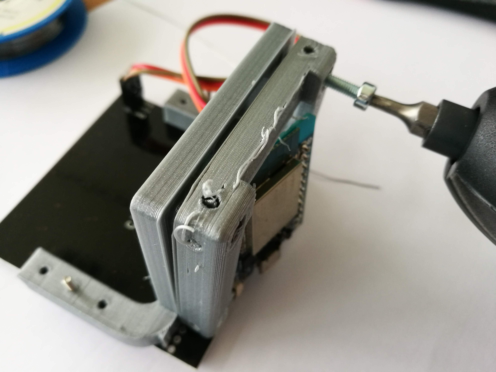

# Cube LED Matrix
This parts adapt a LED matrix to the UC2 cubes. Electric control is done by an ESP32.

The stl-files can be found in the folder [STL](./STL).

<p align="center">

</p>

## Purpose
It can be used for Fourier Ptychographic Microscopy (FPM, Horstmeyer 2014), quantitative differential phase-contrast (qDPC, Tian&Waller 2015) or oblique illumination, etc.

### Properties
The basic properties/features of the assembly go here.

## Parts

###  3D printing parts
* No support needed in all designs
* Carefully remove all support structures (if applicable)

The Cube consists of the following components.

1. **The Lid** which holds the ESP32 and the screws which connect to the base-plate (optional: wires can be connected to the screws) ([LID](./STL/10_Lid_1x1_el_v2.stl))
2. **The LED-Matrix Adapter** which adapts to the Neopixel LED Matrix display. ([ADAPTER](./STL/30_Cube_LED_Array_v0.stl))


###  Additional parts
* Check out the [RESOURCES](../../TUTORIALS/RESOURCES) for more information!
* 4× DIN912 M3×12 screws (galvanized steel) [🢂](https://eshop.wuerth.de/Zylinderschraube-mit-Innensechskant-SHR-ZYL-ISO4762-88-IS25-A2K-M3X12/00843%20%2012.sku/de/DE/EUR/)
* 2× M2 screws with nuts for connecting the LED matrix to the adapter, alternatively use hot glue
* 1× ESP32 [🢂](https://www.amazon.de/AZDelivery-NodeMCU-Development-Nachfolgermodell-ESP8266/dp/B074RGW2VQ/ref=sr_1_3?__mk_de_DE=%C3%85M%C3%85%C5%BD%C3%95%C3%91&keywords=esp32&qid=1565008313&s=gateway&sr=8-3)
* 1× LED-Array, Neopixel, 8x8 [🢂](https://www.amazon.de/Adafruit-NeoPixel-NeoMatrix-8x8-64-Matrix/dp/B00FA9JDEU)
* 3× Female-Female Jumper Wire, 0.14 mm² [🢂](https://www.amazon.de/AZDelivery-NodeMCU-Development-Nachfolgermodell-ESP8266/dp/B074RGW2VQ/ref=sr_1_3?__mk_de_DE=%C3%85M%C3%85%C5%BD%C3%95%C3%91&keywords=esp32&qid=1565008313&s=gateway&sr=8-3)
* 1× Power cable for ESP32 - USB-microUSB [🢂](https://www.amazon.de/Gritin-Datenkabel-Geflochtene-Robust-Daten%C3%BCbertragung-Grau/dp/B07CJJHVKX/ref=sr_1_3?keywords=usb+c+kabel&qid=1566029225&s=gateway&sr=8-3)


### Tricks
You can connect the supply-voltage wires to the screws (5V, Gnd) which can connect to the baseplates' magnets which can eventually also hold power. This makes additional wires obsolete.

## Electronics
Please follow the tutorial of how to handle the LED Matrix in the Adafruit Post [here](https://learn.adafruit.com/adafruit-neopixel-uberguide/neomatrix-library). We connect the LED-array to ```pin 9```.

##  Assembly
The assembly of this part is straight forward. Just screw all the parts together to end up here:

<p align="center">

</p>

<p align="center">

</p>

The ```DIN```, ```5V``` and ```Gnd```-Pin have to be connected to the ESP32. The ESP32 connects to the supply voltage (5V).


### Tutorial with images
Don't insert batteries in the laser yet!!

1. All parts for this model
<p align="center">

</p>

2. Solder the 3xpinhead to the LED-Matrix
<p align="center">

</p>

3. Add the pinheads to the ESP32
<p align="center">

</p>

4. Solder everything
<p align="center">

</p>

5. Connect 5V, GND and Data from ESP32 to Neopixel Array using Female-Female jumpers
<p align="center">

</p>

6. Add Lid and Screws - Done!
<p align="center">

</p>

6. Mount everything
<p align="center">

</p>


## Safety
Don't burn yourself if you solder the part!

- Open Electronic Contacts can deduce a shortcut!
