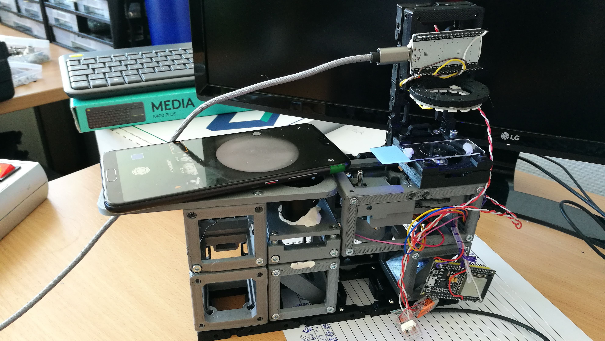
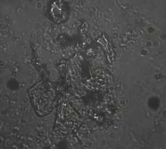
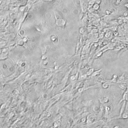
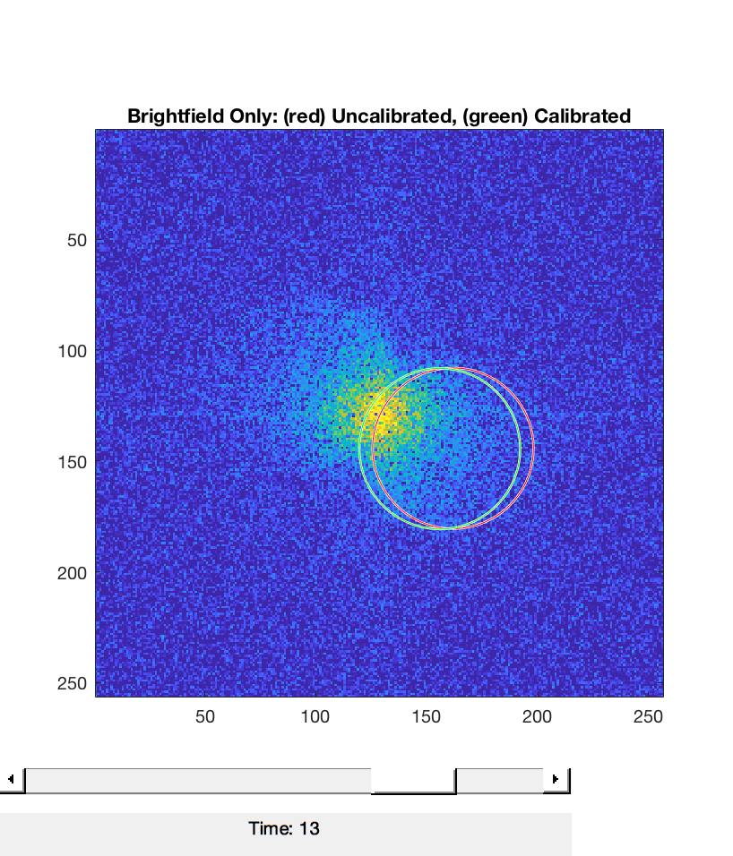
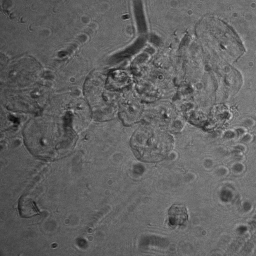
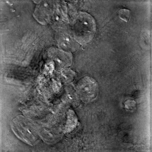
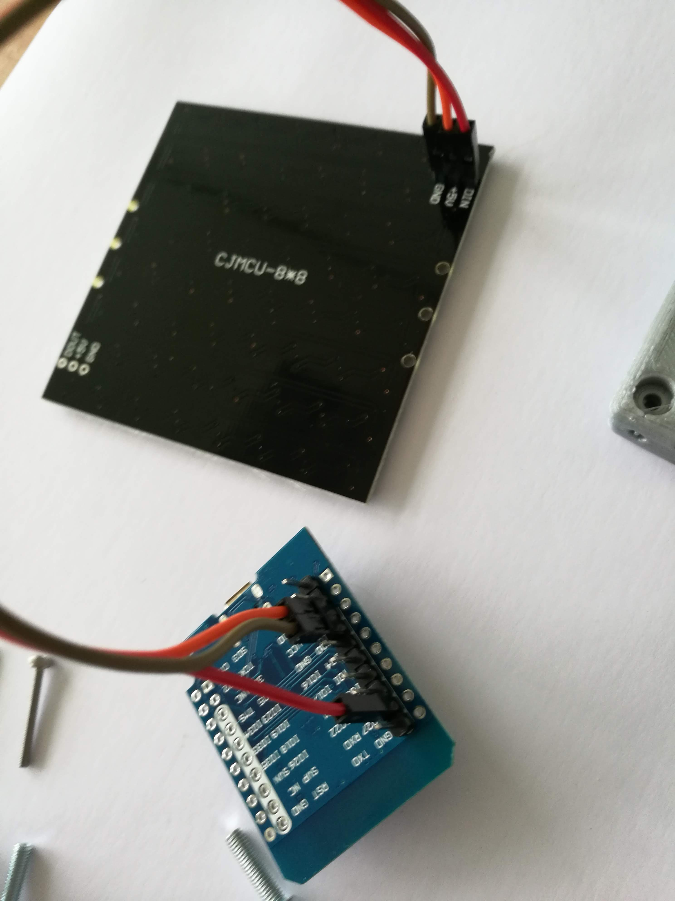

# Cube LED Ring
This parts adapt a LED Ring to the UC2 cubes. Electric control is done by an ESP32.

The stl-files can be found in the folder [STL](./STL).

<p align="center">

</p>

## Purpose
It can be used for quantitative phase imaging (QPI) using the work from Tian et al. [ARXIV](https://arxiv.org/abs/1904.06004) and [code](https://github.com/bu-cisl/IDT-using-Annular-Illumination)  provided by the [Tian-Lab](http://sites.bu.edu/tianlab/) at Boston University. 

### LED-Ring Smartphone Setup for QPI
<p align="center">

</p>

## Results 
The images using the Huawei P9 with a monochromatic CMOS chip and a LED sequence of only Red/Green/Blue looks like that:
<p align="center">

</p>
We used a 10x objective lens with an NA=0.3. 

And some HeLa cells with subtracted background shot on a Huawei P9 (monochrome):

<p align="center">

</p>

We used a 10x objective lens with an NA=0.3. 


### Reconstruction Results

We acquiered a stack of freshly taken Cheek cells on a coverslip and imaged it with the Aafruit LED ring using a Huawei P20 with ISO400, texp=1/15s. It's very important to capture in RAW-mode. The demosaicing of the images destroys the FT relationship of the transfer function! 

We provide a script to convert a stack of RAW-images to a TIFF-file in [CODE](./CODE). The modified files for the ***aIDT*** code from the ***TIANLAB*** can also be found in the [CODE](./CODE) folder. It just needs to be copy/pasted into the original Master-branch of their  [github - repository](https://github.com/bu-cisl/IDT-using-Annular-Illumination) in order to make it work. 

The code will automatically fit the pupil function:
<p align="center">

</p>


The whole stack of oblique angle illumination looks like this: 
<p align="center">

</p>

After processing this stack of images with the code you get the 3D refractive index distribution **RI(r)** where we visualize a virtual focus-stack of the real part (e.g. phase retardation):

UC2_AIDT_Cheek_Sequentiaprocessing this stack of images with the code you get the 3D refractive index distribution **RI(r)** where we visualize a virtual focus-stack of the real part (e.g. phase retardation):

<p align="center">

</p>


## Code 
A sample code for the EPS32 or Arduino can be found in this [folder](./ESP32/LED_Ring_test).

The image processing codes for python and Matlab based on this publication: 
[ARXIV](https://arxiv.org/abs/1904.06004) 

Many credits go to Alex Matlock who helped a lot to make sure that the data is curated the right way! Thanks to the TIANLAB for poviding the code!


## Properties
The basic properties/features of the assembly go here.

## Parts

### 3D printing parts
Here we list the 3D printed components from the ./STL folder

The Part consists of the following components.

1. **The Lid** which holds the ESP32 and the screws which connect to the base-plate (optional: wires can be connected to the screws) ([LID](./STL/10_Lid_1x1_el_v2.stl))
2. **The LED-Matrix Adapter** which adapts to the Neopixel LED Matrix display. ([ADAPTER](./STL/20_Cube_insert_LED_holder.stl))


### Additional parts
Here we list all parts which need to be bought from different sources.

|  Name | Properties  |  Price | Link  | # |
|---|---|---|---|---|
|  ESP32 | Microcontroller | 5€  | [ESP](http://esp32.net/)  | 1|
|  DIN912 M3x18 | Screws | 1€  | [Würth](https://eshop.wuerth.de/Zylinderschraube-mit-Innensechskant-SHR-ZYL-ISO4762-88-IS25-A2K-M3X18/00843%20%2018.sku/de/DE/EUR/)  | 6|
|  Adafruit #1463 | LED Ring (16 LEDs, 33mm Dia)| 15€  | [adafruit](https://www.adafruit.com/product/1463)  | 1|

## Remarks and Tips

### 3D Printing
Print as is without support. Infill can be around 30%.

### Tricks
You can connect the supply-voltage wires to the screws (5V, Gnd) which can connect to the baseplates' magnets which can eventually also hold power. This makes additional wires obsolete.

### Electronics
Please follow the tutorial of how to handle the LED Matrix in the Adafruit Post [here](https://learn.adafruit.com/adafruit-neopixel-uberguide/neomatrix-library). We connect the LED-array to ```pin 9```.

## Assembly
The assembly of this part is straight forward. Just screw all the parts together to end up here (same as [LED matrix](ASSEMBLY_CUBE_LED_Matrix_v2)):

<p align="center">

</p>

<p align="center">

</p>

The ```DIN```, ```5V``` and ```Gnd```-Pin have to be connected to the ESP32. The ESP32 connects to the supply voltage (5V).


### Tutorial with images
(same as [LED matrix](ASSEMBLY_CUBE_LED_Matrix_v2))

1. All parts for this model
<p align="center">

</p>

2. Solder the 3xpinhead to the LED-Matrix
<p align="center">

</p>

3. Add the pinheads to the ESP32
<p align="center">

</p>

4. Solder everything
<p align="center">

</p>

5. Connect 5V, GND and Data from ESP32 to Neopixel Array using Female-Female jumpers
<p align="center">

</p>

6. Add Lid and Screws - Done!
<p align="center">

</p>

6. Mount everything
<p align="center">

</p>


## Safety
Take care in case you're dealing with lasers. Don't burn yourself if you solder the part!

- Open Electronic Contacts can deduce a shortcut!
