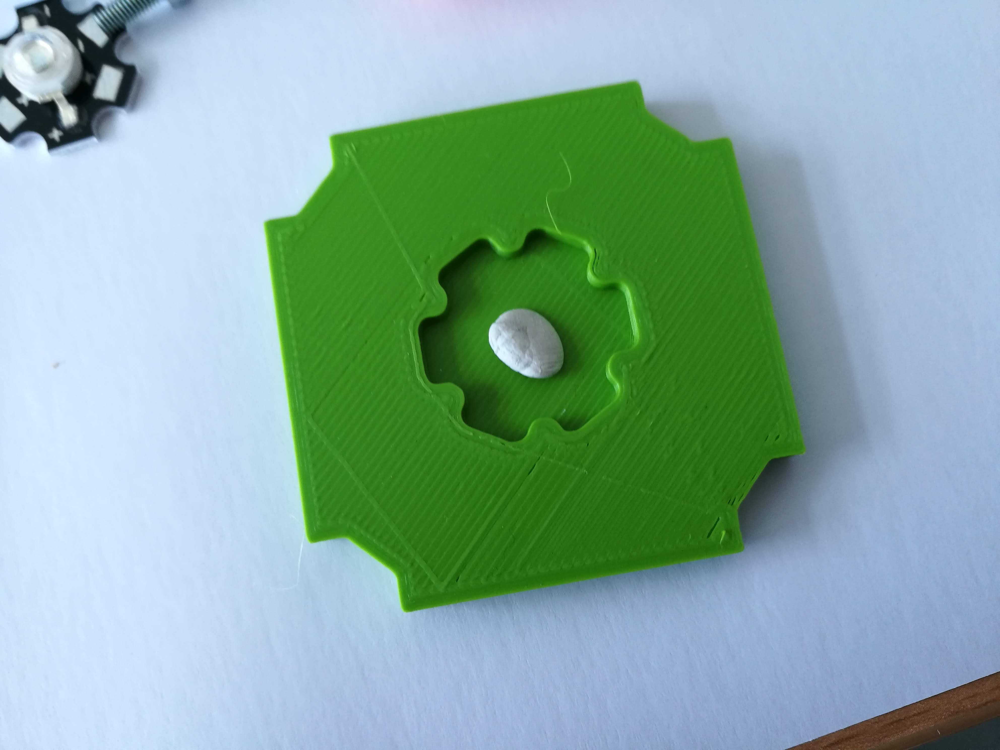

# LED Cube (+ Pinhole)
This is the repository for the design of the LED Cube. The stl-files can be found in the folder [STL](./STL).

## Purpose
This cube holds a single LED. Optionally, A generic sample holder can be added to hold a pinhole directly in front of the LED.

## Properties
* design is derived from the Base Cube

## Parts

### 3D printing parts
Here we list the 3D printed components from the [STL](./STL) folder

The Part consists of the following components.

1. **The Lid** where the Arduino + Electronics finds its place
2. **The Cube** which will be screwed to the Lid. Here all the functions (i.e. Mirrors, LED's etc.) find their place
3. **The LED holder Insert** that holds the LED
4. **The Sample holder Insert** that can hold the pinhole in front of the LED
5. **The Sample holder clamp** that fixes the pinhole in its position

### Additional parts
* Hi-Power LED 1W/3W UV STAR Blue for the Holography experiment
* Any LED STAR if you plan to use it for another application
* Cables
* Resistor to down-convert the 5V supply-voltage to 2.5V for the LED; e.g. 180R@0.5W

## Remarks and Tips

### 3D Printing
* No support required in all designs
* Carefully remove all support structures (if applicable)

## Assembly
* Remove any support and clean the part
* Solder the wires to the LED
* Insert the LED in its holder
* Slide the LED holder into the Cube Body
* Press the Clamp on the sample holder, slide the holder into the Cube Body in front of the LED
* Add the lid and fix it using a set of M3 screws
* Don't forget to fix the wires of the LED to the screw in the Lid!
* Done!

### Tutorial with images
Don't insert batteries in the laser yet!!

1. All parts for this model

2. Add some glue or poster-fix/blutek to the LED insert

3. Mount the LED inside the insert; Add the insert to the cube

4.  Add the insert to the cube

5. Close the cube by adding screws and the lied

6. Mount everything

7. Prepare wires and resistors for the LED. Make sure it suits the supply-voltage (e.g. 5V)

8. Add the wires to the LED - Done!

## Safety
Never (!) look into the LED directly! It may damage your eye immediately!

* ATTENTION: NEVER WATCH DIRECTLY INTO THE LED! EYE WILL BE DAMAGED DIRECTLY
* NEVER SWITCH ON THE LASER WITHOUT INTEDED USE
* BEAM HAS TO GO AWAY FROM ONESELF - ALWAYS!
