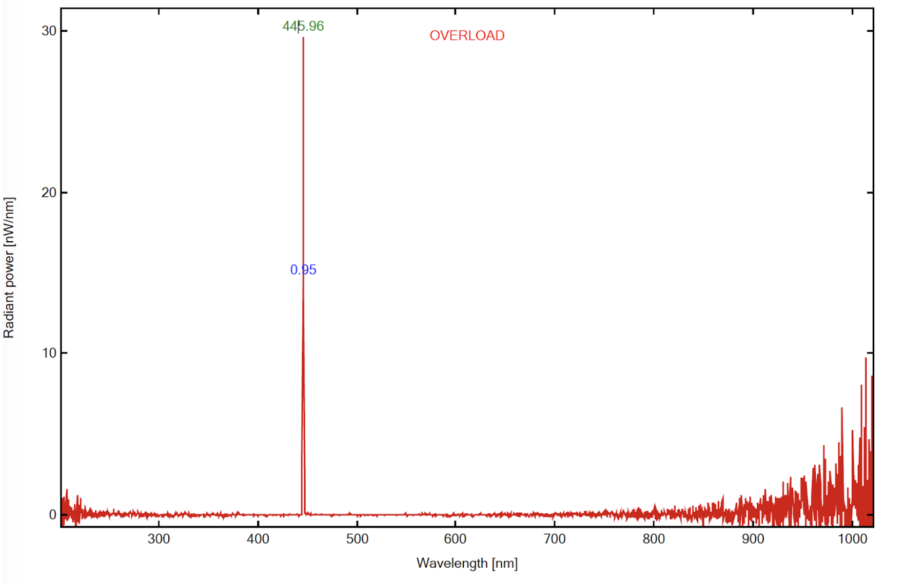

# LASER Mount Cube
This is the repository for the Laser Mount Cube.

To acquire the STL-files use the [UC2-Configurator](). The files themselves are in the [RAW](../RAW/STL) folder. The module can be built using injection-moulded (IM) or 3D-printed (3DP) cubes.

## Purpose
It adapts a laser-pointer to the to the UC2 system.

The laser-pointer is permanently switched on/off using a 3D printed clamp. It is inserted in a Thorlabs-like adapter which centers the laser on the optical axis. Using a set of rods, this adapter can be mounted inside the base-cube. Having two of these adapters makes the design very robust!

### Properties
* design is derived from the base-cube
* the adapter for the laser can be adjusted to individual laser-pointer diameters
* the 4 screws make centering of the laser w.r.t. the optical axis easy
* Diode-laser, Multimode line profile, Beam
* Peak-Wavelength: ***446 nm***

### Laser Spectrum
The measured sepctrum from the 450nm laser pointer we used for the Light sheet setup can be found below:

### Laser Power
We measured a mean power of ***0.546 mW*** in continuous mode. We used new batteries.

## Parts
The [Bill of Materials](https://docs.google.com/spreadsheets/d/1U1MndGKRCs0LKE5W8VGreCv9DJbQVQv7O6kgLlB6ZmE/edit?usp=sharing) is always the most up-to-date version!

###  3D printing parts
* No support needed in all designs
* Carefully remove all support structures (if applicable)

The Cube consists of the following components.

#### Default:
* **IM Cube** which houses the insert and adapts it into a UC2 setup.
* **The Laser inserts** which holds the laser and adapts it to the base cube. For optimal performance use two inserts in one cube ([20_Cube_Insert_Laser_Holder_fixed_v3.stl](../RAW/STL))
* **The Laser Clamp** allows keeping the laser switched on without holding it ([30_Laser_Clamp_OnOffSwitch.stl](../RAW/STL))

#### Alternatives:
* **3DP Cube** which will be screwed to the Lid. Here all the functions (i.e. Mirrors, LED's etc.) find their place ([10_Cube_1x1_v3.stl](../RAW/STL)) and **3DP Lid** which closes the Cube ([10_Lid_1x1_v3.stl](../RAW/STL)) - find the details in [ASSEMBLY_CUBE_Base](../ASSEMBLY_CUBE_Base)

###  Additional parts
* Check out the [RESOURCES](../../TUTORIALS/RESOURCES) for more information!
* 4× DIN912 M3×18 screws
* Laserlands 450 nm laser-pointer [🢂](https://www.laserlands.net/11040037.html)

##  Assembly
* Insert the 4 screws in the Laser Mount Adapter and screw them thus far so the they are not visible in the inner hole
* Insert the laser pointer inside the adapter
* Fix the laser by precisely rotate all 4 screws so that the laser pointer is centered
* Place the insert/inserts with the laser inside the cube
* Close the cube accordingly (IM/3DP)
* Done!
* Only insert the batteries before you use the module!

### Tutorial with images
    This tutorial needs an update!

Don't insert batteries in the laser yet!!

1. All parts for this model

2. Add the button clamp to the Laser to keep the laser on in CW-mode. Put the laser inside the two Laser-inserts. Adding 2 scews to the insert makes it possible to decenter the laser in X/Y.

3. Mount Laser inside the inserts in the cube

4. Align the Laser in X/Y using the two screws

5. Add the lid and the screws - Done!

6. Only insert the batteries before you use the module!

## Safety
Never (!) look into the laser pointer! It will damage your eye immediately!

* ATTENTION: NEVER WATCH DIRECTLY INTO THE LASER! EYE WILL BE DAMAGED DIRECTLY
* NEVER SWITCH ON THE LASER WITHOUT INTEDED USE
* BEAM HAS TO GO AWAY FROM ONESELF - ALWAYS!
