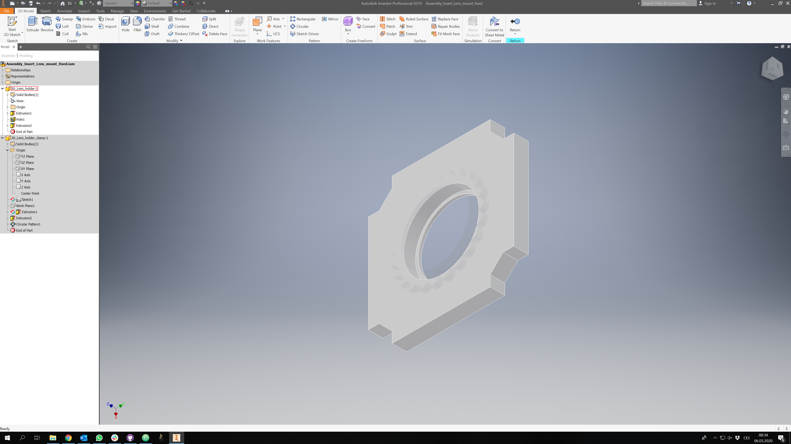
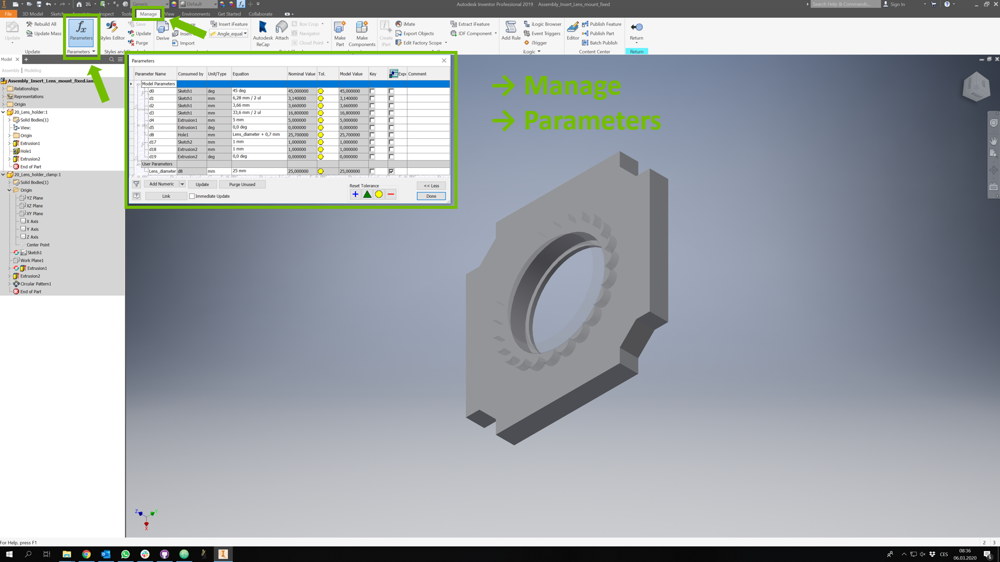
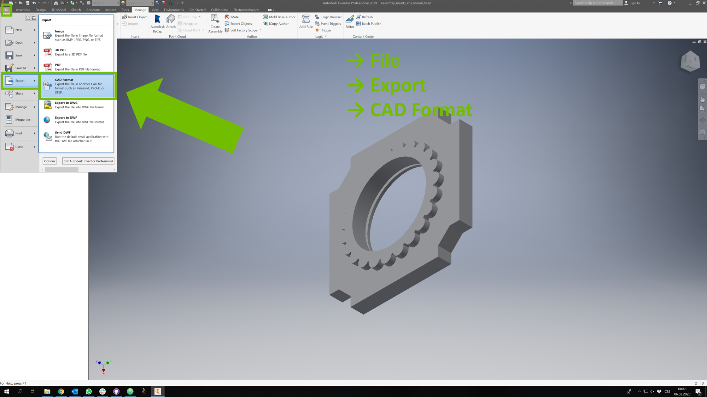

### Assembly Tutorial with images (Inventor Lens Holder)

1. All parts for this model

1. Put the lens inside the holder. When using plano-convex lenses, put the plano-surface in the holder with the convex surface in the direction where the clamp will be. That way, your lens will be completely sunken in the holder and therefore more protected from scratching.

1. Put hot glue on the clamp as shown in the pictures. Do not use too much glue - you don't want to glue the clamp to the surface of the lens!

1. Press the clamp in the holder. The glue will fill the groove between the holder and the clamp's "flowery" rim. Be careful not to put any glue on the surface of the lens!

1. Insert the insert into the Cube, add screws - Done!

## Safety
Don't touch the optical surfaces - fingerprints and scratches are bad for lenses!

Be careful not to burn yourself with the hot glue gun!

# Design your own Lens Holder (Inventor)
## For any lens or round filter from ⌀9 mm to ⌀42 mm
Note: [The holder we designed in openSCAD](../OPENSCAD) is a bit different from THIS ONE - and better. But if you prefer Inventor, the files and Assembly Tutorial are still available here ;)

#### The STL files for the Inventor Lens Holder
For a convex 1 inch lens:
* **The 1" Lens Holder** which holds a lens with 1 inch (25,4 mm) diameter and adapts it to the base cube ([HOLDER](./STL/1inch_Assembly_Insert_Lens_mount_fixed_20_Lens_holder.stl))
* **The 1" Lens Clamp** which holds a lens with 1 inch (25,4 mm) diameter in the holder ([CLAMP](./STL/1inch_Assembly_Insert_Lens_mount_fixed_20_Lens_holder_clamp.stl))

For a convex 25 mm lens:
* **The 25 mm Lens Holder** which holds a lens with 25 mm diameter and adapts it to the base cube ([HOLDER](./STL/25mm_Assembly_Insert_Lens_mount_fixed_20_Lens_holder.stl))
* **The 25 mm Lens Clamp** which holds a lens with 25 mm diameter in the holder ([CLAMP](./STL/25mm_Assembly_Insert_Lens_mount_fixed_20_Lens_holder_clamp.stl))

### Shortly, for any lens you have at hand:
* Download the [Lens Insert Folder](./Lens_Insert), adapt the .ipt files to the dimensions of your lens, export .stl and print your own holders.
* The clamp is adaptive to the holder - it is enough to change a single parameter - the diameter of your lens.
* Open the file called "Assembly_Insert_Lens_mount_fixed.iam" → 20_Lens_holder.ipt → Manage → Parameters → Lens_Diameter → Done → Return → Update → Save Copy As → .stl → Options → One Part per File
* For a thick (often the case of concave lenses) increase the thickness of the holder (hint: thickness of your lens at the edge + 2-3 mm)

### Tutorial with images

1. Open the file called _Assembly_Insert_Lens_mount_fixed.iam_ from [_/Lens_Insert_](./Lens_Insert)

2. Double-click the _20_Lens_holder.ipt_ in the Model bar on the right to enter the editing of the part

3. In the top pannel choose _Manage_ and then _Parameters_. The Parameters window opens as shown in the picture

4. In _User Parameters_ change the value of _Lens_diameter_ to the diameter of your lens, then close the _Parameters_ window by clicking on _Done_

5. For a lens thicker than ~3 mm you need to adapt the thickness of the holder as well. In the _Parameters_ window in _Model Parameters_ there is a _thickness_ dimension in mm consumed by _Thickness_.

* The default thickness of our insert is 5 mm, which works for lenses with edge thickness < 3 mm
* For each milimeter above 3 mm of the edge thickness of your lens, add one milimeter to _thickness_  
* Example: Dublet Lens with edge thickness 5 mm -  _thickness_  = 7 mm
* Example: Biconcave Lens with edge thickness 7 mm -  _thickness_ = 9 mm

6. In the top pannel bar choose _Return_ to exit the part editing. The dimensions update automatically. If not, click on _Update_ in the top pannel

7. From the top pannel choose _File_, _Export_ and then _CAD format_

8. In the _Save As_ window choose data type _STL_ and then click on _Options..._

9. In the _STL File Save As Options_ under _Structure_ choose _One File per Part Instance_

10. You might find it useful to add the diameter to the name of the file before you _Save_ it, especially if you're going to print many different holders

11. Both the Lens holder and clamp are saved by the assembly name and part name by default

12. Place both _.stl_ files in the 3D printer slicer. The clamp is usually exported in a bad orientation for printing. Rotate the clamp if necessary - always print it with the "flowery" rim lying on the build plate. Slice it, print it, use it ;)

