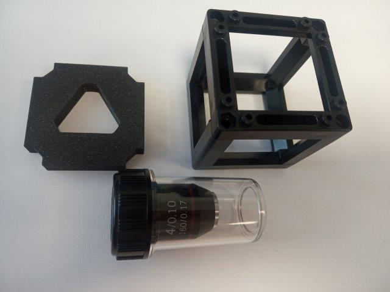
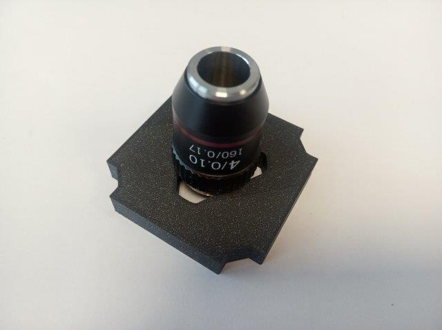
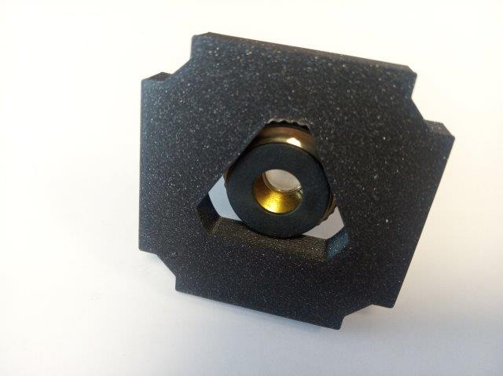
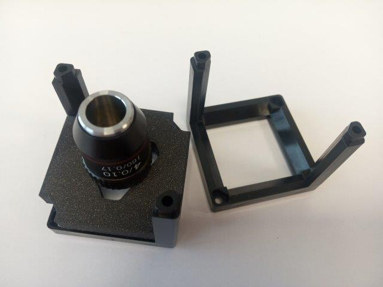
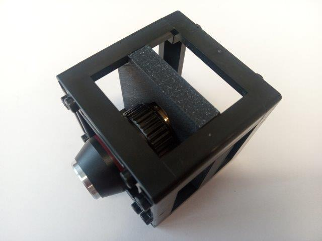
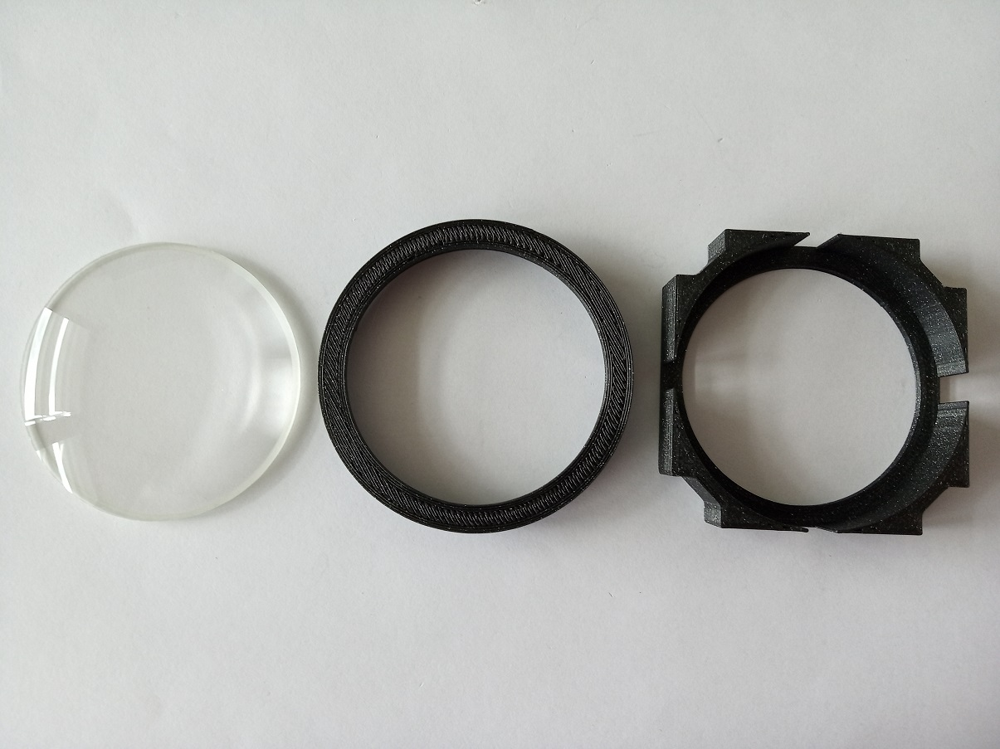
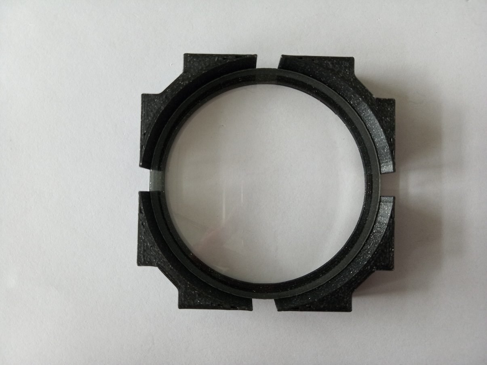
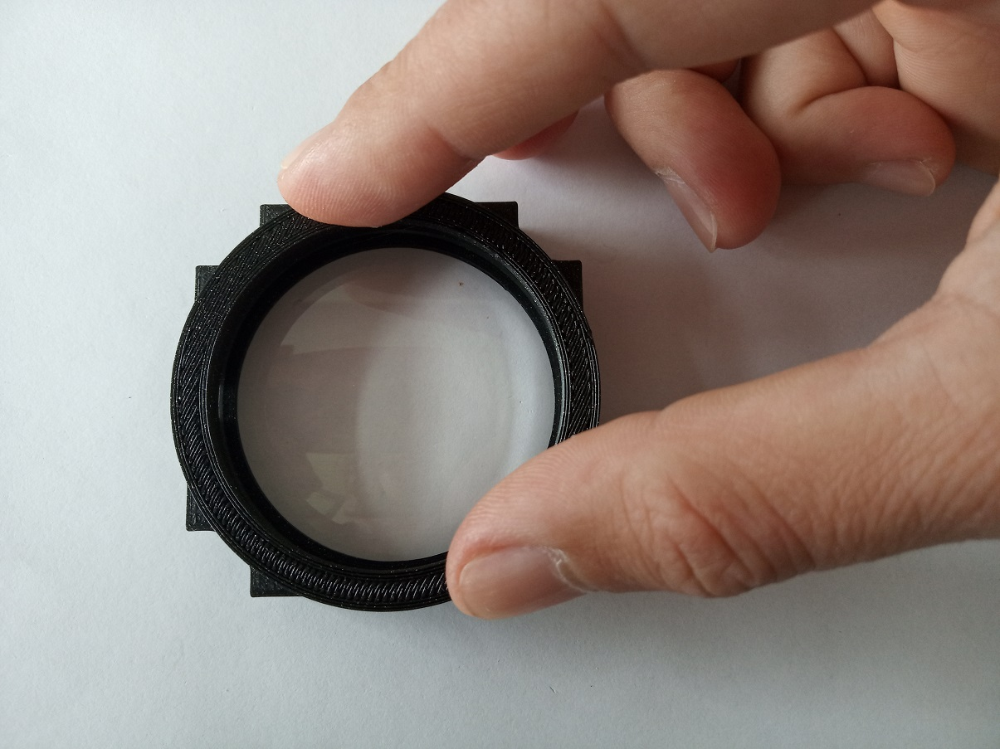

# Generic Lens Holder Cube
This is the repository for the Generic Lens Holder Cube.

To acquire the STL-files use the [UC2-Configurator](https://uc2configurator.netlify.app/). The files themselves are in the [RAW](../RAW/STL) folder. The module can be built using injection-moulded (IM) or 3D-printed (3DP) cubes.

## Purpose
RMS Objective holder: It adapts a objective with a RMS threading to the UC2 system.

Fixed holder: For the common lenses we also offer a more stable solution.

### Properties
* design is derived from the base-cube
* the adapter can hold a large variety of different lenses (different diameter/thickness)
* Objective holder: the triangle automatically centers the lens to the optical axis
* Fixed holder: The lens is safely fixed in the holder without the risk of being disassembled by some curious user

## Parts
The [Bill of Materials](https://docs.google.com/spreadsheets/d/1U1MndGKRCs0LKE5W8VGreCv9DJbQVQv7O6kgLlB6ZmE/edit?usp=sharing) is always the most up-to-date version!

###  3D printing parts
* No support needed in all designs
* Carefully remove all support structures (if applicable)

The Cube consists of the following components.

#### Default:
* **IM Cube** which houses the insert and adapts it into a UC2 setup.

#### RMS Objective holder
* **The Objective Holder (RMS)** which holds an objective or a lens with varying diameter and adapts it to the base cube. It is not optimal for a bare lens. ([20_Cube_Insert_Lens_holder_RMS_63x.stl](../RAW/STL))

#### Fixed Lens holder
There are two parts contained in one STL:
* **The Lens Holder** which holds a lens and adapts it to the base cube and **The Lens Clamp** which holds the lens in the holder

For the frequently used lenses (the ones that are used in our BOXes etc.) you can directly download the STLs:
* **+40 mm lens** ([Artikel 2120](https://optikbaukasten.de/)) - [LENS +40](../RAW/STL/20_Insert_Lens_holder_v3_40mm.stl))
* **+100 mm lens** ([Artikel 2004](https://optikbaukasten.de/)) - [LENS +100](../RAW/STL/20_Insert_Lens_holder_v3_100mm.stl))
* **-50 mm lens** ([LC1259](https://www.thorlabs.com/thorproduct.cfm?partnumber=LC1259)) - [LENS -50](../RAW/STL/20_Insert_Lens_holder_v3_-50mm.stl))

#### Alternatives:
* **3DP Cube** which will be screwed to the Lid. Here all the functions (i.e. Mirrors, LED's etc.) find their place ([10_Cube_1x1_v3.stl](../RAW/STL)) and **3DP Lid** which closes the Cube ([10_Lid_1x1_v3.stl](../RAW/STL)) - find the details in [ASSEMBLY_CUBE_Base](../ASSEMBLY_CUBE_Base)

## Design your own Lens Holder  
For any lens or round filter from ⌀9 mm to ⌀50 mm - using [OPENSCAD](./OPENSCAD)

###  Additional parts
* Check out the [RESOURCES](../../TUTORIALS/RESOURCES) for more information!
* Microscope Objective lens (spiral holder) [🢂](https://de.aliexpress.com/item/4X-10X-20X-40X-60X-100X195-Augenmikroskops-System-Bio-Mikroskop-Biologische-Mikroskop-Lab-Labor-Achromatische-Objektiv/32947647522.html?spm=a2g0x.search0104.3.54.6cf57a4c3DwsTO&transAbTest=ae803_3&ws_ab_test=searchweb0_0%2Csearchweb201602_6_10065_10130_10068_10890_10547_319_10546_317_10548_10545_10696_10084_453_454_10083_10618_10307_537_536_10902_10059_10884_10887_321_322_10103%2Csearchweb201603_6%2CppcSwitch_0&algo_pvid=06d972be-b176-4446-8665-56d9e61a8d2c&algo_expid=06d972be-b176-4446-8665-56d9e61a8d2c-7)
* or any lens with corresponding diameter (fixed holder)

##  Assembly of the Spiral Lens Holder
* Mount the objective lens inside the insert
* Put the Insert inside the Cube
* Close the cube accordingly (IM/3DP)
* Done!

### Tutorial with images (Spiral Lens Holder)

1. All parts for this model

2. Put the lens inside the triangular hole of the insert (it auto-centres)

3. Insert the insert into the Cube and close the Cube - Done!

##  Assembly of Fixed Lens Holder
* Mount the lens inside the holder
* Put the clamp in, to hold the lens
* Put the Insert in the Cube
* Close the cube accordingly (IM/3DP)
* Done!

### Tutorial with images (Fixed Lens Holder)

1. All parts for this model

2. Put the lens inside the holder. When using plano-convex lenses, put the plano-surface in the holder with the convex surface in the direction where the clamp will be. That way, your lens will be completely sunken in the holder and therefore more protected from being scratched.

3. The rim and the clamp are slightly elliptical to lock the lens inside. Put the clamp on the rim of the holder with the beak of the clamp pointing to the one mark (|) on the holder (right side in the picture); now the axes if the ellipses are matching. Then turn the clamp counter clockwise until the beak is pointing towards the two marks (||) on the holder (top side in the picture); now the axes if the ellipses are perpendicular to each other. Press the clamp firmly onto the rim of the holder.  The lens shouldn't be able to move when you're done. Be careful not to touch the surface of the lens!

Using the holder for big lenses? It works even simpler, because it's just round:

If you can't rotate the clamp all the way to the two marks (||) it is okay, as long as the lens is fixed. When printing with different printers, the dimensions slightly differ and sometimes is the clamp more tight.

4. Insert the insert into the Cube, close the Cube - Done!

## Safety
Don't touch the optical surfaces - fingerprints and scratches are bad for lenses!
