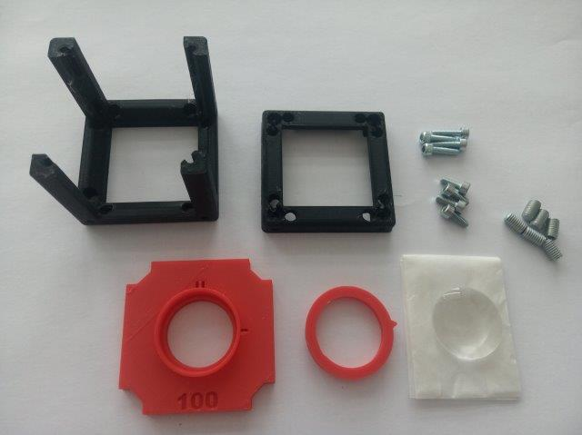
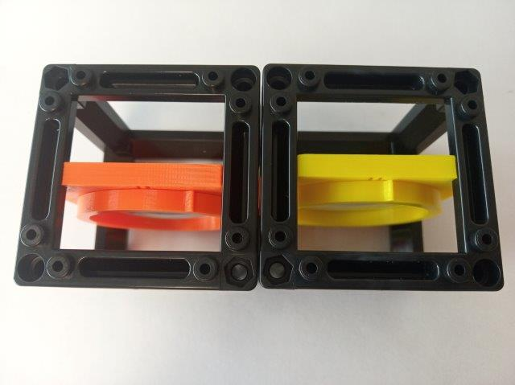
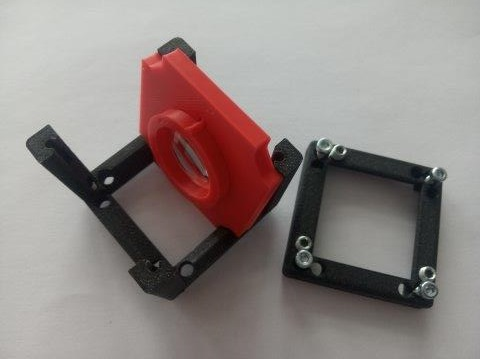

# TUT03: Give your first cube a function - lens as a magnifying glass
([TUT03 of TUTORIALS](../../../TUTORIALS) )  
This is a subsection of the repository for the [Generic Lens Holder Cube](../).

To acquire the STL-files use the [UC2-Configurator](). The files themselves are in the [RAW](../RAW/STL) folder. The module can be built using injection-moulded (IM) or 3D-printed (3DP) cubes.

### Purpose
The Lens Holder insert adapts a lens into the cube.

## Parts

###  3D printing parts
* No support needed in all designs
* Carefully remove all support structures (if applicable)

The Cube consists of the following components.

#### Default:
* **IM Cube** which houses the insert and adapts it into a UC2 setup.

For the 40 mm lens linked in additional parts:
* **The 1" Lens Holder with clamp** which holds a lens with 1 inch (25,4 mm) diameter and adapts it to the base cube ([20_Insert_Lens_holder_v3_40mm.stl](../../RAW/STL/20_Insert_Lens_holder_v3_40mm.stl))

OR For the 50 mm lens linked in additional parts:
* **The Ajax Lens Holder with clamp** which holds a lens with 38 mm diameter and adapts it to the base cube ([20_Insert_Lens_holder_v3_40mm.stl](../../RAW/STL/ajax_20_Insert_Lens_holder_v3_50.stl))

You can generate a holder for any arbitrary lens following the [Thingiverse Customizer](https://www.thingiverse.com/thing:4377691). For the other lenses we frequently use, the STL can be found [here](../STL).

###  Additional parts
* Lens, f' = +40 mm (Artikel 2120) [🢂](https://optikbaukasten.de/)
* Lens, Ajax scientific, f' = +50 mm (LI150-0050) [🢂](https://www.amazon.com/Ajax-Scientific-Double-Convex-Bi-Convex-Spherical/dp/B00EPQ9EVQ)

##  Assembly
* Mount the lens inside the holder
* Put the clamp in, to hold the lens
* Put hot glue in the groove between the clamp and the holder - this way it will fix it permanently. The glue must never touch the lens!
* Put the Insert in the Cube
* Close the cube accordingly (IM/3DP)
* Done!

### Tutorial with images: IM Cube

1. All parts for this model

2. Put the lens inside the holder. When using plano-convex lenses, put the plano-surface in the holder with the convex surface in the direction where the clamp will be. That way, your lens will be completely sunken in the holder and therefore more protected from being scratched.

3. The rim and the clamp are slightly elliptical to lock the lens inside. Put the clamp on the rim of the holder with the beak of the clamp pointing to the one mark (|) on the holder (right side in the picture); now the axes if the ellipses are matching. Then turn the clamp counter clockwise until the beak is pointing towards the two marks (||) on the holder (top side in the picture); now the axes if the ellipses are perpendicular to each other. Press the clamp firmly onto the rim of the holder.  The lens shouldn't be able to move when you're done. Be careful not to touch the surface of the lens!

If you can't rotate the clamp all the way to the two marks (||) it is okay, as long as the lens is fixed. When printing with different printers, the dimensions slightly differ and sometimes is the clamp more tight.

4. Insert the insert into the Cube, add screws - Done!

### Tutorial with images: 3DP Cube

1. All parts for this model

2. Put the lens inside the holder. When using plano-convex lenses, put the plano-surface in the holder with the convex surface in the direction where the clamp will be. That way, your lens will be completely sunken in the holder and therefore more protected from being scratched.

3. The rim and the clamp are slightly elliptical to lock the lens inside. Put the clamp on the rim of the holder with the beak of the clamp pointing to the one mark (|) on the holder (right side in the picture); now the axes if the ellipses are matching. Then turn the clamp counter clockwise until the beak is pointing towards the two marks (||) on the holder (top side in the picture); now the axes if the ellipses are perpendicular to each other. Press the clamp firmly onto the rim of the holder.  The lens shouldn't be able to move when you're done. Be careful not to touch the surface of the lens!

4. Insert the M5×8 screws into the Cube-Body. In our experience, three are optimal. Distribute the over the area, don't put them all next to each other.

5. Make sure they are not screwed in too much, otherwise they might get in the way of the insert inside the cube. This can be adjusted later.

6. Insert the M5×8 screws into the Cube-Body. In our experience, three are optimal. Distribute the over the area, don't put them all next to each other. Make sure they are not screwed in too much, otherwise they might get in the way of the insert inside the cube. This can be adjusted later.

7. Insert the insert into the Cube, close it using four M3×12 screws - Done!

## Lens as a magnifying glass

A magnifying glass is simply a convex lens with small focal length. The magnification is given by

***M=  250 mm/flens*** ,

where 250 mm stands for a so called conventional near-point distance. It is given by accommodation properties of the eye. *f* is the focal length of the lens.

Place the cube with the lens on newspapers or any other small text in such a way that you will look on the text through the lens. Adjust the position of the insert in order to see the text with the highest possible magnification.

Now you can use it as a "reading stone" - the cube will keep the correct distance between the lens and the text and you just shift the cube over it.

Where next?  
Find out more about lenses in the [SimpleBOX manuals](../../../TheBOX/SimpleBOX/DOCUMENTS)     

### This was TUT03 of [TUTORIALS](../../../TUTORIALS). Continue to [TUT04](../../ASSEMBLY_Baseplate)!

## Safety
Don't touch the optical surfaces - fingerprints and scratches are bad for lenses!

Be careful not to burn yourself with the hot glue gun!
