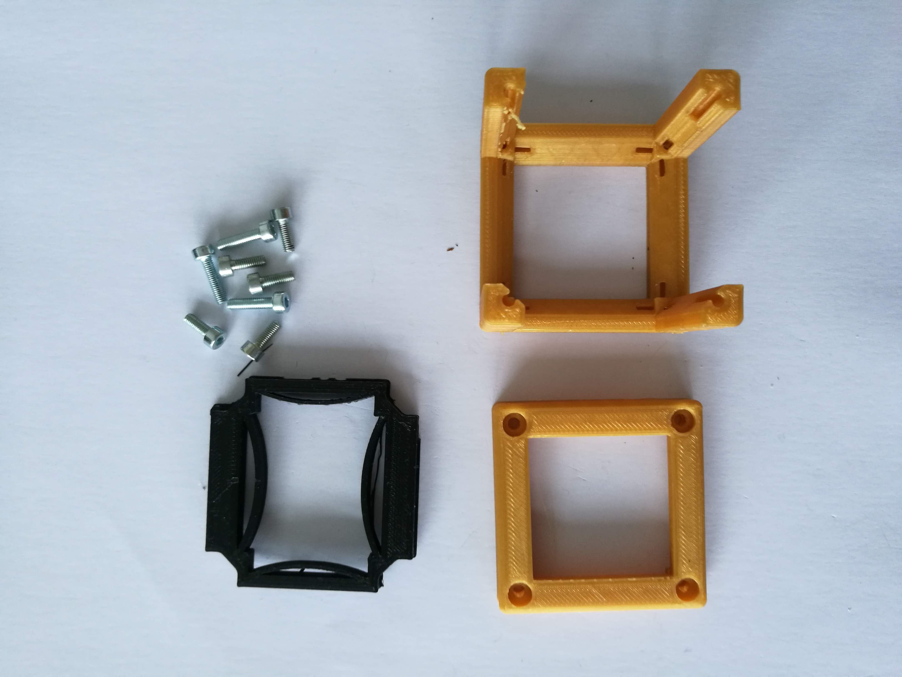
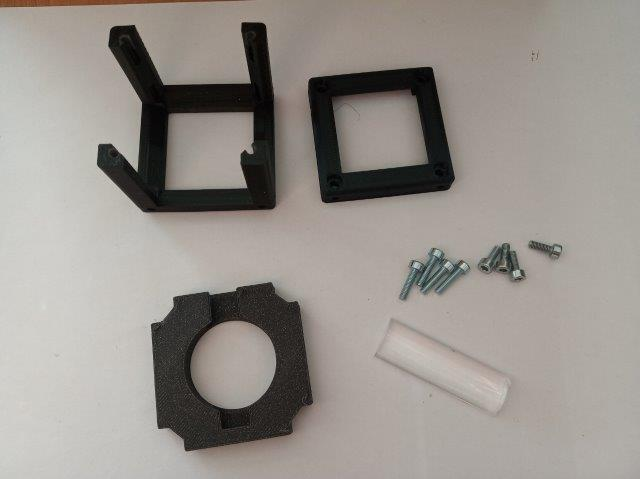
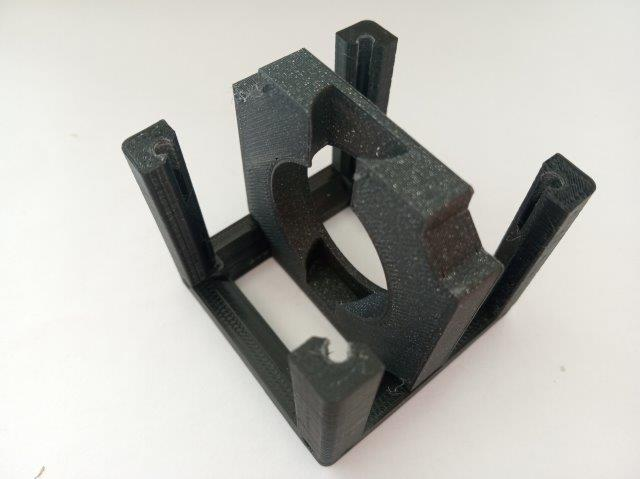
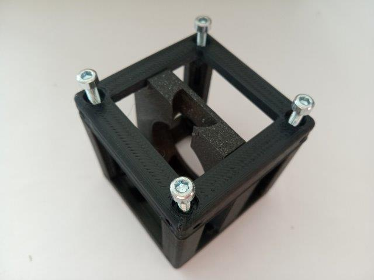
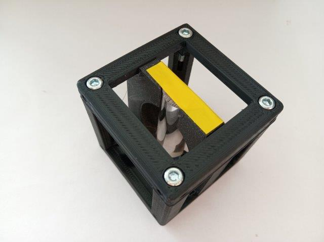

# Cylindrical Lens holder Cube
This is a lens-holder for rectangular (e.g. cylindrical) lenses.

To acquire the STL-files use the [UC2-Configurator](https://uc2configurator.netlify.app/). The files themselves are in the [RAW](../RAW/STL) folder. The module can be built using injection-moulded (IM) or 3D-printed (3DP) cubes.

## Purpose
It adapts the cylindrical lenses from COMAR optics to the UC2 system.

There is also a cheap alternative - using a half of a plexiglass rod. The focal length is shorter and the general performance is of course not as good as with a glass lens, but it is a truly home made cylindrical lens and it just works.

### Cylindrical lens (in the light sheet)
Like any other lens, a cylindrical lens focuses the incoming light. In case of a positive focal length, the focal spot can be found right after the lens inside the back focal plane (BFP), usually measured as the focal length of the lens. In case of a cylindrical lens, the focus spot is not a single point as in a rotationally symmetric lens, but rather a line like focus. This is because an incoming parallel beam gets focussed only in one direction. In the eye this sometimes happens and hinders clear eyesight by introducing astigmatism (greek: point-less)

More information:

* [What are cylindrical lenses?](https://www.edmundoptics.com/resources/application-notes/optics/what-are-cylinder-lenses/)
* Comar Optics, 63 YE 25, cylindrical lens 63, coated

### Properties
* design is derived from the base-cube
* the adapter can hold a rectangular lens

## Parts
The [Bill of Materials](https://docs.google.com/spreadsheets/d/1U1MndGKRCs0LKE5W8VGreCv9DJbQVQv7O6kgLlB6ZmE/edit?usp=sharing) is always the most up-to-date version!

###  3D printing parts
* No support needed in all designs
* Carefully remove all support structures (if applicable)

The Cube consists of the following components.

#### Default:
* **IM Cube** which houses the insert and adapts it into a UC2 setup.
* **The Lens Holder** which holds a rect. lens ([20_Cube_Insert_Lens_Cylindrical_v3.stl](../RAW/STL))

#### Alternatives:
* **3DP Cube** which will be screwed to the Lid. Here all the functions (i.e. Mirrors, LED's etc.) find their place ([10_Cube_1x1_v3.stl](../RAW/STL)) and **3DP Lid** which closes the Cube ([10_Lid_1x1_v3.stl](../RAW/STL)) - find the details in [ASSEMBLY_CUBE_Base](../ASSEMBLY_CUBE_Base)
* **The Lens Holder** which holds a plexiglass rod (half) ([UC2_20_Cube_Insert_Lens_Cylindrical_Plexiglas_glassslab_v3.stl](../RAW/STL))

###  Additional parts
* Check out the [RESOURCES](../../TUTORIALS/RESOURCES) for more information!
* Comar cylindrical lens, f' = 63 mm (63 YQ 40) [🢂](https://www.comaroptics.com/components/lenses/cylindrical-lenses/quality-planoconvex-cylindrical-lenses-visibleuv#row-63_yq_40)
* Plexiglass rod - half [🢂](https://www.ebay.de/itm/10-99-m-Acrylglas-Halb-Rundstab-15-mm-Hohe-7-5-mm-Lange-wahlbar/362697878979?hash=item54727a6dc3:g:WmAAAOSwUKxYm1H3)

##  Assembly
* Put the lens inside the insert
* Add the insert to the Cube
* Close the cube accordingly (IM/3DP)
* Done!

### Tutorial with images (Cylindrical lens)
:grey_exclamation: This tutorial shows a UC2_v2 cube but the assembly of the insert is still the same. For assembly of the cube (IM/3DP) check the [ASSEMBLY_CUBE_Base](../ASSEMBLY_CUBE_Base).

1. All parts for this model

2. Put all parts together

### Tutorial with images (Plexiglass rod)
:grey_exclamation: This tutorial shows a UC2_v2 cube but the assembly of the insert is still the same. For assembly of the cube (IM/3DP) check the [ASSEMBLY_CUBE_Base](../ASSEMBLY_CUBE_Base).

1. All parts for this model

2. Put the insert inside the cube

3. Close the cube

4. Insert the lens into the insert. You can fix it using some tape to keep it safe.

Note: How to get a pice with the right length? Be creative ;-) But also careful!

## Safety
Don't touch the lens' surfaces!
