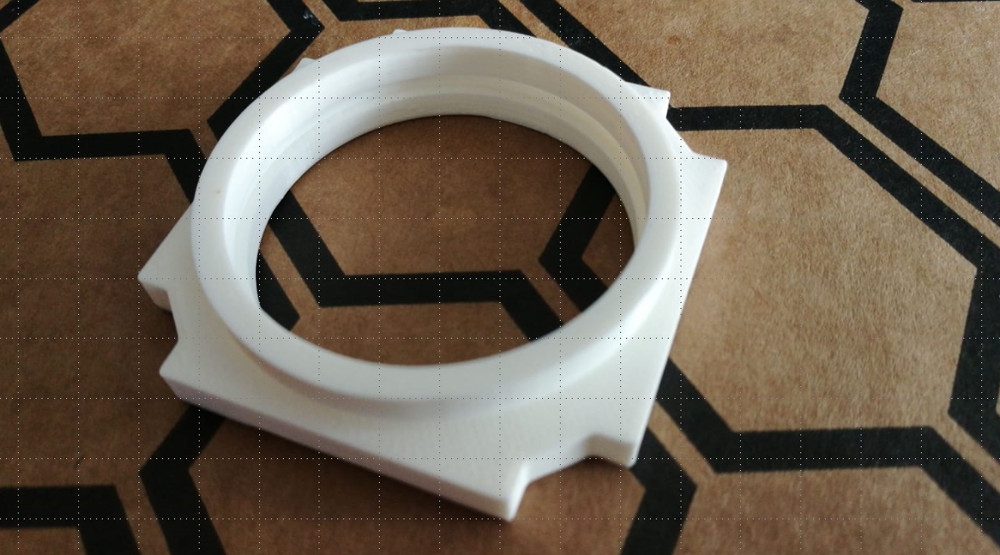
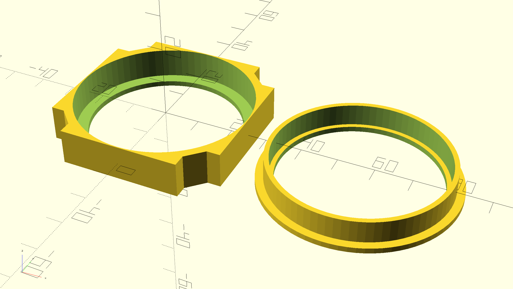

# Design your own Lens Holder  
## For any lens or round filter from ⌀9 mm to ⌀42 mm
Note: This holder is a bit different from the one we designed in Inventor - and better. The update of the STLs and Inventor files will be done in a near future ;)

### Using Thingiverse customizer
Go to the [Thingiverse page of this lens holder](https://www.thingiverse.com/thing:4377691) and use their in-built customizer to change the parameters of the insert. Ufortunately, the Thingiverse Customizer is for some time already not working in Google Chrome and Safari. Use a different browser to use the Customizer. 

### Using openSCAD
* Download the [UC2_Lens_insert_v2.scad](UC2_Lens_insert_v2.scad) file and open it in openSCAD
1. Use the Customizer
  * In the View menu, the option called [Hide customizer] must be unselected to display the customizer
  * Change the _lens diameter_ and _lens edge thickness_ to fit your lens
  * Choose whether you need both the holder and the clamp (most likely) or just one of them
  * Render it, export an STL file and print it
  

  
  

2. Change the parameters in the code
  * In the top of the code is the section called /* [User Parameters] */
  * Change the _lens_diameter_ and _lens_edge_thickness_ to fit your lens
  * Render it, export an STL file and print it
  * In case you're not happy with the way the clamp fits on the holder (it might vary among different 3D printers), you can also fiddle with any of the values in the code
  * If you have a suggestion for an improvement, please let us know! :-)

## For any lens or round filter from ⌀42 mm to ⌀50 mm
Go to the [Thingiverse page of this lens holder](https://www.thingiverse.com/thing:4580156) or use the [UC2_Lens_insert_v2_large_lens.scad](UC2_Lens_insert_v2_large_lens.scad) - the steps to follow are the same, but this holder has a different design, allowing you to put a big lens into the cube.

