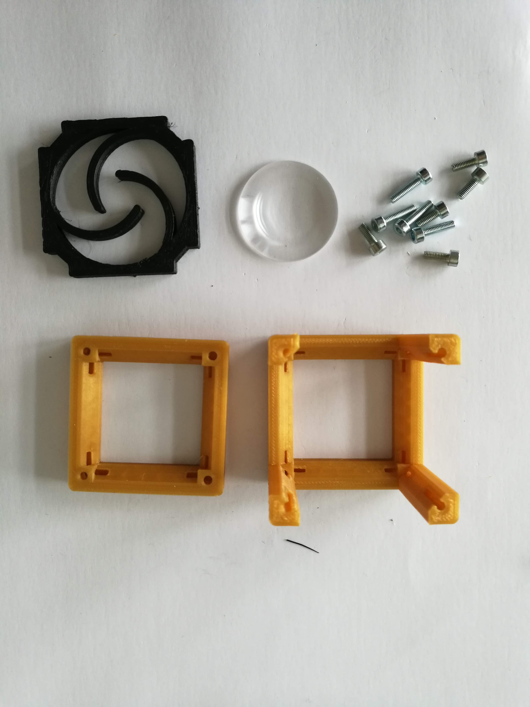

# Generic Lensholder Cube
This is the repository for the Generic Lensholder Cube.

The stl-files can be found in the folder [STL](./STL).

### Purpose
It adapts any circular symmetric lens with varying diameter to the UC2 system.

### Properties
* design is derived from the base-cube
* the adapter can hold a large variety of different lenses (differnt diameters/threads)
* the spiral automatically centers the lens to the optical axis
* the here used objective lens has the following parameters:
	* Thread: RMS
	* Magnification: 4x
	* NA: 0.1
	* Finite Corrected Optics

## Parts

### 3D printing parts
The Part consists of the following components.

* **The Lid** where the Arduino + Electronics finds its place
* **The Cube** which will be screwed to the Lid. Here all the functions (i.e. Mirrors, LED's etc.) find their place
* **The Objective/Lens Holder** which holds a lens with varying diamater and adapts it to the base cube

### Additional parts
* 8x DIN912 M3*12 screws (non stainless steel)
* Microscopic Objective lens, 4x, 0.1NA, RMS-Thread, Finite corrected or any lens < 16mm Diameter

## Remarks and Tips
### 3D Printing:
* No support required in all designs
* Carefully remove all support structures (if applicable)

## Assembly
* Mount the lens inside the insert
* Put the Insert inside the Cube
* Add all screws to the Cube
* Done!

###Tutorial with images (LENSHOLDER)
Don't insert batteries in the laser yet!!

1. All parts for this model

2. Put the lens inside the Spiral lens adapter (it auto centers)

3. Insert the insert into the Cube, add screws - Done!

## Safety
Attention, don't cut your fingers while removing the lens from the iPhone sensor!

Never (!) look into the laser pointer! It will damage your eye immediately!

* ATTENTION: NEVER WATCH DIRECTLY INTO THE LASER! EYE WILL BE DAMAGED DIRECTLY
* NEVER SWITCH ON THE LASER WITHOUT INTEDED USE
* BEAM HAS TO GO AWAY FROM ONESELF - ALWAYS!
