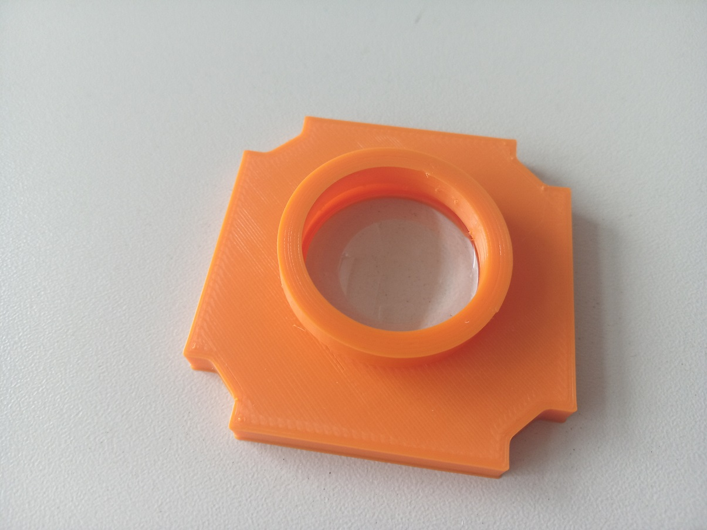
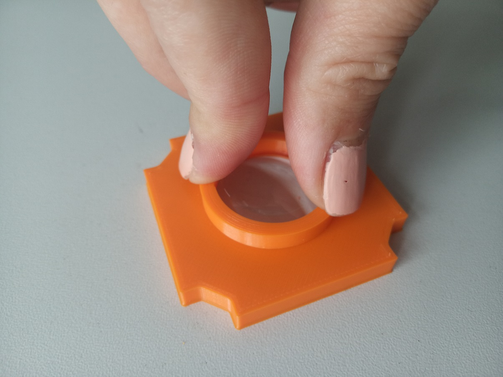
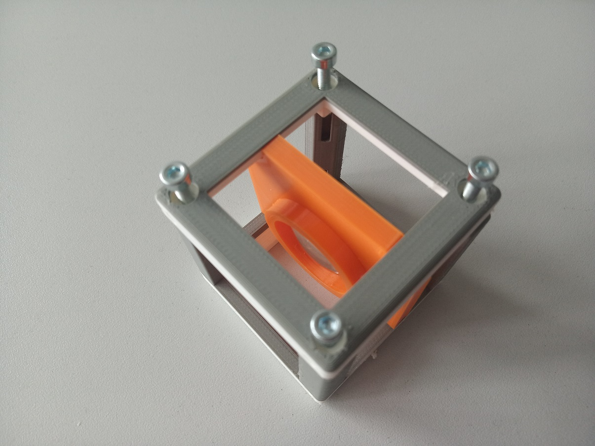

# Generic Lens Holder Cube
This is the repository for the Generic Lens Holder Cube.

The .stl files can be found in the folder [STL](./STL).

## Purpose
Spiral holder: It adapts any circular symmetric lens with varying diameter to the UC2 system.

Fixed holder: For the common lenses we also offer a more stable solution.

### Properties
* design is derived from the base-cube
* the adapter can hold a large variety of different lenses (different diameter/thickness)
* Spiral holder: the spiral automatically centers the lens to the optical axis
* Fixed holder: The lens is safely fixed in the holder without the risk of being disassembled by some curious user

## Parts

Note: [The holder we designed in openSCAD](./OPENSCAD) is a bit different and better than the one designed with Inventor. The Inventor files are still available [here](./INVENTOR).

###  3D printing parts
The Part consists of the following components.

* No support needed in all designs
* Carefully remove all support structures (if applicable)

#### Always
* **The Lid** where the Arduino + Electronics finds its place ([LID](./STL/10_Lid_1x1_v2.stl))
* **The Cube** which will be screwed to the Lid. Here all the functions (i.e. Mirrors, LED's etc.) find their place ([BASE](./STL/10_Cube_1x1_v2.stl))

#### Spiral holder
* **The Objective/Lens Holder** which holds a lens with varying diameter and adapts it to the base cube ([HOLDER](./STL/20_Cube_Insert_Objective_Holder.stl))

#### Fixed holder
There are two parts contained in one STL:
* **The Lens Holder** which holds a lens and adapts it to the base cube
* **The Lens Clamp** which holds the lens in the holder

For the frequently used lenses (the ones that are used in ou BOXes etc.) you can directly download the STLs:
* **+40 mm lens** ([Artikel 2120](https://optikbaukasten.de/)) - [LENS +40](./STL/UC2_Lens_insert_v2_40mm.stl)
* **+100 mm lens** ([Artikel 2004](https://optikbaukasten.de/)) - [LENS +100](./STL/UC2_Lens_insert_v2_100mm.stl)
* **-50 mm lens** ([LC1259](https://www.thorlabs.com/thorproduct.cfm?partnumber=LC1259)) - [LENS -50](./STL/UC2_Lens_insert_v2_-50mm.stl)

## Design your own Lens Holder  
For any lens or round filter from ⌀9 mm to ⌀50 mm  
* [OPENSCAD](./OPENSCAD)
* [INVENTOR TUTORIAL with images](./INVENTOR)

###  Additional parts
* Check out the [RESOURCES](../../TUTORIALS/RESOURCES) for more information!
* 8× DIN912 M3×12 screws (galvanized steel) [🢂](https://eshop.wuerth.de/Zylinderschraube-mit-Innensechskant-SHR-ZYL-ISO4762-88-IS25-A2K-M3X12/00843%20%2012.sku/de/DE/EUR/)
* alternatively: 4× M3×12 and 4× M3×8
* Microscope Objective lens (spiral holder) [🢂](https://de.aliexpress.com/item/4X-10X-20X-40X-60X-100X195-Augenmikroskops-System-Bio-Mikroskop-Biologische-Mikroskop-Lab-Labor-Achromatische-Objektiv/32947647522.html?spm=a2g0x.search0104.3.54.6cf57a4c3DwsTO&transAbTest=ae803_3&ws_ab_test=searchweb0_0%2Csearchweb201602_6_10065_10130_10068_10890_10547_319_10546_317_10548_10545_10696_10084_453_454_10083_10618_10307_537_536_10902_10059_10884_10887_321_322_10103%2Csearchweb201603_6%2CppcSwitch_0&algo_pvid=06d972be-b176-4446-8665-56d9e61a8d2c&algo_expid=06d972be-b176-4446-8665-56d9e61a8d2c-7)
* or any lens with corresponding diameter (fixed holder)

##  Assembly of the Spiral Lens Holder
* Mount the lens inside the insert
* Put the Insert inside the Cube
* Add all screws to the Cube
* Done!

### Tutorial with images (Spiral Lens Holder)

1. All parts for this model

1. Put the lens inside the Spiral lens adapter (it auto centers)

1. Insert the insert into the Cube, add screws - Done!

##  Assembly of Fixed Lens Holder
* Mount the lens inside the holder
* Put the clamp in, to hold the lens
* Put the Insert in the Cube
* Add all screws to the Cube
* Done!

### Tutorial with images (Fixed Lens Holder)

1. All parts for this model

1. Put the lens inside the holder. When using plano-convex lenses, put the plano-surface in the holder with the convex surface in the direction where the clamp will be. That way, your lens will be completely sunken in the holder and therefore more protected from being scratched.

1. Put the clamp on the rim of the holder a press it firmly. The lens shouldn't be able to move when you're done. Be careful not to touch the surface of the lens!

Using the holder for big lenses? It works pretty much the same:

4. Insert the insert into the Cube, add screws - Done!

## Safety
Don't touch the optical surfaces - fingerprints and scratches are bad for lenses!

Be careful not to burn yourself with the hot glue gun!
