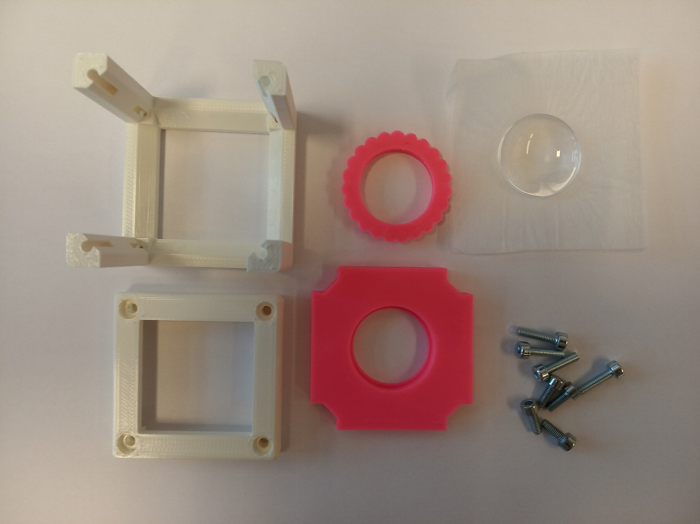
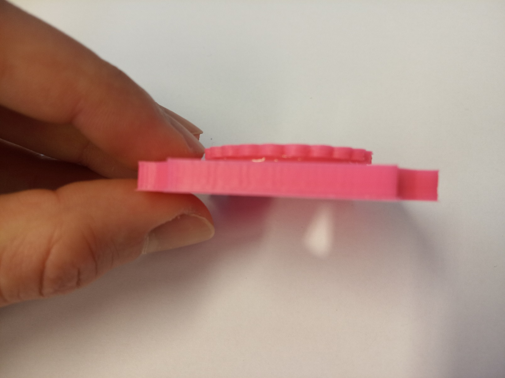

# TUT03: Give your first cube a function - lens as a magnifying glass
([TUT03 of TUTORIALS](../../../TUTORIALS) )  
This is a subsection of the repository for the [Generic Lens Holder Cube](../).

The .stl files can be found in the folder [STL](../STL).

### Purpose
The Lens Holder insert adapts a lens into the cube.

## Parts

###  3D printing parts
* No support needed in all designs
* Carefully remove all support structures (if applicable)

The Cube consists of the following components.

* **The Lid** where the Arduino + Electronics finds its place ([LID](../STL/10_Lid_1x1_v2.stl))
* **The Cube** which will be screwed to the Lid. Here all the functions (i.e. Mirrors, LED's etc.) find their place ([BASE](../STL/10_Cube_1x1_v2.stl))

For a thin convex 1 inch lens (like the one in additional parts):
* **The 1" Lens Holder** which holds a lens with 1 inch (25,4 mm) diameter and adapts it to the base cube ([HOLDER](../STL/1inch_Assembly_Insert_Lens_mount_fixed_20_Lens_holder.stl))
* **The 1" Lens Clamp** which holds a lens with 1 inch (25,4 mm) diameter in the holder ([CLAMP](../STL/1inch_Assembly_Insert_Lens_mount_fixed_20_Lens_holder_clamp.stl))

###  Additional parts
* 8× DIN912 M3×12 screws (galvanized steel) [🢂](https://eshop.wuerth.de/Zylinderschraube-mit-Innensechskant-SHR-ZYL-ISO4762-88-IS25-A2K-M3X12/00843%20%2012.sku/de/DE/EUR/)
* alternatively: 4× M3×12 and 4× M3×8
* Lens, f' = +40 mm (Artikel 2120) [🢂](https://optikbaukasten.de/)

##  Assembly
* Mount the lens inside the holder
* Put the clamp in, to hold the lens
* Put hot glue in the groove between the clamp and the holder - this way it will fix it permanently. The glue must never touch the lens!
* Put the Insert in the Cube
* Add all screws to the Cube
* Done!

### Tutorial with images

1. All parts for this model

1. Put the lens inside the holder. When using plano-convex lenses, put the plano-surface in the holder with the convex surface in the direction where the clamp will be. That way, your lens will be completely sunken in the holder and therefore more protected from scratching.

1. Put hot glue on the clamp as shown in the pictures. Do not use too much glue - you don't want to glue the clamp to the surface of the lens!

1. Press the clamp in the holder. The glue will fill the groove between the holder and the clamp's "flowery" rim. Be careful not to put any glue on the surface of the lens!

1. Insert the insert into the Cube, add screws - Done!

## Lens as a magnifying glass

A magnifying glass is simply a convex lens with small focal length. The magnification is given by

***M=  250 mm/flens*** ,

where 250 mm stands for a so called conventional near-point distance. It is given by accommodation properties of the eye. *f* is the focal length of the lens.

Place the cube with the lens on newspapers or any other small text in such a way that you will look on the text through the lens. Adjust the position of the insert in order to see the text with the highest possible magnification.

Now you can use it as a "reading stone" - the cube will keep the correct distance between the lens and the text and you just shift the cube over it.

Where next?  
Find out more about lenses in the [SimpleBOX manuals](../../../TheBOX/SimpleBOX/DOCUMENTS)     
Or return to the [TUTORIALS](../../../TUTORIALS)

## Safety
Don't touch the optical surfaces - fingerprints and scratches are bad for lenses!

Be careful not to burn yourself with the hot glue gun!
