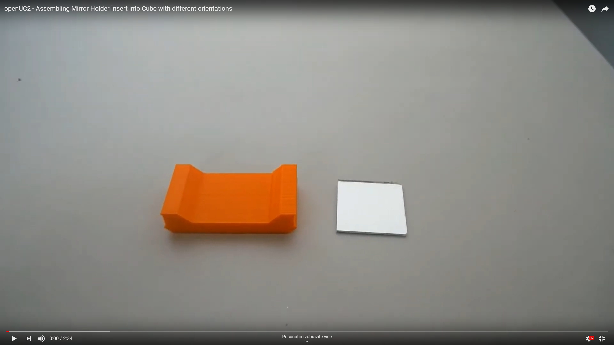

# Mirror Holder Cube
This is the repository for the Adjustable Mirror Holder Cube.

To acquire the STL-files use the [UC2-Configurator](). The files themselves are in the [RAW](../RAW/STL) folder. The module can be built using injection-moulded (IM) or 3D-printed (3DP) cubes.

## Purpose
It adapts a 30×30 mm ² fold-mirror to the UC2 system. Alternatively, we also have a design for a 1-inch mirror holder.

Due to limited space, we need to fold the beam using a mirror. This is done by reflecting the incoming light under an angle of 45°. It follows in a change of the optical axis by 90°

### Properties
* design is derived from the base-cube
* the adapter holds a 30×30 mm ² toy-mirror or a 1 inch circular mirror (e.g. Thorlabs part) at 45 degrees in a UC2 base cube
* the here used mirror has the following parameters:
	* Diameter: 25,4mm
	* Reflectance
	* Surface Flatness: (Peak to Valley) λ/10 @ 633 nm
	* Substrate Fused: Silica
	* Thickness: 6.0 mm (0.24")

## Parts
The [Bill of Materials](https://docs.google.com/spreadsheets/d/1U1MndGKRCs0LKE5W8VGreCv9DJbQVQv7O6kgLlB6ZmE/edit?usp=sharing) is always the most up-to-date version!

###  3D printing parts
* No support needed in all designs
* Carefully remove all support structures (if applicable)

The Cube consists of the following components.

#### Default:
* **IM Cube** which houses the insert and adapts it into a UC2 setup.
* **The Mirror Insert (30×30 mirror)** which holds a 30x30mm Mirror from Amazon and adapts it to the base cube ([20_Cube_Insert_Mirror_Holder_wLogo_v3.stl](../RAW/STL))

#### Alternatives:
* **3DP Cube** which will be screwed to the Lid. Here all the functions (i.e. Mirrors, LED's etc.) find their place ([10_Cube_1x1_v3.stl](../RAW/STL)) and **3DP Lid** which closes the Cube ([10_Lid_1x1_v3.stl](../RAW/STL)) - find the details in [ASSEMBLY_CUBE_Base](../ASSEMBLY_CUBE_Base)
* **The Mirror Insert (Thorlabs mirror)** which holds a 1-inch Mirror from Thorlabs and adapts it to the base cube ([20_Cube_Insert_Mirror_Holder_Thorlabs_v3.stl](../RAW/STL))

###  Additional parts
* Check out the [RESOURCES](../../TUTORIALS/RESOURCES) for more information!
* 1× 30×30 Mirror from Amazon [🢂](https://www.amazon.de/Rayher-14548606-Spiegelmosaik-selbstklebend-SB-Btl/dp/B008KJ8438/ref=pd_bxgy_201_img_3/258-8761405-4543762?_encoding=UTF8&pd_rd_i=B008KJ8438&pd_rd_r=80fd534c-997b-4a19-b91a-9bf38dbf4ade&pd_rd_w=4DEXV&pd_rd_wg=7SLRE&pf_rd_p=98c98f04-e797-4e4b-a352-48f7266a41af&pf_rd_r=N95R9S45MNSYNQX2BAJE&psc=1&refRID=N95R9S45MNSYNQX2BAJE)
* or 1× Thorlabs PF10-03-P01 - Protected Silver Mirror [🢂](https://www.thorlabs.com/newgrouppage9.cfm?objectgroup_id=903)

##  Assembly
* Add the mirror to the Insert
* Add the insert to the Cube
* Close the cube accordingly (IM/3DP)
* Done!

### Assembly Video Tutorial
:grey_exclamation: This tutorial shows a UC2_v2 cube but the assembly of the insert is still the same. For assembly of the cube (IM/3DP) check the [ASSEMBLY_CUBE_Base](../ASSEMBLY_CUBE_Base).

### Tutorial with images (30×30 mm² mirror)
:grey_exclamation: This tutorial shows a UC2_v2 cube but the assembly of the insert is still the same. For assembly of the cube (IM/3DP) check the [ASSEMBLY_CUBE_Base](../ASSEMBLY_CUBE_Base).

1. All parts for this model

2. Stick the mirror to the insert.

3. Put the insert inside the cube and close the lid using the screws.

4. Add screws to the other side of the cube - Done!

## Safety
Don't touch the mirror surface!
