# Kinematic Mirror Holder Cube - Diagonal
This is the repository for the Diagonal Kinematic Mirror Holder Cube.

To acquire the STL-files use the [UC2-Configurator](https://uc2configurator.netlify.app/). The files themselves are in the [RAW](../RAW/STL) folder. The module can be built using injection-moulded (IM) or 3D-printed (3DP) cubes.

## Purpose
It adapts a mirror to the UC2 system. It allows precise tilting in *x* and *y*.

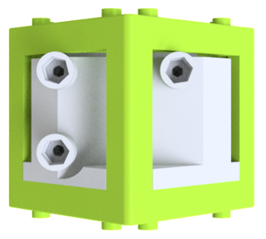

Due to limited space, we sometimes need to fold the beam using a mirror. This is done by reflecting the incoming light under an angle of 45°. It follows in a change of the optical axis by 90°.

### Properties
* design is derived from the base-cube
* the adapter holds a 30×30 mm ² toy-mirror or a 1 inch circular mirror (e.g. Thorlabs part) at 45 degrees in a UC2 base cube
* the here used mirror has the following parameters:
	* Diameter: 25,4mm
	* Reflectance
	* Surface Flatness: (Peak to Valley) λ/10 @ 633 nm
	* Substrate Fused: Silica
	* Thickness: 6.0 mm (0.24")

## Parts
The [Bill of Materials](https://docs.google.com/spreadsheets/d/1U1MndGKRCs0LKE5W8VGreCv9DJbQVQv7O6kgLlB6ZmE/edit?usp=sharing) is always the most up-to-date version!

###  3D printing parts
* No support needed in all designs
* Carefully remove all support structures (if applicable)

The Cube consists of the following components.

#### Default:
* **IM Cube** which houses the insert and adapts it into a UC2 setup.
* **The Kinematic Mirror Holder Base - part 1** which adapts the mirror into the cube ([20_Cube_Insert_Kinematic_Mirrormount_45_base_part1.stl](../RAW/STL)
* **The Kinematic Mirror Holder Base - part 2** which holds the three screws that change the tilt of the mirror ([20_Cube_Insert_Kinematic_Mirrormount_45_base_part2.stl](../RAW/STL))
* **The Mirror (30×30 mm) Holder for the Kinematic Mirror Holder** which holds the Mirror on the front side and three magnets on the back. For 30×30mm² Toy mirror ([20_Cube_Insert_Kinematic_Mirrormount_45_Plate.stl](../RAW/STL))
* **The M3 Adapter** for convenient manipulation of the screws ([30_Adapter_M3_nut.stl](../RAW/STL))

#### Alternatives:
* **3DP Cube** which will be screwed to the Lid. Here all the functions (i.e. Mirrors, LED's etc.) find their place ([10_Cube_1x1_v3.stl](../RAW/STL)) and **3DP Lid** which closes the Cube ([10_Lid_1x1_v3.stl](../RAW/STL)) - find the details in [ASSEMBLY_CUBE_Base](../ASSEMBLY_CUBE_Base)
* **The Mirror (Thorlabs) Holder for the Kinematic Mirror Holder** which holds the Mirror on the front side and three magnets on the back. For a 1 inch Thorlabs mirror ([20_Cube_Insert_Kinematic_Mirrormount_45_Thorlabsadapter.stl](../RAW/STL))

###  Additional parts
* Check out the [RESOURCES](../../TUTORIALS/RESOURCES) for more information!
* 5× DIN912 M3×12 screws (galvanized steel) [🢂](https://eshop.wuerth.de/Zylinderschraube-mit-Innensechskant-SHR-ZYL-ISO4762-88-IS25-A2K-M3X12/00843%20%2012.sku/de/DE/EUR/)
* 3× Ballmagnets, arbitrary diameter [🢂](https://www.magnetmax.de/Neodym-Kugelmagnete/Magnetkugel-Kugelmagnet-O-5-0-mm-Neodym-vernickelt-N40-haelt-400-g::158.html)
* 1× Mirror (e.g. Amazon 30×30mm² with double-sided sticky tape) [🢂](https://www.amazon.de/Rayher-14548606-Spiegelmosaik-selbstklebend-SB-Btl/dp/B008KJ8438/ref=pd_bxgy_201_img_3/258-8761405-4543762?_encoding=UTF8&pd_rd_i=B008KJ8438&pd_rd_r=80fd534c-997b-4a19-b91a-9bf38dbf4ade&pd_rd_w=4DEXV&pd_rd_wg=7SLRE&pf_rd_p=98c98f04-e797-4e4b-a352-48f7266a41af&pf_rd_r=N95R9S45MNSYNQX2BAJE&psc=1&refRID=N95R9S45MNSYNQX2BAJE)
* or 1× Thorlabs PF10-03-P01 - Protected Silver Mirror [🢂](https://www.thorlabs.com/newgrouppage9.cfm?objectgroup_id=903)
* For better precision, we use a custom cut metal plate (30×40 mm, galvanized steel) instead of the 3D-printed plate to hold the mirror.

##  Assembly
* Remove any support and clean the part
* Insert three M3 screw into the holes in the mirror holder. There are four holes - the one in the center of the part stays empty! Make sure you are using the correct holes
* Attach the part with the screws to the bottom of the base
* Slide the mirror holder into the Cube
* Close the cube accordingly (IM/3DP)
* Insert the ballmagnets into the mirror holder.
* Glue/Insert your mirror to the holder. For the sticky mirror: place the mirror roughly in the center of the plate
* Attach the mirror holder to the ends of the screws of the kinematic mirror base using the magnets of the mirror holder and the screws of the base
* Done!

### Tutorial with images
1. All parts for this model

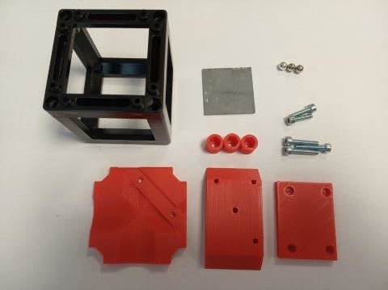

2. Assemble the base of the kinematic mirror. Attach the bottom part to the top one using two M3×12 screws.

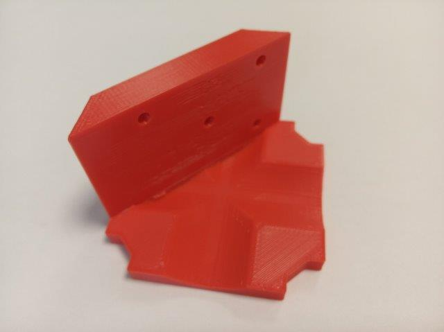
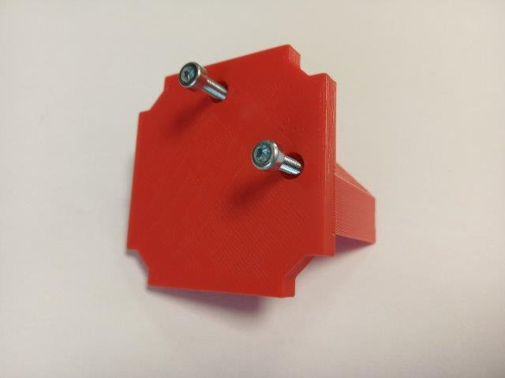
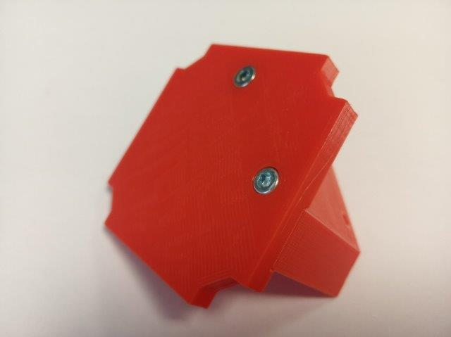

3. Assemble the kinematic screws. Screw a M3×18 screw all the way into the printed head. In case the printed head is too loose, you may fix it using an M3 nut. Do this for all three screws.

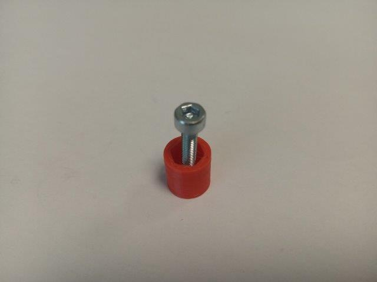
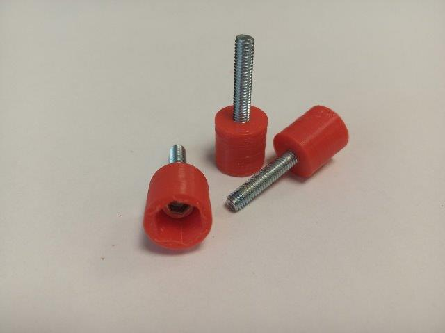

4. Insert the kinematic screws into the base. They should be about half the way through.

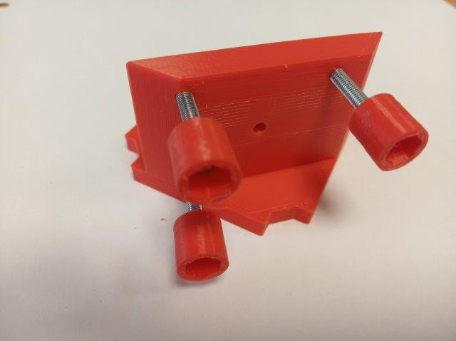
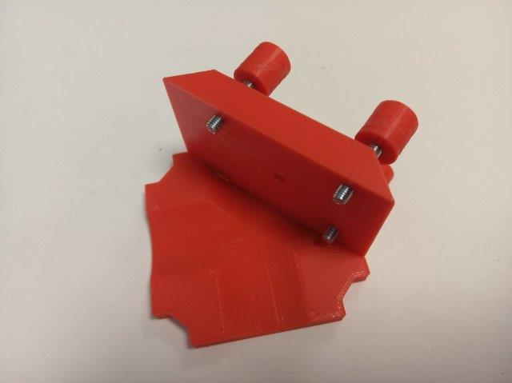

5. assemble the mirror plate. Press the magnets into the holes using pliers. Be careful to put magnets into the right holes - they have to match the screws of the base.

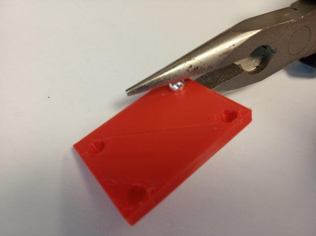
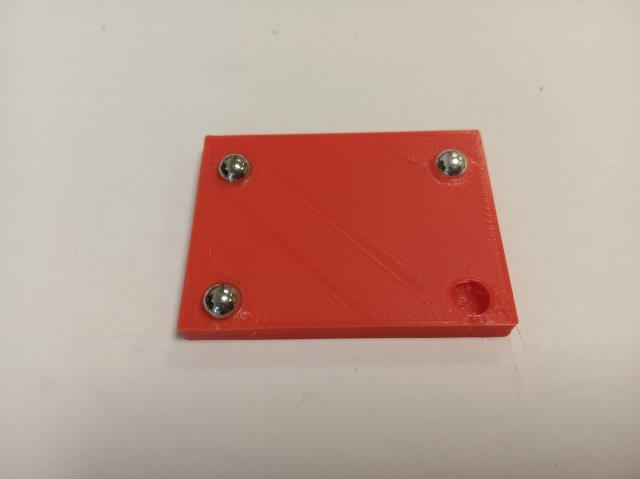

6. Stick the mirror to the plate.

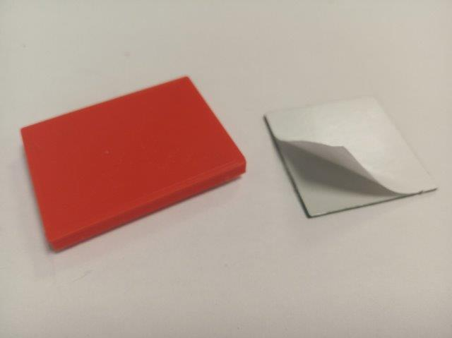
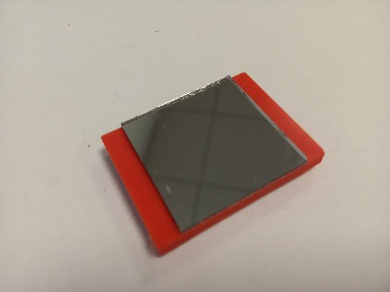

7. Attach the mirror plate to the base via their screws and magnets.

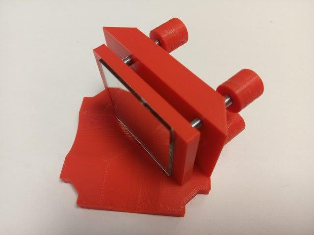

8. Here you see the 3D printed plates for the toy mirror and for 1" mirror. Both of them are found among the STL files.  
	**Note:**  
	The previous version of this module used a metal plate instead of the 3D printed plate. However, the metal plates are not generally available (We had them custom cut in a mechanical workshop).   
	The metal plates limit the play between the magnets and screws, so it might be a more stable solution.

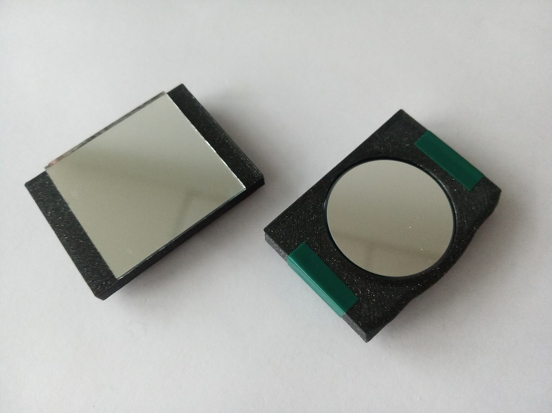

9. Place the insert inside a Cube and close it - done!

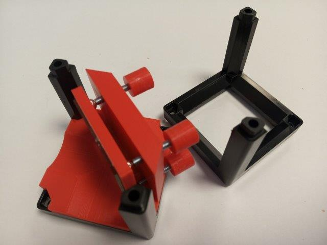
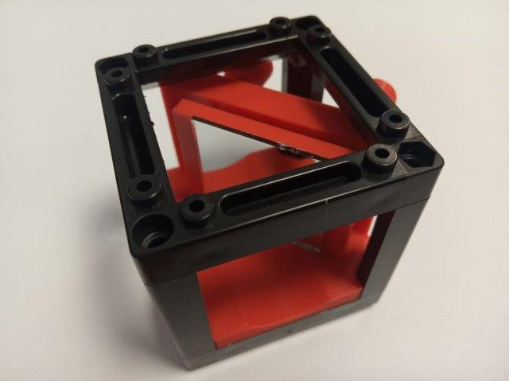

## Safety
Don't touch the mirror surface!
