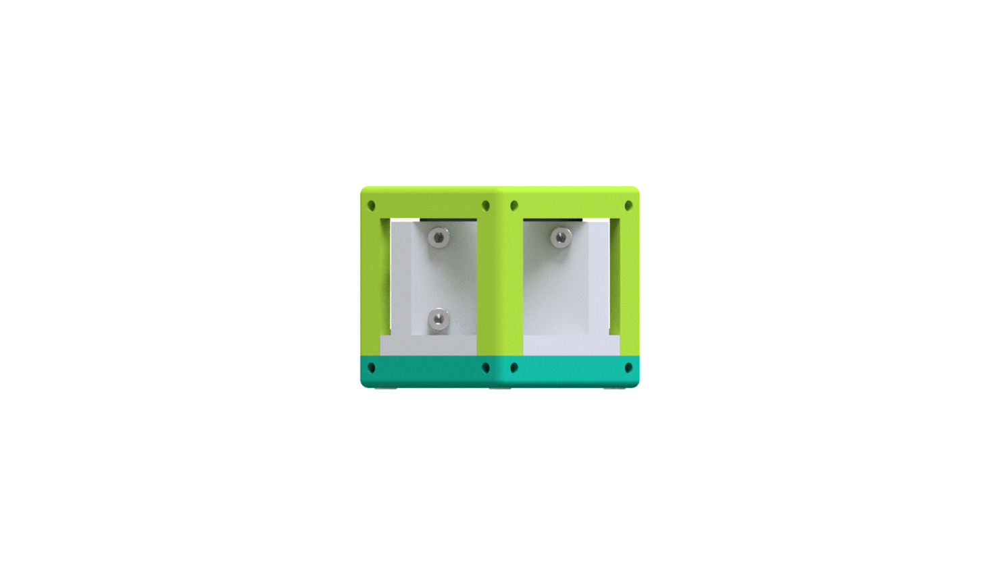
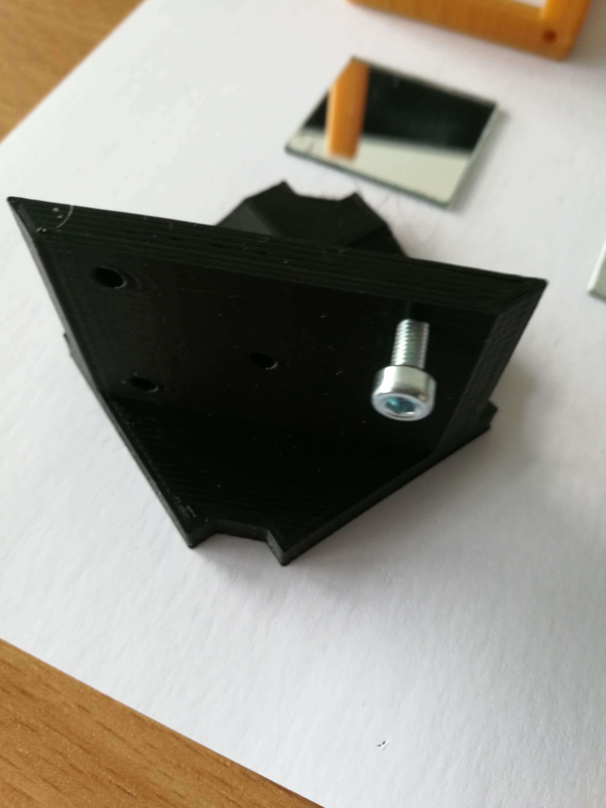
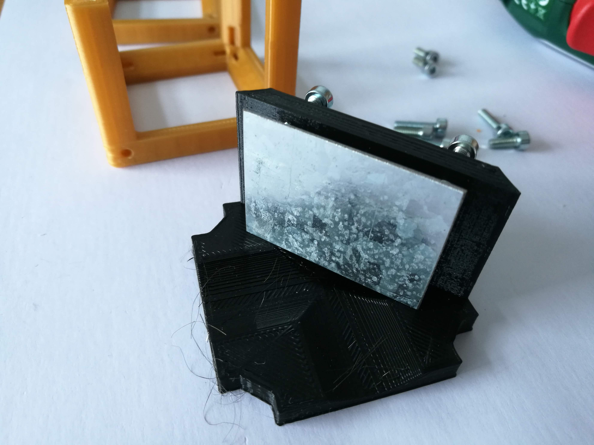
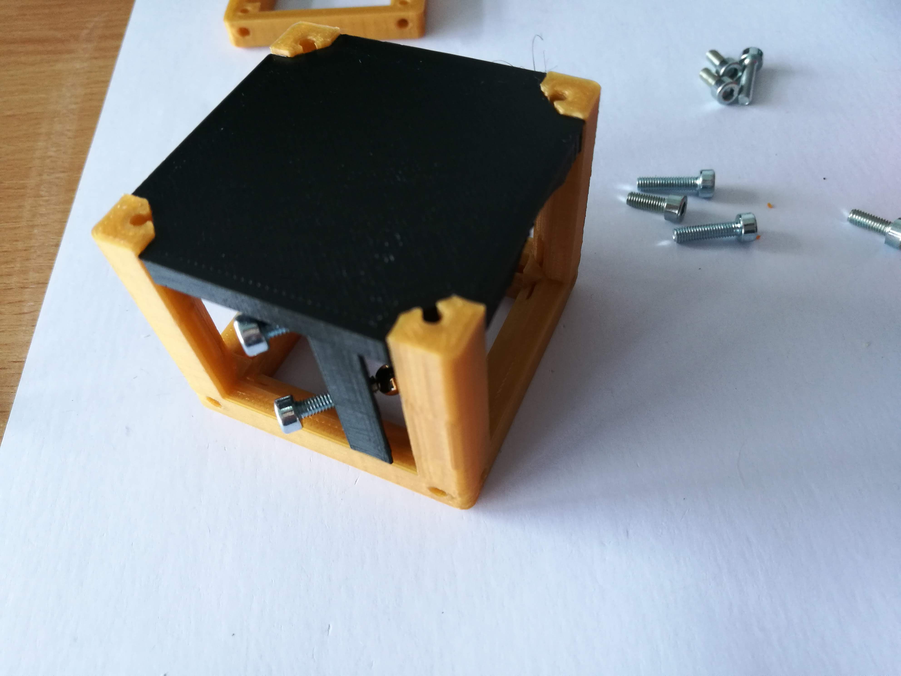

# Kinematic Mirror Holder Cube - Diagonal
This is the repository for the Diagonal Kinematic Mirror Holder Cube.

The stl-files can be found in the folder [STL](./STL).

### Purpose
It adapts a mirror to the UC2 system. It allows precise tilting in *x* and *y*.

Due to limited space, we sometimes need to fold the beam using a mirror. This is done by reflecting the incoming light under an angle of 45°. It follows in a change of the optical axis by 90°.

## Properties
* design is derived from the base-cube

## Parts

###  3D printing parts
The Part consists of the following components.

* **The Lid** where the Arduino + Electronics finds its place ([LID](./STL/10_Lid_1x1_v2.stl))
* **The Cube** which will be screwed to the Lid. Here all the functions (i.e. Mirrors, LED's etc.) find their place ([BASE](./STL/10_Cube_1x1_v2.stl))
* **The Kinematic Mirror Holder** which holds a Mirror and adapts it to the base cube ([INSERT](./STL/20_Cube_Insert_Kinematic_Mirrormount_45_base.stl))

###  Additional parts
* 7× DIN912 M3*12 screws (non stainless steel)
* 3× Ballmagnets, arbitrary diameter
* Metalplate, 30×40 mm2, magnetic material (e.g. Nickel)
* 1× Mirror (e.g. Amazon 30x30mm with double-sided sticky tape )

## Remarks and Tips
### 3D Printing:
* No support required in all designs
* Carefully remove all support structures (if applicable)

##  Assembly
* Remove any support and clean the part
* Insert three M3 screw into the holes in the mirror holder. There are four holes - the one in the center of the part stays empty! Make sure you are using the correct holes
* Slide the mirror holder into the Cube
* Add the lid and fix it using a set of M3 screws
* Glue your mirror to the metal Metalplate. Place the mirror roughly in the center of the plate
* Attach the Metalplate, which carries the mirror, to the ends of the screws of the Mirror holder using the magnets
* Done!

### Tutorial with images

1. All parts for this model

2. Add M3 scews to the insert

3. Add Ballmagnets to the screws

4. Add the magnetic plate to the Ballmagnets

5. Glue the mirror onto the magnetic plate

6. Put the insert in the cube

7. Add the M3 Screws - Done.

## Safety
Don't touch the mirror surface!

When working with lasers:  

Never (!) look into the laser pointer! It will damage your eye immediately!

* ATTENTION: NEVER WATCH DIRECTLY INTO THE LASER! EYE WILL BE DAMAGED DIRECTLY
* NEVER SWITCH ON THE LASER WITHOUT INTEDED USE
* BEAM HAS TO GO AWAY FROM ONESELF - ALWAYS!
