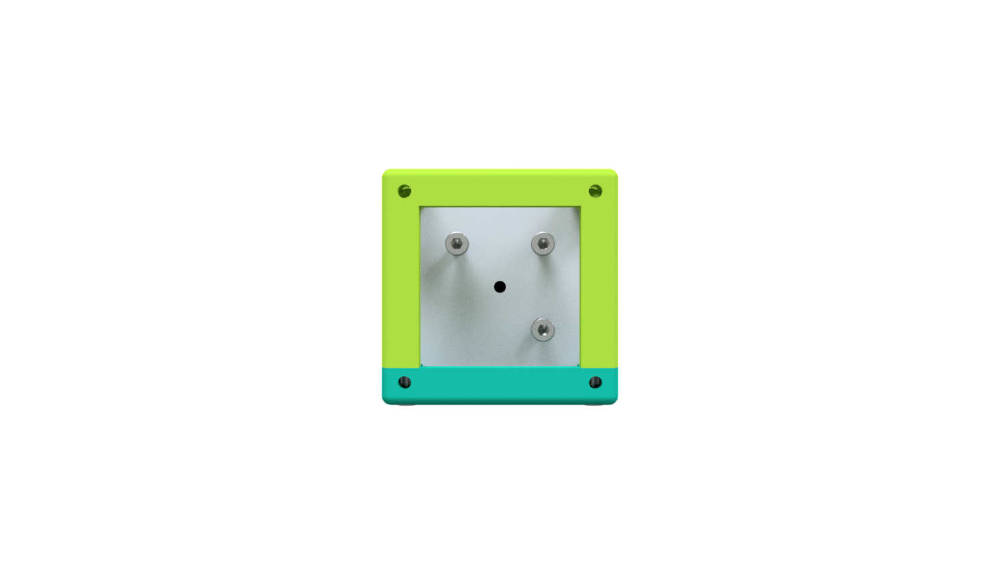
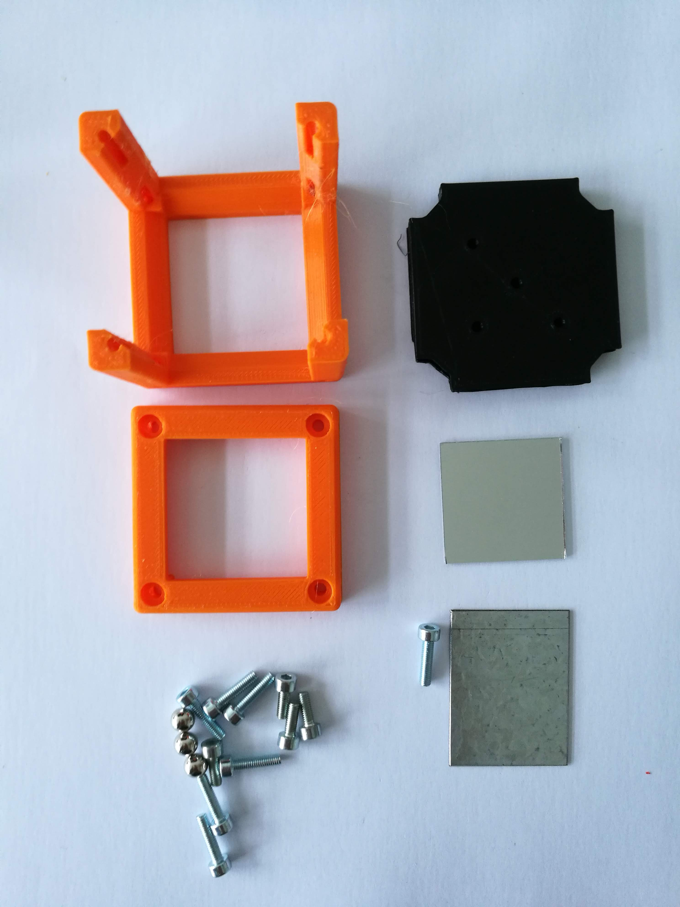
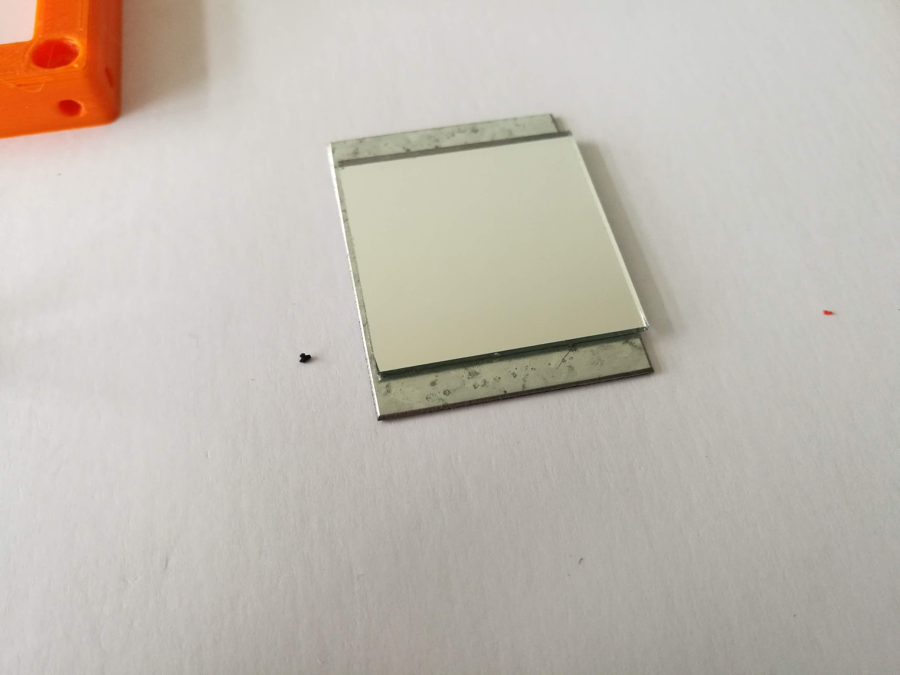
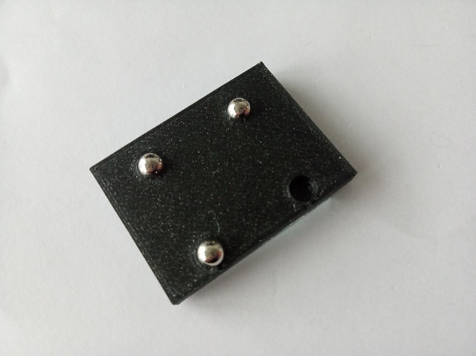

# Kinematic Mirror Holder Cube
This is the repository for the Kinematic Mirror Holder Cube.

The stl-files can be found in the folder [STL](./STL).

## Purpose
It adapts a mirror to the UC2 system. It allows precise tilting in *x* and *y*.

### Properties
* design is derived from the base-cube

## Parts

###  3D printing parts
* No support needed in all designs
* Carefully remove all support structures (if applicable)

The Cube consists of the following components.

* **The Lid** where the Arduino + Electronics finds its place ([LID](./STL/10_Lid_1x1_v2.stl))
* **The Cube** which will be screwed to the Lid. Here all the functions (i.e. Mirrors, LED's etc.) find their place ([BASE](./STL/10_Cube_1x1_v2.stl))
* **The Kinematic Mirror Holder Base** which holds the three screws that change the tilt of the mirror ([INSERT](./STL/20_Cube_Insert_Kinematic_Mirrormount_base.stl))
* **The Mirror Holder for the Kinematic Mirror Holder** which holds the Mirror on the front side and three magnets on the back. For 30×30mm² Toy mirror ([SQUARE MIRROR HOLDER](./STL/20_Cube_Insert_Kinematic_Mirrormount_Plate.stl))

###  Additional parts
* Check out the [RESOURCES](../../TUTORIALS/RESOURCES) for more information!
* 11× DIN912 M3×12 screws (galvanized steel) [🢂](https://eshop.wuerth.de/Zylinderschraube-mit-Innensechskant-SHR-ZYL-ISO4762-88-IS25-A2K-M3X12/00843%20%2012.sku/de/DE/EUR/)
* 3× Ballmagnets, arbitrary diameter [🢂](https://www.magnetmax.de/Neodym-Kugelmagnete/Magnetkugel-Kugelmagnet-O-5-0-mm-Neodym-vernickelt-N40-haelt-400-g::158.html)
* 1× Mirror (e.g. Amazon 30×30mm² with double-sided sticky tape) [🢂](https://www.amazon.de/Rayher-14548606-Spiegelmosaik-selbstklebend-SB-Btl/dp/B008KJ8438/ref=pd_bxgy_201_img_3/258-8761405-4543762?_encoding=UTF8&pd_rd_i=B008KJ8438&pd_rd_r=80fd534c-997b-4a19-b91a-9bf38dbf4ade&pd_rd_w=4DEXV&pd_rd_wg=7SLRE&pf_rd_p=98c98f04-e797-4e4b-a352-48f7266a41af&pf_rd_r=N95R9S45MNSYNQX2BAJE&psc=1&refRID=N95R9S45MNSYNQX2BAJE)

##  Assembly
* Remove any support and clean the part
* Insert three M3 screw into the holes in the mirror holder. There are four holes - the one in the center of the part stays empty! Make sure you are using the correct holes
* Slide the mirror holder into the Cube
* Add the lid and fix it using a set of M3 screws
* Insert the ballmagnets into the mirror holder.
* Glue/Insert your mirror to the holder. For the sticky mirror: place the mirror roughly in the center of the plate
* Attach the mirror holder to the ends of the screws of the kinematic mirror base using the magnets of the mirror holder and the screws of the base
* Done!

### Tutorial with images
**Note:  
The previous version of this module used a metal plate instead of the 3D printed plate. We got rid of the metal plates, since they are not generally available. Other than the, the assembly is still the same - have a look in step 8.  
The metal plates limit the play between the magnets and screws, so it might be a more stable solution. However, they are not generally available components (We had them custom cut in a mechanical workshop).**

1. All parts for this model

1. Add M3 screws and Ballmagnets to the insert

1. Glue the Mirror to the Metal plate

1. Add the magnetic mirror plate to the 3 Ballmagents

1. Put the insert inside the cube, add Screws - Done!

1. Here you see the 3D printed plate. Simply press the ballmagnets into the holes of the plate using pliers.

  

1. In the end it should look like this:

  

## Safety
Don't touch the mirror surface!
