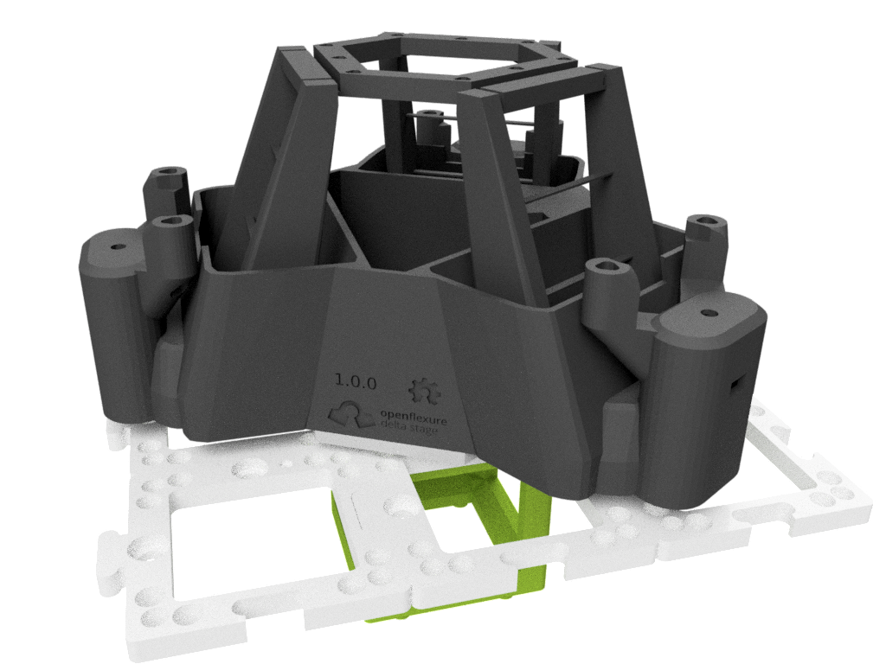
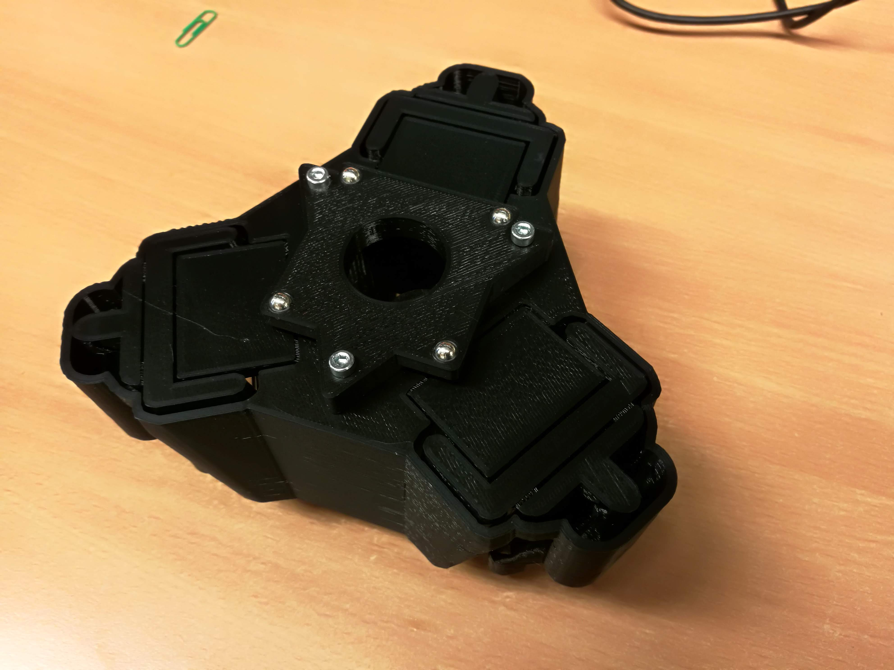

# Cube Insert OpenFlexure (Delta) Stage
This part adapts the OpenFlexure Delta-stage from Richard Bowman's group at the Bath University to the modular optical system UC2. It is basically a plate which has  4 ball-magnets on one side to adapt to 1 UC2 cubes and a flat surface equipped with 3 holes to adapt to the openflexure delta-stage.

It's a work in progress!

A discussion dedicated to this topic can be found [here](https://gitlab.com/openflexure/openflexure-delta-stage/.

## Purpose
The [OpenFlexure Stage](https://www.openflexure.org) can be downloaded from the official [GitLab](https://gitlab.com/openflexure/openflexure-microscope)-Repository. It's a monolithic XYZ-stage with tremendous precision.

## Properties

OpenFlexure Stage stacked on the UC2 cubes. A fold-mirror can redirect the beam from the objective lens inside the Z-slide of the stage.

The Ball-Magnets visualized from below.

## Parts

To acquire the STL-files use the [UC2-Configurator](https://uc2configurator.netlify.app/). The files themselves are in the [RAW](../RAW/STL) folder. The module can be built using injection-moulded (IM) or 3D-printed (3DP) cubes.

### 3D printing parts
..can be found in the [STL](./STL)-folder.

1. **The Adapter** which connects one UC2 cubes to the Flexure Delga-Stage

### Additional parts
Here we list all parts which need to be bought from different sources.

|  Name | Properties  |  Price | Link  | # |
|---|---|---|---|---|
|  Screws | M3 screws for mounting the stage | 1€  | [Various]()  | 6 |
|  Screws | M5 screws for mounting the plate to the basplates  | 1€  | [Various]()  | 6 |

## Remarks and Tips

### 3D Printing
Print as is without support. Infill can be around 30%.

## Safety
Take care in case you're dealing with lasers. Don't burn yourself if you solder the part!