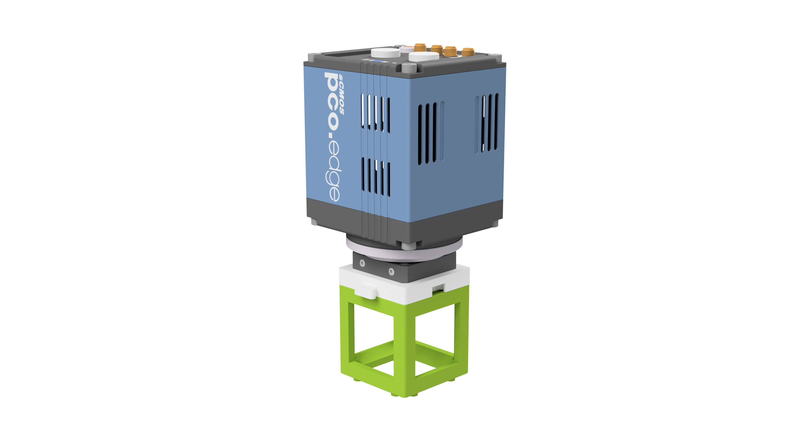
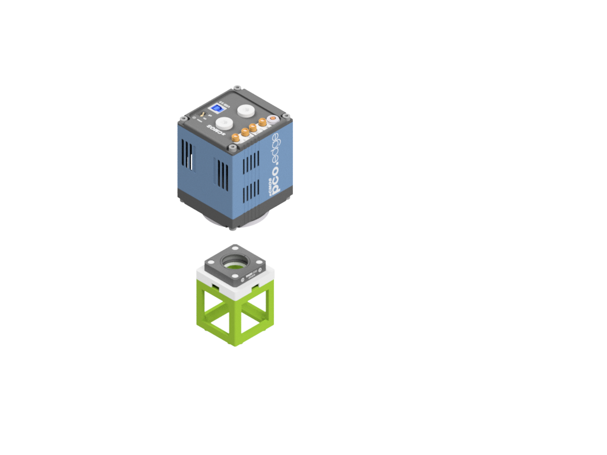
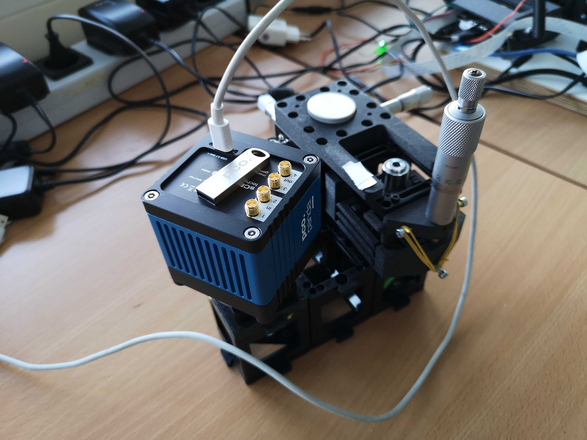

# Camera Cube (PCO PAnda / CMOUNT)

This is the repository for the Camera Cube which hosts a sophisticated scientific camera (e.g. PCO Panda sCMOS).

To acquire the STL-files use the [UC2-Configurator](https://uc2configurator.netlify.app/). The files themselves are in the [RAW](../RAW/STL) folder. The module can be built using injection-moulded (IM) or 3D-printed (3DP) cubes.

## Purpose

It adapts a camera with a C-mount to the UC2 system.

The sensor is put into an adapter which holds the camera in the center of the cube. The height can be varied by sliding the adapter along the slides.

### Properties
* design is derived from the base-plate
* Basicallly it holds a Thorlabs cage which then adapts a C-mount adapter

## Parts
The [Bill of Materials](https://docs.google.com/spreadsheets/d/1U1MndGKRCs0LKE5W8VGreCv9DJbQVQv7O6kgLlB6ZmE/edit?usp=sharing) is always the most up-to-date version!

###  3D printing parts
* No support needed in all designs
* Carefully remove all support structures (if applicable)

The Cube consists of the following components.

#### Default:
* **IM Cube** which houses the insert and adapts it into a UC2 setup.
* **The Camera Insert** which holds the camera and makes it adaptable to the base-cube ([20_Cube_insert_AlliedVision_Alvium_v3.stl](../RAW/STL))

#### Alternatives:
* **3DP Cube** which will be screwed to the Lid. Here all the functions (i.e. Mirrors, LED's etc.) find their place ([10_Cube_1x1_v3.stl](../RAW/STL)) and **3DP Lid** which closes the Cube ([10_Lid_1x1_v3.stl](../RAW/STL)) - find the details in [ASSEMBLY_CUBE_Base](../ASSEMBLY_CUBE_Base)
* **The Adjustable Camera Insert** which holds the camera and makes it adaptable to the base-cube and makes it possible to slide it through the cube and fix its position with screws ([20_Cube_insert_AlliedVision_Alvium_adjustable.stl](../RAW/STL))

###  Additional parts
* Check out the [RESOURCES](../../TUTORIALS/RESOURCES) for more information!
* 1x Thorlabs Cage [🢂](https://www.thorlabs.com/thorproduct.cfm?partnumber=CP33/M)
* 1x CMount-to-Thorlabs SM1 adapter (Thorlabs) [🢂](https://www.thorlabs.com/thorproduct.cfm?partnumber=SM1A39)
* PCO Panda 

##  Assembly
* Mount the camera to the insert using the C-Mount adapter
* Mount the Thorlabs cage on the UC2 Adapter
* Mount the Thorlabse'd Adapter on the cube
* Mount the camer to the Thorlabs Adapter
* Done!

Once it's done it looks like this:

# Showcase 

