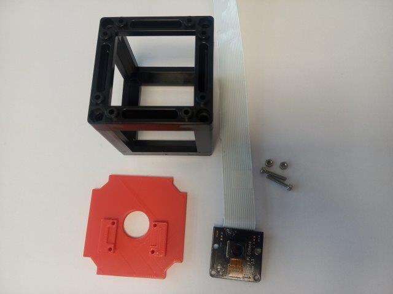
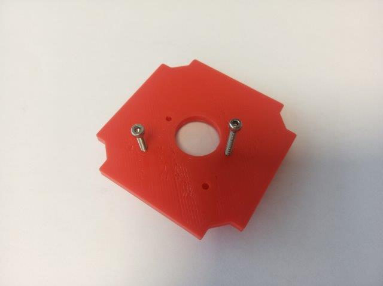
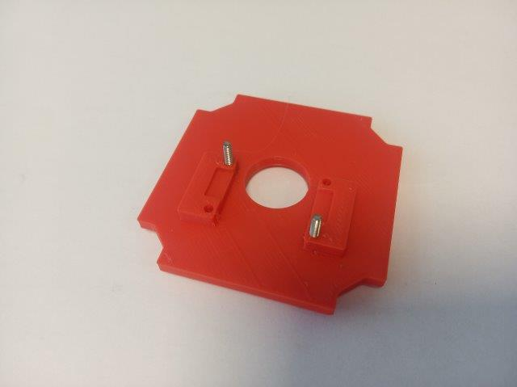
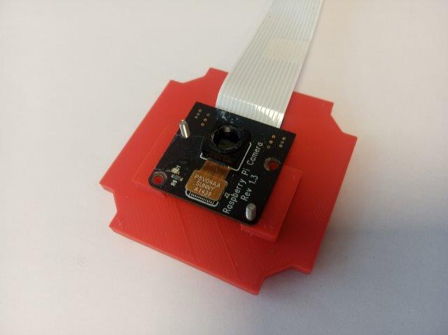
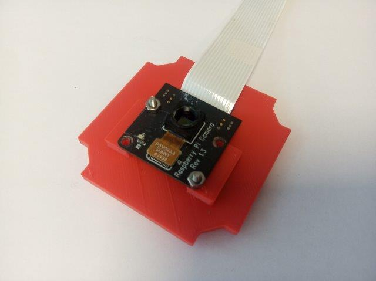
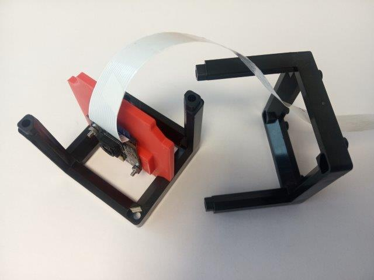
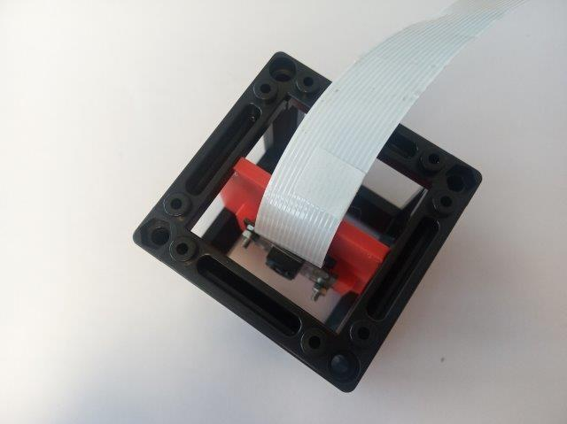

# Camera Cube
This is the repository for the Camera Cube.

To acquire the STL-files use the [UC2-Configurator](https://uc2configurator.netlify.app/). The files themselves are in the [RAW](../RAW/STL) folder. The module can be built using injection-moulded (IM) or 3D-printed (3DP) cubes.

## Purpose
It adapts a standard Raspberry Pi Camera (v1, v2) to the UC2 system.

The sensor (w/wo lens) is put into an adapter which holds the camera in the center of the cube. The height can be varied by sliding the adapter along the slides. It is designed to eventually hold (fluorescent) filters. The camera need to be fixed with a set of screws. M2×10mm in combination with nuts work best.

### Properties
* design is derived from the base-cube
* camera adapter can be adjusted to individual needs

## Parts
The [Bill of Materials](https://docs.google.com/spreadsheets/d/1U1MndGKRCs0LKE5W8VGreCv9DJbQVQv7O6kgLlB6ZmE/edit?usp=sharing) is always the most up-to-date version!

###  3D printing parts
* No support needed in all designs
* Carefully remove all support structures (if applicable)

The Cube consists of the following components.

#### Default:
* **IM Cube** which houses the insert and adapts it into a UC2 setup.
* **The Camera Insert** which holds the camera and makes it adaptable to the base-cube ([20_Cube_Insert_RaspiCam_v3.stl](../RAW/STL))

#### Alternatives:
* **3DP Cube** which will be screwed to the Lid. Here all the functions (i.e. Mirrors, LED's etc.) find their place ([10_Cube_1x1_v3.stl](../RAW/STL)) and **3DP Lid** which closes the Cube ([10_Lid_1x1_v3.stl](../RAW/STL)) - find the details in [ASSEMBLY_CUBE_Base](../ASSEMBLY_CUBE_Base)
* The **Sample Holder** in front on the camera is needed in the [In-line holography application](../../APPLICATIONS/APP_INLINE_HOLOGRAM)
* **The Sample holder Insert** that can hold the pinhole in front of the LED ([20_Cube_insert_Sample_holder_v3.stl](../RAW/STL))
* **The Sample holder clamp** that fixes the pinhole in its position ([20_Cube_Insert_Sample_clamp.stl](../RAW/STL))

###  Additional parts
* Check out the [RESOURCES](../../TUTORIALS/RESOURCES) for more information!
* 1× Raspi Camera (v1, v2) [🢂](https://www.amazon.de/Raspberry-Pi-v2-1-1080P-Kamera-Modul/dp/B01ER2SMHY/ref=sr_1_4?__mk_de_DE=%C3%85M%C3%85%C5%BD%C3%95%C3%91&crid=1LUZK9XHFS5CX&keywords=raspberry+pi+camera+v2.1&qid=1565008837&s=gateway&sprefix=raspberry+pi+camera+%2Caps%2C163&sr=8-4)
* 1× long cable for Raspi Camera [🢂](https://www.az-delivery.de/collections/raspberry-pi-kamera-zubehor/products/100cmflexkabel?ls=de)
* 2× M2*10 screws (best: plastic)
* 2× M2 nuts (best: plastic)

##  Assembly
* Mount the flex cable to the raspi-cam
* Mount the camera board to the Camera Insert using the 2 M2 screws
* Fix the position by mounting the two nuts. Take care to not destroy the camera'S PCB
* Take the mounted camera adapter inlet and slide it into the base-cube
* Close the cube accordingly (IM/3DP)
* Done!

### Tutorial with images

1. All parts for this model  
For most applications you need to remove the lens of the RasPi camera. It is also advisable to use a longer cable (100 cm)

2. Screw the two M2 through the insert from the back side. There are four holes but two screws are enough. Best, choose the position of the screws to hold the camera diagonally.

3. Turn the insert around and place the camera on it, fitting on the screws. Gently, by hand, tigthen the screws with two M2 nuts. Be careful not to destroy the camera! It's fragile.

4. Place the insert into the Cube. Don't break the cable, make sure it leave the Cube through an open face. Close the Cube - Done!

## Safety
Be careful with the camera's PCB. It's sensible to electronic static discharge!
