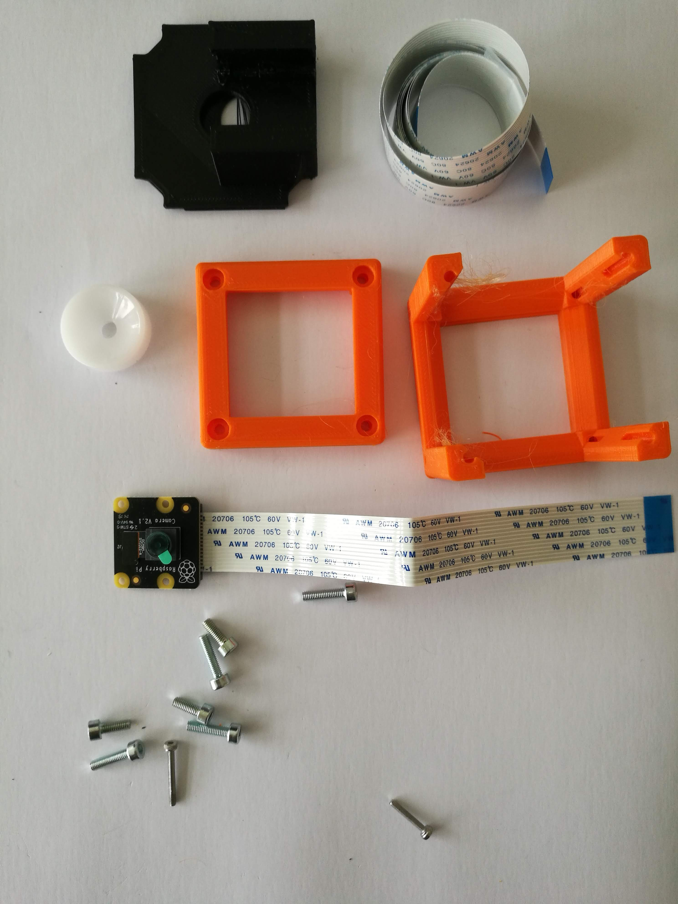
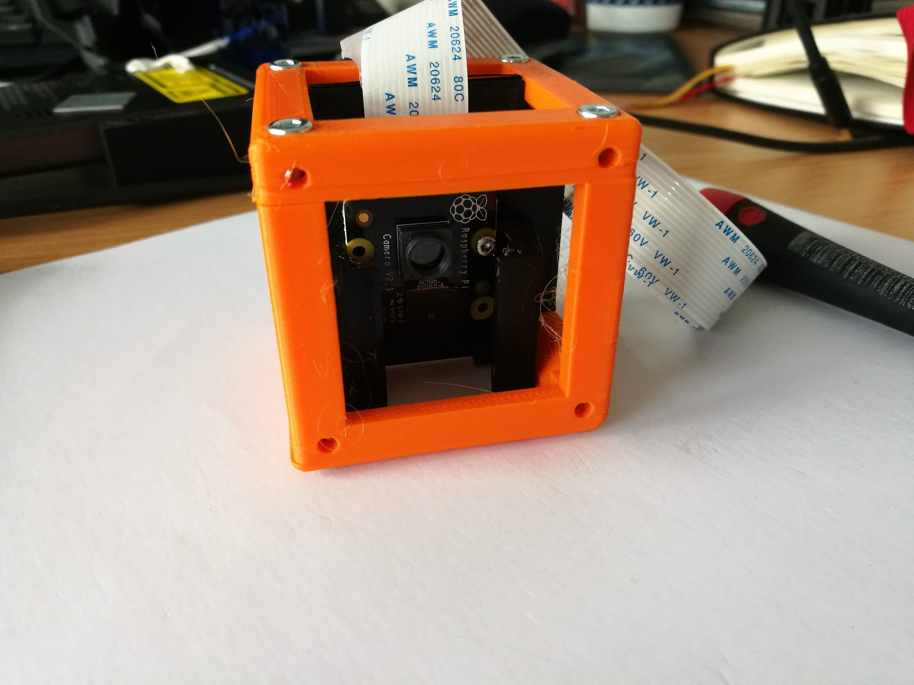

# Camera Cube
This is the repository for the Camera Cube.

The stl-files can be found in the folder [STL](./STL).

## Purpose
It adapts a standard Raspberry Pi Camera (v1, v2) to the UC2 system.

The sensor (w/wo lens) is put into an adapter which holds the camera in the center of the cube. The height can be varied by sliding the adapter along the slides. It is designed to eventually hold (fluorescent) filters. The camera need to be fixed with a set of screws. M2x10mm in combination with nuts work best.

### Properties
* design is derived from the base-cube
* camera adapter can be adjusted to individual needs

## Parts

###  3D printing parts
* No support needed in all designs
* Carefully remove all support structures (if applicable)

The Cube consists of the following components.

* **The Lid** where the Arduino + Electronics finds its place ([LID](./STL/10_Lid_1x1_v2.stl))
* **The Cube** which will be screwed to the Lid. Here all the functions (i.e. Mirrors, LED's etc.) find their place ([BASE](./STL/10_Cube_1x1_v2.stl))
* **The Camera Insert** which holds the camera and makes it adaptable to the base-cube ([INSERTE](./STL/20_Cube_Insert_RaspiCam.stl))

###  Additional parts
* 8× DIN912 M3×12 screws (galvanized steel) [🢂](https://eshop.wuerth.de/Zylinderschraube-mit-Innensechskant-SHR-ZYL-ISO4762-88-IS25-A2K-M3X12/00843%20%2012.sku/de/DE/EUR/)
* 1× Raspi Camera (v1, v2) [🢂](https://www.amazon.de/Raspberry-Pi-v2-1-1080P-Kamera-Modul/dp/B01ER2SMHY/ref=sr_1_4?__mk_de_DE=%C3%85M%C3%85%C5%BD%C3%95%C3%91&crid=1LUZK9XHFS5CX&keywords=raspberry+pi+camera+v2.1&qid=1565008837&s=gateway&sprefix=raspberry+pi+camera+%2Caps%2C163&sr=8-4)
* 1× long cable for Raspi Camera [🢂](https://www.az-delivery.de/collections/raspberry-pi-kamera-zubehor/products/100cmflexkabel?ls=de)
* 2× M2*10 screws (best: plastic)
* 2× M2 nuts (best: plastic)

##  Assembly
* Mount the flex cable to the raspi-cam
* Mount the camera board to the Camera-Inlet using the 2 M2 screws
* Fix the position by mounting the 2 nuts. Take care to not destroy the camera'S PCB
* Take the mounted camera adapter inlet and slide it into the base-cube
* Take the cube lid and mount it using the 4 hex screws
* Done!

### Tutorial with images

1. All parts for this model

2. Remove the Lens of the raspberry pi camera using the tool which comes with it. Optional: Add a longer camera cable to it.

3. Add the camera to the insert using some M2 crews + nuts. Be careful and try not to destroy the camera! It's fragile.

4. Add the screws - Done!

## Safety
Be careful with the camera's PCB. It's sensible to electronic static discharge!
