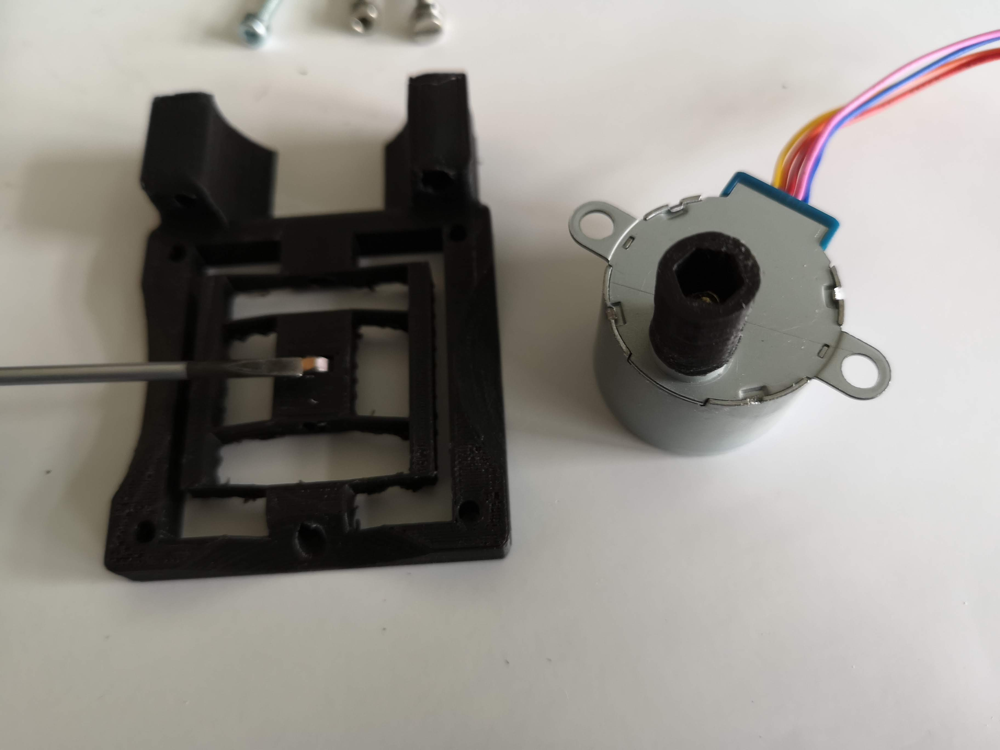
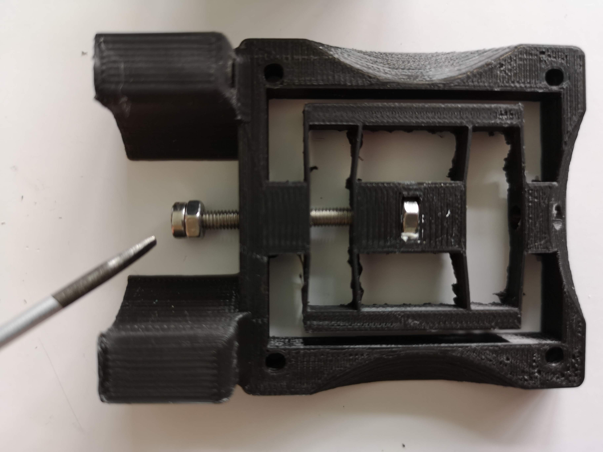
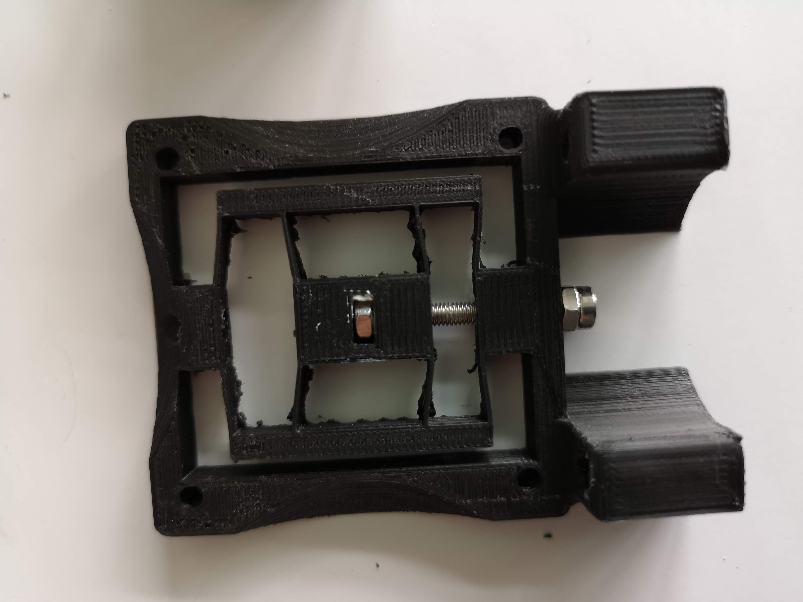
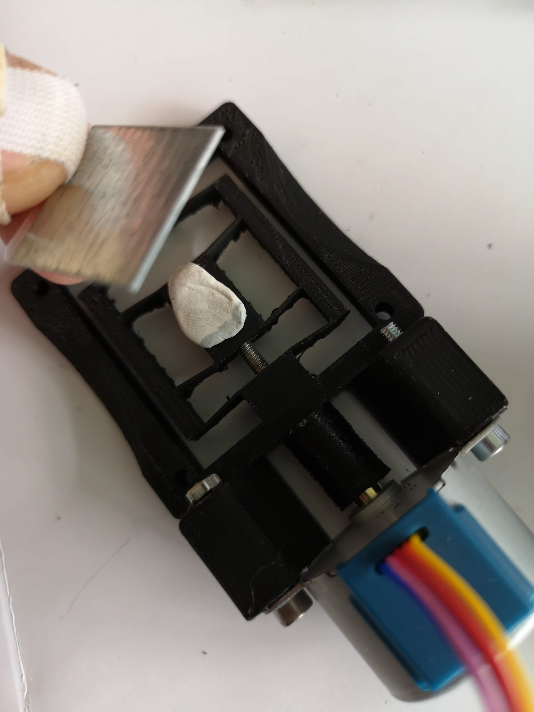
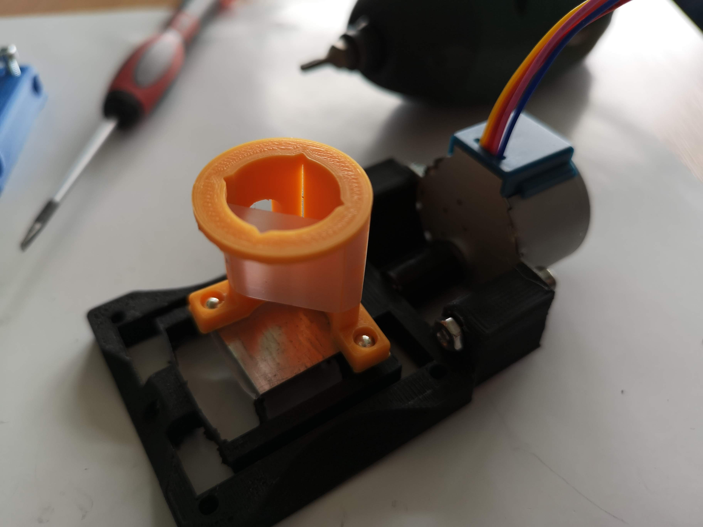
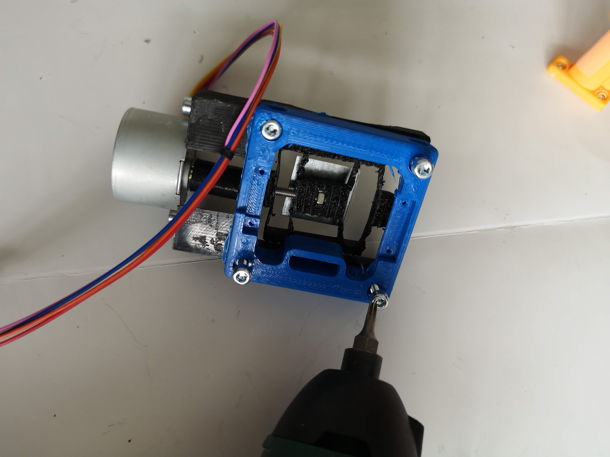

# S-Stage (Sample) Cube (v2)
This is the repository for the Z-Stage (Sample) Cube.

The stl-files can be found in the folder [STL](./STL).

Wiring and coding examples can be found in the folder [ELECTRONICS](./ELECTRONICS).

### Purpose
In light-sheet microscopy one often needs the ability to move the sample trough the illuminating light-sheet in order to capture the 3D information from the sample. This can either be done by scanning the light-sheet and focussing the objective lens simultaneously or by simply moving the sample along the optical axis w.r.t. the detection objective lens.

To keep the setup as simple as possible we decided to mount the sample (e.g. beads in agarose prepared in a syringe) on a stage which linearly moves it back and forth. Therefore, the light-sheet and objective lens once aligned can always stay in the same position.

***The mechanism is as follows***: A stepper motor (28-BYJ) drives a small gearbox which rotates a screw. On the screw, there is a nut which acts as a worm-drive. The conversion of the rotational into linear movement pushes/pulls a small table which is formed by a set of flexure-bearings. The syringe can be placed on a dedicated stand which is mounted using magnets on a ferro-magnetic metal plate itself glued to the moving table.

## Properties
* theoretically no play due to the use of flexure bearings
* moving range around +/- 10mm
* very low cost by relying on off-the-shelf components

## Parts

###  3D printing parts
* No support needed in all designs
* Carefully remove all support structures (if applicable)

The Cube consists of the following components.

* **The Lid (Special)** where the Arduino + Electronics finds its place ([LID](./STL/10_Lid_1x1_v2_thin.stl))
* **The Z-translator** which is a linear bearing-based table that carries the plate with the sample ([TRANSLATOR](./STL/30_Z_Translator_Lightsheet_v4.stl))
* **The Coupling Screw** which couples the motor to a screw a through that to the movement of the stage ([SCREW](./STL/30_Coupling_Screw_28BYJ_M3.stl))
* **The Sample Chamber** which can be filled with liquid ([CHAMBER](./STL/30_Samplechamber.stl))
* **The Syringe Holder** which holds a Syringe and is very useful for light-sheet alignment ([HOLDER](./STL/30_Syringe_holder_v2.stl))

###  Additional parts
* Check out the [RESOURCES](../../TUTORIALS/RESOURCES) for more information!
* 6× DIN912 M3×12 screws (galvanized steel) [🢂](https://eshop.wuerth.de/Zylinderschraube-mit-Innensechskant-SHR-ZYL-ISO4762-88-IS25-A2K-M3X12/00843%20%2012.sku/de/DE/EUR/)
* 1× M3 Nut
* 1× M3 Screw, 26 mm
* 1× ferro-magnetic plate ~ 30×40 mm², 1mm thickness (galvanized steel)
* 1× 28-BYJ stepper motor with 1x Driving electronic [🢂](https://www.amazon.de/Elegoo-Stepper-Schrittmotor-28BYJ-48-Treiberplatine/dp/B01MEGIHLF/ref=sr_1_1_sspa?__mk_de_DE=%C3%85M%C3%85%C5%BD%C3%95%C3%91&keywords=stepper+arduino&qid=1565008205&s=gateway&sr=8-1-spons&psc=1)
* 1× ESP32 for controlling the motor [🢂](https://www.amazon.de/AZDelivery-NodeMCU-Development-Nachfolgermodell-ESP8266/dp/B074RGW2VQ/ref=sr_1_3?__mk_de_DE=%C3%85M%C3%85%C5%BD%C3%95%C3%91&keywords=esp32&qid=1565008313&s=gateway&sr=8-3)
* wires to connect everything; for example: 6× Female-Female Jumper Wire, 0.14 mm² [🢂](https://www.amazon.de/ZOORE-120pcs-Multicolored-Female-Breadboard/dp/B07P85V1G3/ref=sr_1_5?__mk_de_DE=%C3%85M%C3%85%C5%BD%C3%95%C3%91&keywords=jumper+male&qid=1565690543&s=industrial&sr=1-5)
* 1× USB Micro Cable [🢂](https://www.amazon.de/Gritin-Datenkabel-Geflochtene-Robust-Daten%C3%BCbertragung-Grau/dp/B07CJJHVKX/ref=sr_1_3?keywords=usb+c+kabel&qid=1566029225&s=gateway&sr=8-3)

##  Assembly
* Detailed description coming soon
* Add motor and small gear, fix it with M4 screw
* Add the M3 nut in the dedicated hole close to the moving stage
* Add M3x26mm screw with mounted large gear at one end and insert it into the hole.
* rotate the M3x26 screw so that it pushes the moving z-stage
* Wire the motor, test it
* Done!

### Tutorial with images
Don't insert batteries in the laser yet!!

1. All parts for the module

1. Add the nut to the z-stage and the couple to the motor

1. Add the prepared M3 screw as a worm drive

1. Fasten the screw and move it freely along Z (take care, don't break it!

1. Add the motor (28BYJ) to the assembly using M3+nute

1. Glue a metallic plate to the moving part of the z-stage. It is mportant to glue the metal plate only to the center of the stage - just on the M3 nut. Otherwise the mechanism does not work!

1. Add 5mm ball-magnets to the sample holder

1. Check assembly:

1. Add the thin baseplate using M3 screws

1. Fix the screws

1. Done!

## Electronics
Please find a dedicated tutorial and working example in the folder [ELECTRONICS](./ELECTRONICS).

## Safety
Be careful!
