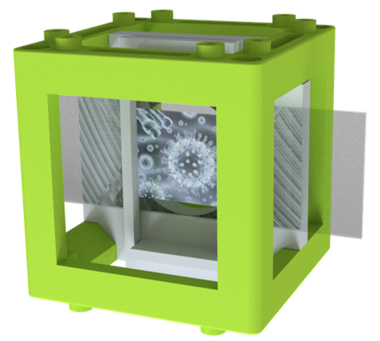
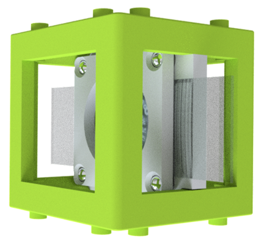
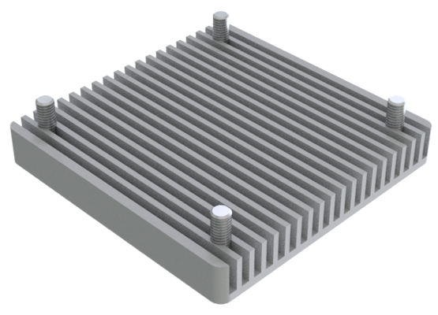
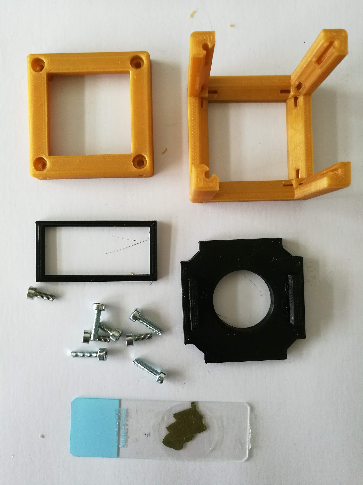
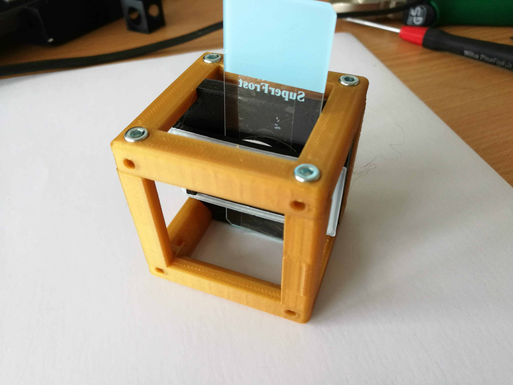
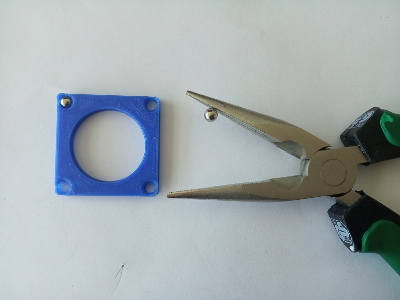
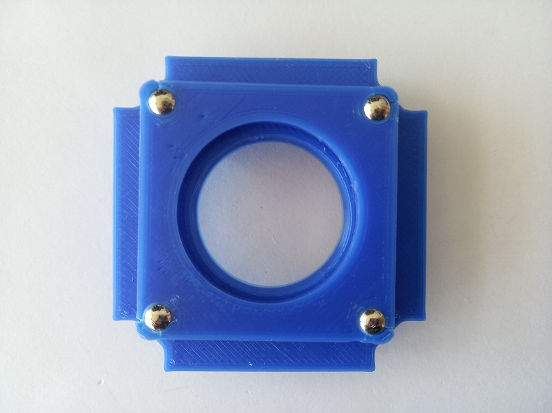
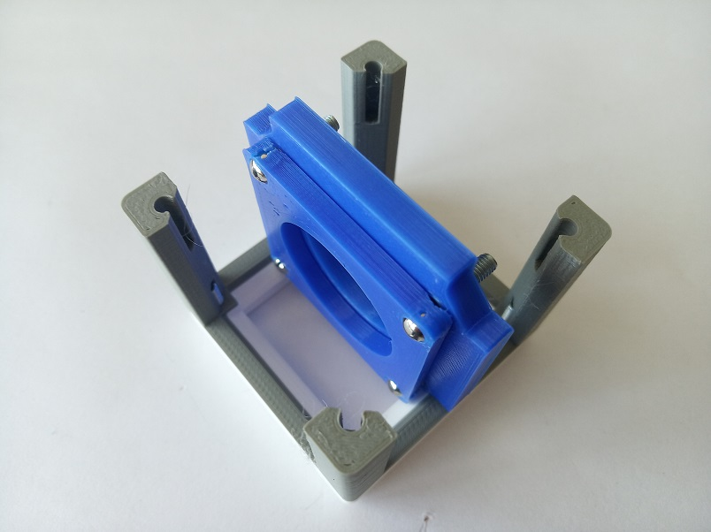

# Generic Sample Holder
This is the repository of the design of the sample holder that can hold microscope slides ad other flat object inside the Cube.

To acquire the STL-files use the [UC2-Configurator](https://uc2configurator.netlify.app/). The files themselves are in the [RAW](../RAW/STL) folder. The module can be built using injection-moulded (IM) or 3D-printed (3DP) cubes.

## Purpose
This holder can be used for microscope slides, filters and other flat objects. Both vertical and horizontal position is possible. The holder can be slided through the cube and the sample can be moved through the field of view in X and Y.

Alternatively, a magnetic version may be used. The magnetic holder can be adjusted for different thicknesses of the samples and it holds the thicker samples stronger. It needs four extra magnets and M3×8 screws.

In some cases (for example to hold a piece of paper as a screen) it might be useful to use the comb-structured sample holder, shown in the following image.

### Properties
* design is derived from the Base Cube

## Parts
The [Bill of Materials](https://docs.google.com/spreadsheets/d/1U1MndGKRCs0LKE5W8VGreCv9DJbQVQv7O6kgLlB6ZmE/edit?usp=sharing) is always the most up-to-date version!

###  3D printing parts
* No support needed in all designs
* Carefully remove all support structures (if applicable)

The Cube consists of the following components.

#### Default:
* **IM Cube** which houses the insert and adapts it into a UC2 setup.
* **The Sample holder Insert** that can hold the sample ([20_Cube_insert_Sample_holder_v3.stl](../RAW/STL))
* **The Sample holder Clamp** that fixes the sample in its position ([20_Cube_Insert_Sample_clamp.stl](../RAW/STL))

#### Alternatives:
* **3DP Cube** which will be screwed to the Lid. Here all the functions (i.e. Mirrors, LED's etc.) find their place ([10_Cube_1x1_v3.stl](../RAW/STL)) and **3DP Lid** which closes the Cube ([10_Lid_1x1_v3.stl](../RAW/STL)) - find the details in [ASSEMBLY_CUBE_Base](../ASSEMBLY_CUBE_Base)
* **The Magnetic Sample holder Insert** that can hold the sample ([20_Cube_insert_Sample_holder_magnetic_v3.stl](../RAW/STL))
* **The Magnetic Sample holder Clamp** that fixes the sample in its position ([20_Cube_Insert_Sample_clamp_magnetic.stl](../RAW/STL))
* **The Sample holder Comb** that can hold a microscope slide or other flat object ([30_Cube_sampleholder.stl](../RAW/STL)). The comb still needs magnets to connect to the baseplate, even the IM one.

###  Additional parts
* Check out the [RESOURCES](../../TUTORIALS/RESOURCES) for more information!

For Sample holder Comb:
* 4× DIN912 M3×12 screws (galvanized steel) [🢂](https://eshop.wuerth.de/Zylinderschraube-mit-Innensechskant-SHR-ZYL-ISO4762-88-IS25-A2K-M3X12/00843%20%2012.sku/de/DE/EUR/)

For magnetic sample holder:
* 4× DIN912 M3×8 screws (galvanized steel)
* 4× Ballmagnets - 5 mm diameter [🢂](https://www.magnetmax.de/Neodym-Kugelmagnete/Magnetkugel-Kugelmagnet-O-5-0-mm-Neodym-vernickelt-N40-haelt-400-g::158.html)

##  Assembly
Follow the instruction according to which sample holder you printed.

:grey_exclamation: This tutorial shows a UC2_v2 cube but the assembly of the insert is still the same. For assembly of the cube (IM/3DP) check the [ASSEMBLY_CUBE_Base](../ASSEMBLY_CUBE_Base).

### Tutorial with images (Printed-only Sample Holder)

1. All parts for this model

2. Mount the sample to the Sample insert using the clamp

3. Add the Insert to the Cube and fix it with screws - Done!

### Tutorial with images (Magnetic Sample Holder)
1. All parts for this model

1. Insert four M3×8 screws into the insert. For now, screw them all the way in.

1. Push four 5mm ballmagnets into the sample clamp. This can be done using pliers.

1. Connect the clamp to the insert

1. Add the Insert to the Cube and fix it with screws - Done!

1. By unscrewing the screws of the insert symmetrically, you can always adjust the holder for any thickness of a sample - for example for holding two microscope slides together

### Assembly - Sample Comb
The assembly of this module is really simple - just connect the comb part to the Cube Lid using four M3×12 screws. You can also insert the screws directly in the comb part, but remember that then your sample holder will hold the sample lower than when using the lid.

