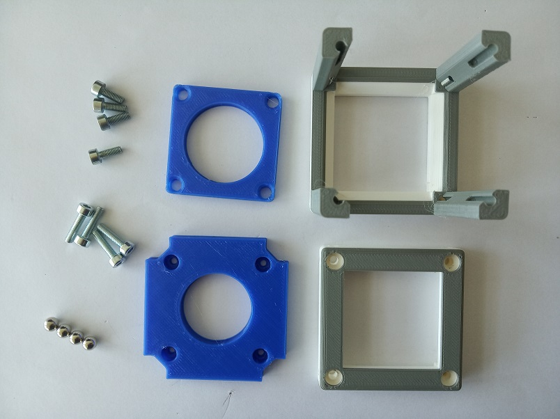
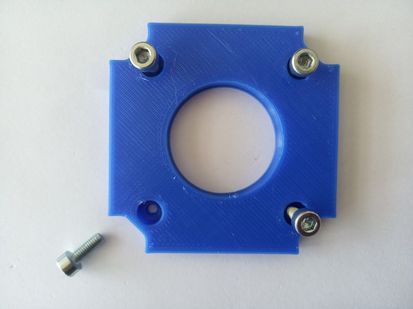
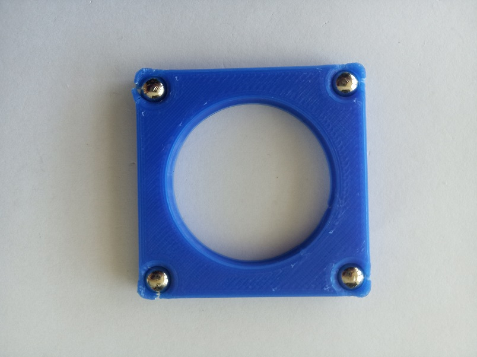
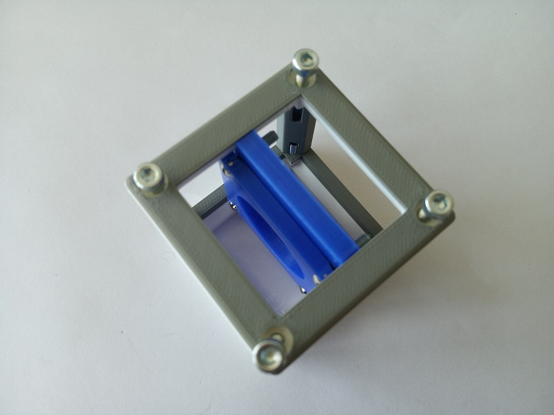
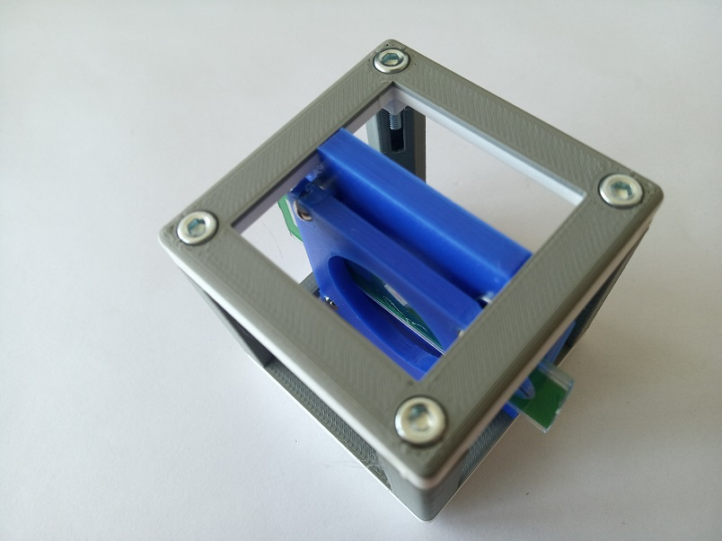

# Generic Sample Holder
This is the repository for the design of the sample holder that can hold microscope slides ad other flat object inside the Cube. The stl-files can be found in the folder [STL](./STL).

## Purpose
This holder can be used for microscope slides, filters and other flat objects. Both vertical and horizontal position is possible. The holder can be slided through the cube and the sample can be moved through the field of view in X and Y.

Alternatively, a magnetic version may be used. The magnetic holder can be adjusted for different thicknesses of the samples and it holds the thicker samples stronger. It needs four extra magnets and M3×8 screws.

In some cases it might be useful to use the comb-structured sample holder, shown in the following image.

### Properties
* design is derived from the Base Cube

## Parts

###  3D printing parts
* No support needed in all designs
* Carefully remove all support structures (if applicable)

The Cube consists of the following components.

* **The Lid** where the Arduino + Electronics finds its place ([LID](./STL/10_Lid_1x1_v2.stl))
* **The Cube** which will be screwed to the Lid. Here all the functions (i.e. Mirrors, LED's etc.) find their place ([BASE](./STL/10_Cube_1x1_v2.stl))

AND

* **The Sample holder Insert** that can hold the sample ([INSERT](./STL/20_Cube_insert_Sample_holder.stl))
* **The Sample holder Clamp** that fixes the sample in its position ([CLAMP](./STL/20_Cube_Insert_Sample_clamp.stl))

OR

* **The Magnetic Sample holder Insert** that can hold the sample ([INSERT MAGNETIC](./STL/20_Cube_insert_Sample_holder_magnetic.stl))
* **The Magnetic Sample holder Clamp** that fixes the sample in its position ([CLAMP MAGNETIC](./STL/20_Cube_insert_Sample_clamp_magnetic.stl))

OR

* **The Sample holder Comb** that can hold a microscope slide or other flat object ([COMB](./STL/20_Cube_Sampleholder.stl)). The comb needs only the Cube Lid, or you can even use it on its own.

###  Additional parts
* Check out the [RESOURCES](../../TUTORIALS/RESOURCES) for more information!
* 4× - 8× DIN912 M3×12 screws (galvanized steel) [🢂](https://eshop.wuerth.de/Zylinderschraube-mit-Innensechskant-SHR-ZYL-ISO4762-88-IS25-A2K-M3X12/00843%20%2012.sku/de/DE/EUR/)

For magnetic sample holder extra:
* 4× DIN912 M3×8 screws (galvanized steel)
* 4× Ballmagnets - 5 mm diameter [🢂](https://www.magnetmax.de/Neodym-Kugelmagnete/Magnetkugel-Kugelmagnet-O-5-0-mm-Neodym-vernickelt-N40-haelt-400-g::158.html)

##  Assembly
Follow the instruction according to which sample holder you printed.

### Tutorial with images (Printed-only Sample Holder)

1. All parts for this model

2. Mount the sample to the Sample insert using the clamp

3. Add the Insert to the Cube and fix it with screws - Done!

### Tutorial with images (Magnetic Sample Holder)
1. All parts for this model

1. Insert four M3×8 screws into the insert. For now, screw them all the way in.

1. Push four 5mm ballmagnets into the sample clamp. This can be done using pliers.

1. Connect the clamp to the insert

1. Add the Insert to the Cube and fix it with screws - Done!

1. By unscrewing the screws of the insert symmetrically, you can always adjust the holder for any thickness of a sample - for example for holding two microscope slides together

### Assembly - Sample Comb
The assembly of this module is really simple - just connect the comb part to the Cube Lid using four M3×12 screws. You can also insert the screws directly in the comb part, but remember that then your sample holder will hold the sample lower than when using the lid.

