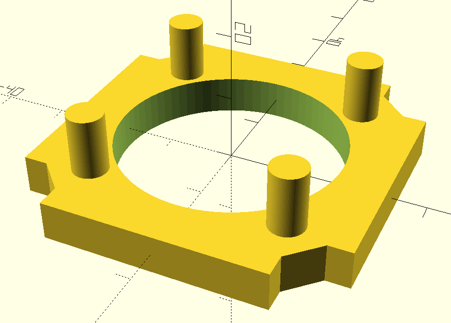
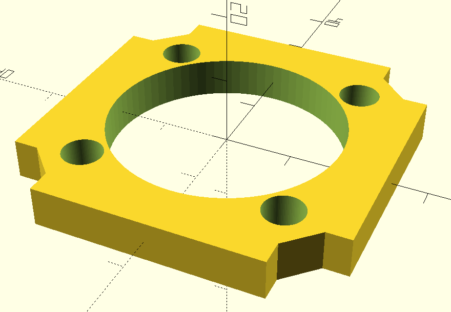
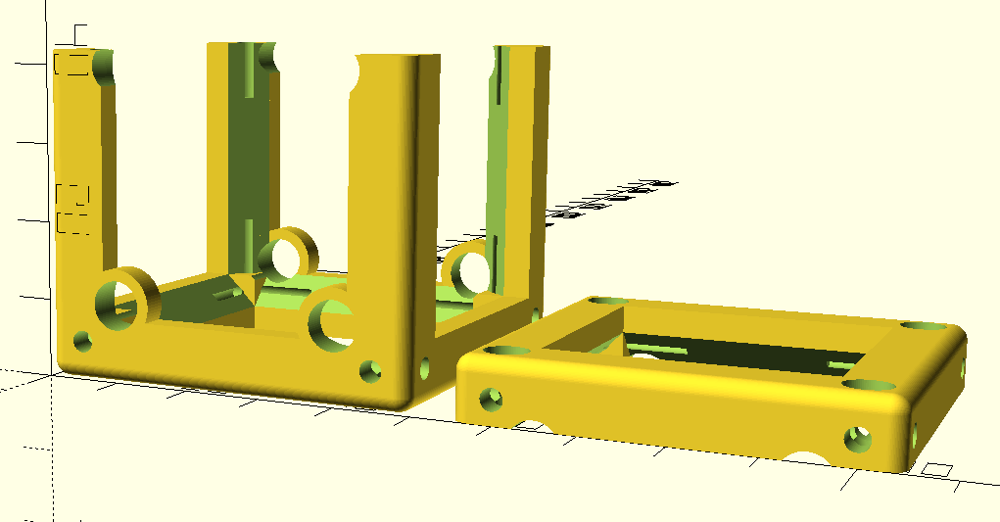

# UC2 - cage system compatibility  
Establishing an open standard in microscopy involves bridging to commercially available devices like the cage system from Thorlabs. With the following inserts and cubes, you should be able to combine our components with the ones frequently used in optical setups.  

## Insert a single cage system component into the UC2 cube
This insert is pretty much the same like the one we designed in Inventor. It is made for components that fit on the rods with 6 mm diameter. However, every 3D printer is a bit different and when you print the insert the rods might be too big or too small for the component. In that case, you can adjust their diameter to have them fit perfectly.

### Using Thingiverse customizer
Go to the [Thingiverse page of this part](https://www.thingiverse.com/thing:4403974) and use their in-built customizer to adjust the diameter of the rods by changing the offset (in millimetres).

The offset is a value added to the diameter in the range of (-1 mm, 1 mm).

## Combine the cage system with the cubes
It might be useful to arbitrarily combine the classical cage system with UC2 cubes. For that, use an adapted cube and lid and an insert that fits the rods of your "cage". It is made for components that fit on the rods with 6 mm diameter. However, every 3D printer is a bit different and when you print the insert the rods might be too big or too small for the component. In that case, you can adjust their diameter to have them fit perfectly. The cube is meant to be loose on the rods, the insert should hold in fixed position.

### Using Thingiverse customizer
Go to the [Thingiverse page of this part](https://www.thingiverse.com/thing:4401936) and use their in-built customizer to adjust the diameter of the rods by changing the offset (in millimetres).

The offset is a value added to the diameter in the range of (-1 mm, 1 mm).

## Using openSCAD
Both inserts and the cage-compatible cube can of course be also adapted directly in openSCAD. Find all the .scad files in this folder, change the diameter of the rods/holes by changing _off_dr_, render it, export an STL file and print it.

In case you're not happy with the way the clamp fits on the holder (it might vary among different 3D printers), you can also fiddle with any of the values in the code.  
If you have a suggestion for an improvement, please let us know! :-)
