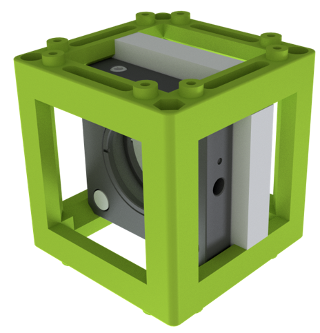
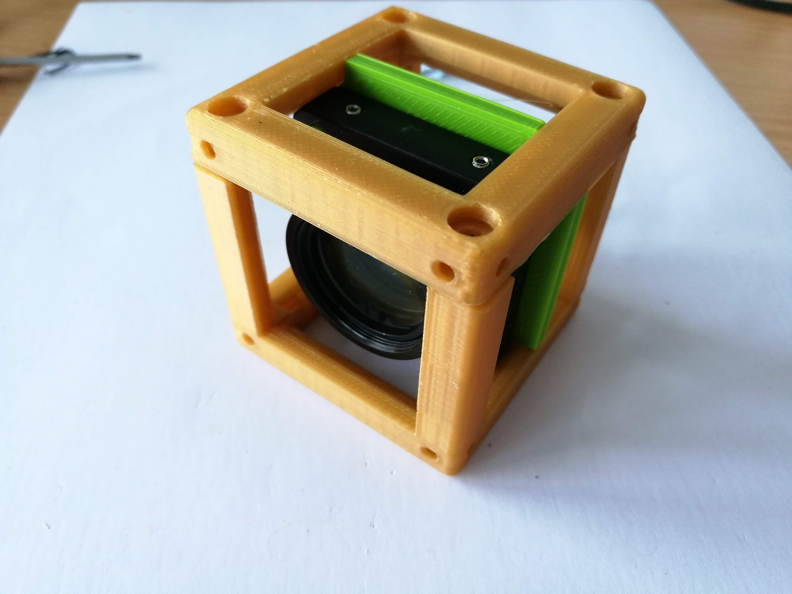

# Thorlabs Insert Cube
This is the repository for the Insert which adapts the UC2 System to the Thorlabs-Cube-System World.

To acquire the STL-files use the [UC2-Configurator](https://uc2configurator.netlify.app/). The files themselves are in the [RAW](../RAW/STL) folder. The module can be built using injection-moulded (IM) or 3D-printed (3DP) cubes.

## Purpose
It adapts to the 1 inch Cage System from Thorlabs.

### Properties
* design is derived from the base-cube

## Parts
Have a look in the [OPENSCAD folder](./OPENSCAD) to learn more about making UC2 cubes compatible with Thorlabs cage system!

###  3D printing parts
* No support needed in all designs
* Carefully remove all support structures (if applicable)

The Cube consists of the following components.

#### Default:
* **IM Cube** which houses the insert and adapts it into a UC2 setup.
* **The Thorlabs Insert** which adapts to any 1 inch cage system component ([UC2_v3_20_Cube_Insert_Thorlabs.stl](../RAW/STL))

#### Alternatives:
* **3DP Cube** which will be screwed to the Lid. Here all the functions (i.e. Mirrors, LED's etc.) find their place ([10_Cube_1x1_v3.stl](../RAW/STL)) and **3DP Lid** which closes the Cube ([10_Lid_1x1_v3.stl](../RAW/STL)) - find the details in [ASSEMBLY_CUBE_Base](../ASSEMBLY_CUBE_Base)
* Check out the [OPENSCAD](./OPENSCAD) folder for other alternatives to connect the UC2 framework with a cage system

###  Additional parts
* Check out the [RESOURCES](../../TUTORIALS/RESOURCES) for more information!
* Thorlabs Cage System Component

##  Assembly
* Mount the Cage component inside the insert
* Put the Insert inside the Cube
* Close the cube accordingly (IM/3DP)
* Done!

### Tutorial with images
:grey_exclamation: This tutorial shows a UC2_v2 cube but the assembly of the insert is still the same. For assembly of the cube (IM/3DP) check the [ASSEMBLY_CUBE_Base](../ASSEMBLY_CUBE_Base).

1. All parts for this model

2. Put the cage mount inside the insert

3. Mount everything with screws - Done!

