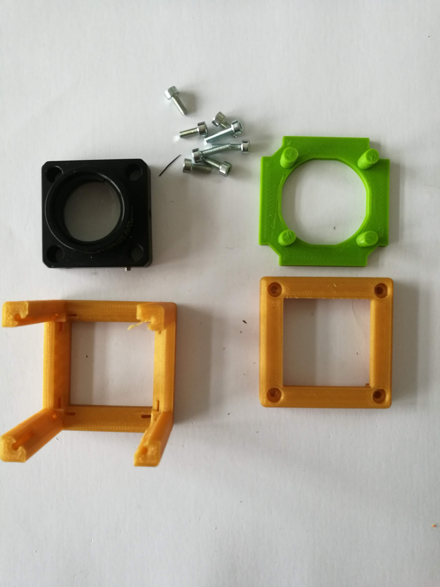
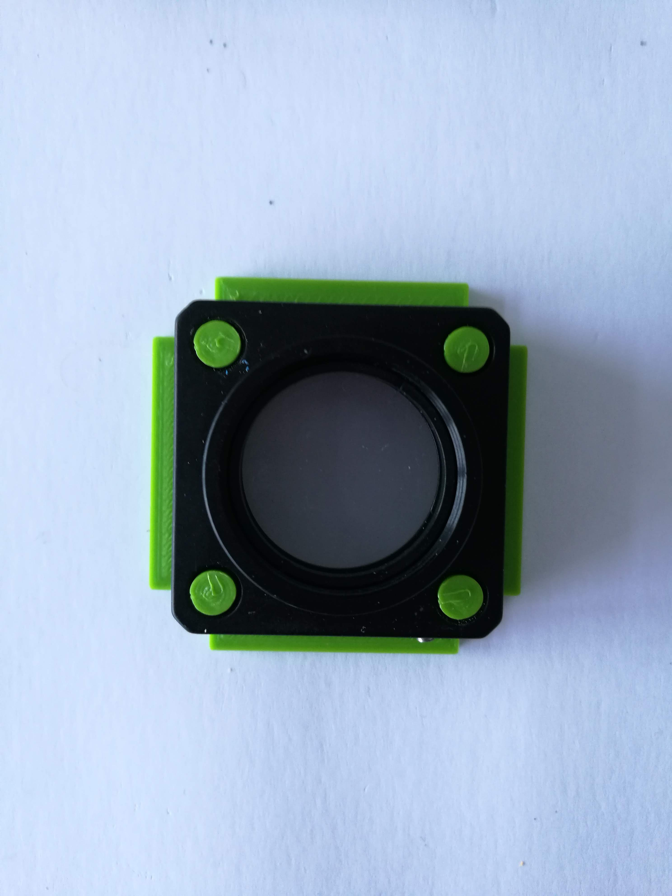

# Thorlabs Insert Cube
This is the repository for the Insert which adapts the UC2 System to the Thorlabs-Cube-System World.

The stl-files can be found in the folder [STL](./STL).

### Purpose
It adapts to the 1 inch Cage System from Thorlabs.

### Properties
* design is derived from the base-cube

## Parts

###  3D printing parts
The Part consists of the following components.

* **The Lid** where the Arduino + Electronics finds its place ([LID](./STL/10_Lid_1x1_v2.stl))
* **The Cube** which will be screwed to the Lid. Here all the functions (i.e. Mirrors, LED's etc.) find their place ([BASE](./STL/10_Cube_1x1_v2.stl))
* **The Thorlabs Insert** which adapts to any 1 inch cage system component ([INSERT](./STL/20_Cube_Insert_Thorlabs.stl))

###  Additional parts
* 8x DIN912 M3*12 screws (non stainless steel)
* Cage System Component

## Remarks and Tips
### 3D Printing:
* No support required in all designs
* Carefully remove all support structures (if applicable)

##  Assembly
* Mount the Cage component inside the insert
* Put the Insert inside the Cube
* Add all screws to the Cube
* Done!

### Tutorial with images (LENSHOLDER)
Don't insert batteries in the laser yet!!

1. All parts for this model

2. Put the cage mount inside the insert

3. Mount everything with screws - Done!

## Safety
Attention, don't cut your fingers while removing the lens from the iPhone sensor!

Never (!) look into the laser pointer! It will damage your eye immediately!

* ATTENTION: NEVER WATCH DIRECTLY INTO THE LASER! EYE WILL BE DAMAGED DIRECTLY
* NEVER SWITCH ON THE LASER WITHOUT INTEDED USE
* BEAM HAS TO GO AWAY FROM ONESELF - ALWAYS!
