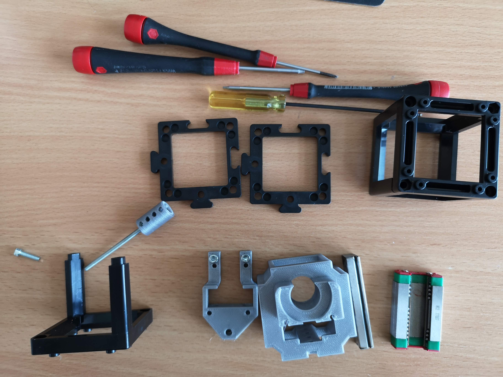
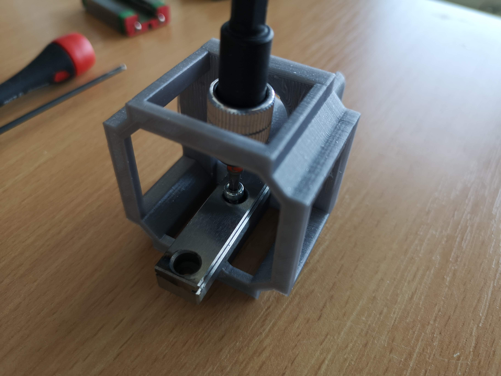
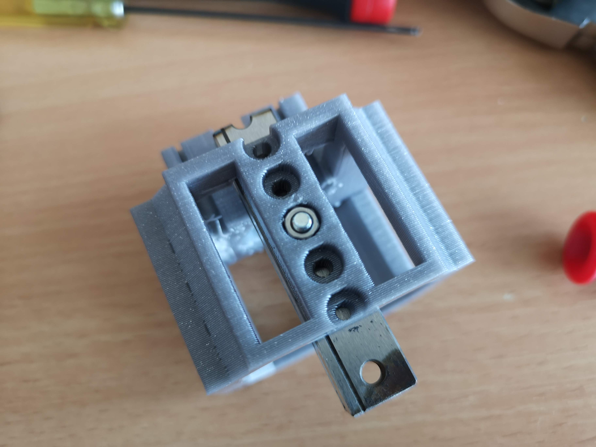
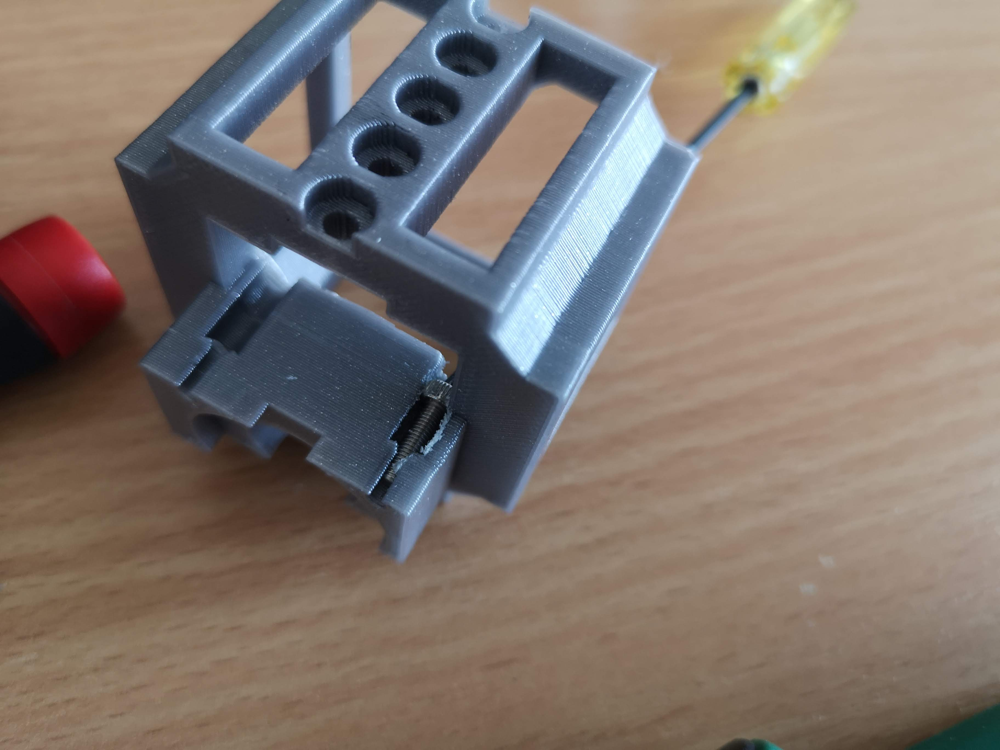
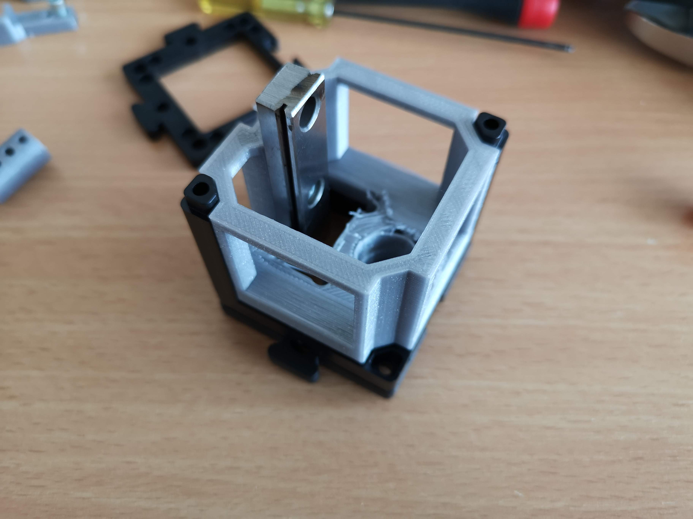
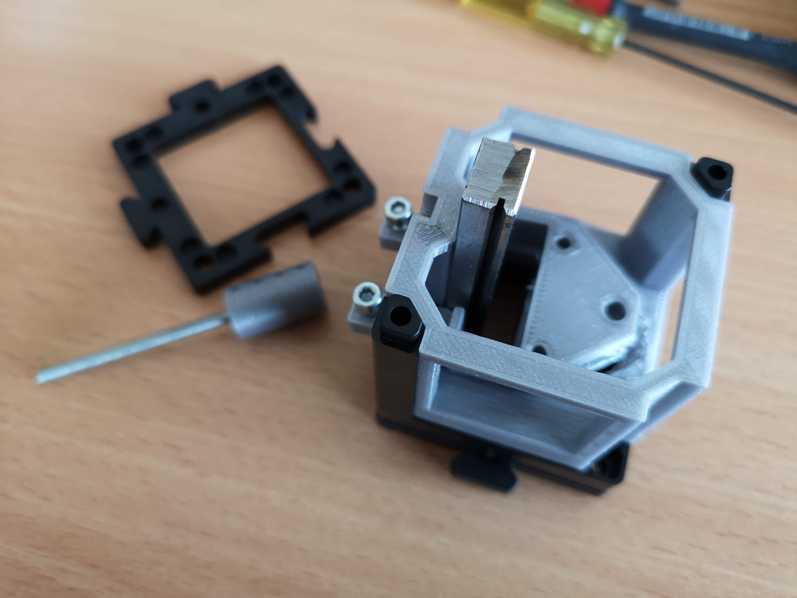
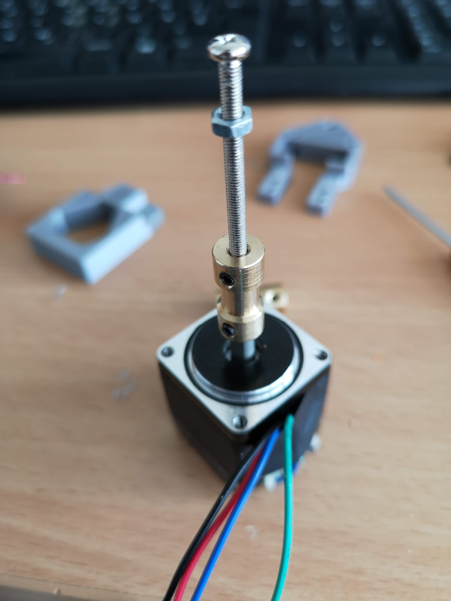
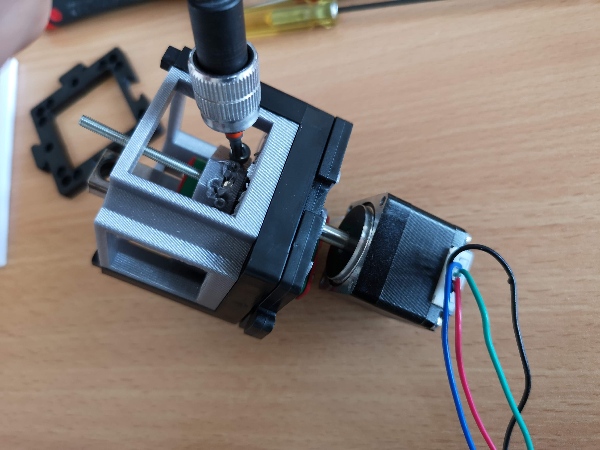

# Z-Stage based on a linear slide (Objective/Sample)

<<<<<<< Updated upstream
This is the repository for the newest Z-Stage (Sample/Objective) all finding space in a single Cube. It moves the sample/objective using a MGN12 linear rail (usually used in CNC machines/3D printers) using a NEMA motor.
=======
This is the repository for the newest Z-Stage (Sample/Objective) all finding space in a single Cube. It moves the sample/objective using a MGN12 linear rail (usually used in CNC machines/3D printers) using a NEMA motor. 
>>>>>>> Stashed changes

To acquire the STL-files use the [UC2-Configurator](https://uc2configurator.netlify.app/). The files themselves are in the [RAW](../RAW/STL) folder. The module can be built using injection-moulded (IM) or 3D-printed (3DP) cubes.

## Purpose
In microscopy one often needs the ability to move the objective along the optical axis in order to refocus a given 3D sample.
In order to automate this, we designed a very simple z-stage all fitting inside one UC2 cube:

### Properties
* Linear motion with linear bearings (MGN12)
* moving range +/-12mm
* Mount different Lenses/Samples with customizable adapter
* Wormdrive using M3 screw + nut
* very low cost by relying on off-the-shelf components
* motorized with a NEMA11 stepper motor

<<<<<<< Updated upstream

## Hack

# HARDWARE

# Z stage

=======
>>>>>>> Stashed changes
## Parts
The [Bill of Materials](https://docs.google.com/spreadsheets/d/1U1MndGKRCs0LKE5W8VGreCv9DJbQVQv7O6kgLlB6ZmE/edit?usp=sharing) is always the most up-to-date version!

###  3D printing parts
<<<<<<< Updated upstream
* No support needed in all designs except in the
=======
* No support needed in all designs except in the 
>>>>>>> Stashed changes
* Carefully remove all support structures (if applicable)

The Cube consists of the following components.

#### Default:

* **IM Cube** which houses the insert and adapts it into a UC2 setup.
* **The Z-Stage and Motor Holder** which holds the motor and gives the base inside the cube to attach all components ([UC2_30_Cube_Z_Focus_MGN_NEMA_base_v3.stl](../RAW/STL))
* **The slider** which connects the sample/objective directly to an M3 screw which acts as a wormdrive ([UC2_30_Cube_Z_Focus_MGN_NEMA_slide_v3.stl](../RAW/STL))
* **The Insert for the RMS/25mm objective or sample** With this you can adapt the objective lens or the sample  ([UC2_30_Cube_Z_Focus_MGN_NEMA_slide_v3.stl](../RAW/STL))
* **The coupling mechanism** which couples the motor to the M3 lead screw ([00_Motorcoupling_5mm_M3.stl](../RAW/STL))

**Hint:** 3D printing parts

* Inside the Prusaslicer we add a support enforcer (green part)
* Have 80-100% infill
* Layerheight: 200µm
* Add a thin support for the base in the center (e.t. 5x5 mm support the top)
* Remove the thin piece which is designed to support the motor holding bit

#### Alternatives:
* **3DP Cube** which will be screwed to the Lid. Here all the functions (i.e. Mirrors, LED's etc.) find their place ([10_Cube_1x1_v3.stl](../RAW/STL)) and **3DP Lid** which closes the Cube ([10_Lid_1x1_v3.stl](../RAW/STL)) - find the details in [ASSEMBLY_CUBE_Base](../ASSEMBLY_CUBE_Base)

###  Additional parts
* Check out the [RESOURCES](../../TUTORIALS/RESOURCES) for more information!
* 2× DIN912 M3×18 screws (galvanized steel) [🢂](https://eshop.wuerth.de/Zylinderschraube-mit-Innensechskant-SHR-ZYL-ISO4762-88-IS25-A2K-M3X12/00843%20%2012.sku/de/DE/EUR/)
* 1x DIN912 M3×12 screws (galvanized steel) [🢂](https://eshop.wuerth.de/Zylinderschraube-mit-Innensechskant-SHR-ZYL-ISO4762-88-IS25-A2K-M3X12/00843%20%2012.sku/de/DE/EUR/)
* 2× DIN912 M2.5×12 screws (galvanized steel) [🢂](https://eshop.wuerth.de/Zylinderschraube-mit-Innensechskant-SHR-ZYL-ISO4762-88-IS25-A2K-M3X12/00843%20%2012.sku/de/DE/EUR/)
* 2× M3 Nut
* 1× M3 Screw, 30 mm or longer (non-magnetic)
* 1× NEMA11 stepper motor with 1x Driving electronic (e.g. GRBL board) [🢂]()
* MGN12 linear slider [🢂](https://www.roboter-bausatz.de/p/mgn12h-linearlager)
* Linear Rail MGN12, 50mm [🢂](https://www.roboter-bausatz.de/p/https://www.roboter-bausatz.de/p/linearfuehrung-mgn12h-500mm)
* 1× USB Micro Cable [🢂](https://www.amazon.de/dp/B0778FV6K4/ref=sr_1_2?dchild=1&fst=as%3Aoff&qid=1586361990&refinements=p_89%3AGritin&rnid=669059031&s=computers&sr=1-2)

DIN 912 - M3 x 0.5 x 30 x 18.stl
30_Cube_Z_Focus_MGN_NEMA_Zeiss_26.8m_adapter.stl
00_NEMA11.stl
10_Base_puzzle_v3_1.stl
10_Base_puzzle_v3.stl
10_Cube_1x1_IM_1.stl
30_Cube_Z_Focus_MGN_NEMA_Zeiss_26.8m_adapter 2.stl
00_MGN12 LINEAR GUIDE RAIL, CONFIGURABLE.stl
00_Microscope_Objective_Lens10x.stl

10_Cube_1x1_IM.stl
30_Cube_Z_Focus_MGN_NEMA_adapter.stl

00_MGN12H, LINEAR GUIDE BLOCK.stl

UC2_30_Cube_Z_Focus_MGN_NEMA_Zeiss_26.8m_adapter_v3.stl
UC2_00_Motorcoupling_5mm_M3_v3.stl
UC2_30_Cube_Z_Focus_MGN_NEMA_adapter_v3.stl

UC2_30_Cube_Z_Focus_MGN_NEMA_base_v3_v3.stl

##  Assembly

### Tutorial with images (Z-Stage)

1. All parts you need for this tutorial + Tools

2. Mount the linear rail inside the base

3.  Fix the screw with a nut

4.  Add the M2.5 screws in the place to later mount the motor

5. Place the base inside the cube and add the puzzle baseplate

6. Prepare the motor coupling screw

6.1 Alternatively: Use a different Motor Coupling, remove the head of the screw

7. Add the motor coupling screw to the assembly, slide in the MGN12 linear rail block and melt additional plastic to keep the Nut of the wormdrive in place

<<<<<<< Updated upstream
8. Mount the Wormdrive with the MGN Block using M3 screws
=======
8. Mount the Wormdrive with the MGN Block using M3 screws 
>>>>>>> Stashed changes

9. Mount the motor using the M2.5 screws and close the cube with the second half or the lid: Done!

10. Focus:

## Fully assembled

## Safety
Be careful!
