# Mechanical Z-Stage (Objective) Cube
This is the repository for the mechanical Z-Stage (Objective) Cube.

To acquire the STL-files use the [UC2-Configurator](https://uc2configurator.netlify.app/). The files themselves are in the [RAW](../RAW/STL) folder. The module can be built using injection-moulded (IM) or 3D-printed (3DP) cubes.

## Purpose
In microscopy one often needs the ability to move the objective along the optical axis in order to refocus a given 3D sample. This is a mechanical-only version of our [Z-stage](../ASSEMBLY_CUBE_Z-STAGE_objective). It allows for course and fine focussing by hand.

**The mechanism is the following:**  
Note: The pictures below show an older version of the stage, but the mechanism is still the same.

**Course movement:** The objective is mounted on a ring which has a screw on one side and the screw head is inserted in a slot in the focussing insert. The movement range for this is 35 mm - the full length of th slot.

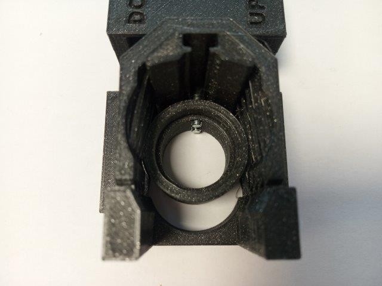
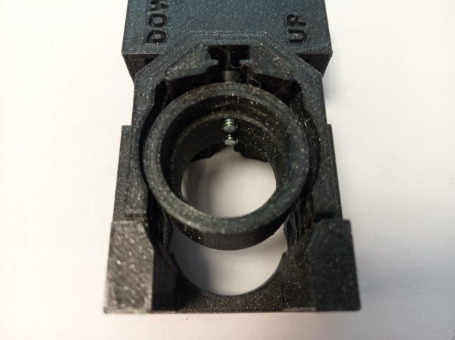

**Fine movement:** For fine focussing the linearbearing lever is moved by (in this case) a mechanical gear. When the screw pushes or pulls the lever, due to a rotation of the gear, the objective mount moves with it.

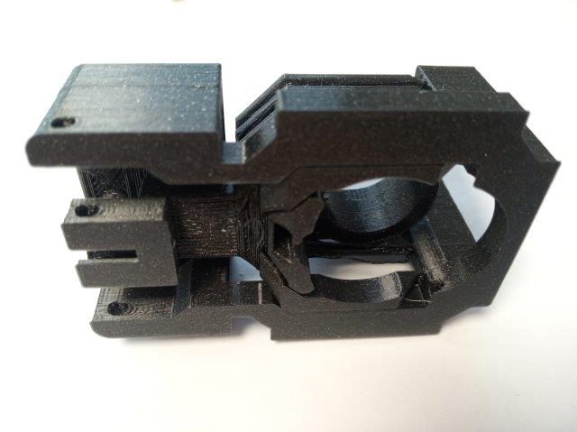
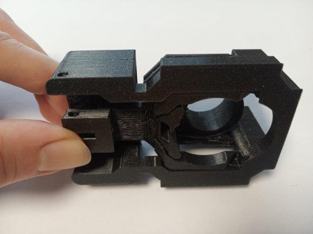
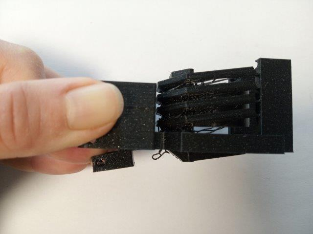

### Properties
* theoretically no play due to the use of flexure bearings
* moving range
	* fine: around +/- 6mm (when using 30 mm long screw for the gear mechanism)
	* coarse: around 30 mm (shifting the objective mount inside the slot)
* very low cost by relying on off-the-shelf components

## Parts
The [Bill of Materials](https://docs.google.com/spreadsheets/d/1U1MndGKRCs0LKE5W8VGreCv9DJbQVQv7O6kgLlB6ZmE/edit?usp=sharing) is always the most up-to-date version!

###  3D printing parts
* No support needed in all designs
* Carefully remove all support structures (if applicable)

The Cube consists of the following components.

#### Default:
* **IM Cube** which houses the insert and adapts it into a UC2 setup.
* **The Z-Stage Focussing Insert** which moves the objective against a fixed plate ([20_focus_inlet_linearflexure_mechanical_v3.stl](../RAW/STL))
* **The Gear** which, when rotated, pushes the lever arm via the screw and hence moves the objective up and down  ([20_gear.stl](../RAW/STL))
* **The Objective Lens Mount** which holds the objective lens (RMS thread) ([20_focus_inlet_objective_mount_v8.stl](../RAW/STL))

#### Alternatives:
* **3DP Cube** which will be screwed to the Lid. Here all the functions (i.e. Mirrors, LED's etc.) find their place ([10_Cube_1x1_v3.stl](../RAW/STL)) and **3DP Lid** which closes the Cube ([10_Lid_1x1_v3.stl](../RAW/STL)) - find the details in [ASSEMBLY_CUBE_Base](../ASSEMBLY_CUBE_Base)

###  Additional parts
* Check out the [RESOURCES](../../TUTORIALS/RESOURCES) for more information!
* 4× DIN912 M3×8 screws (galvanized steel)
* 1× M3 Nut
* 1× M3 Screw, 30 mm (non-magnetic)
* 1× Microscope Objective, RMS thread [🢂](https://de.aliexpress.com/item/4X-10X-20X-40X-60X-100X195-Augenmikroskops-System-Bio-Mikroskop-Biologische-Mikroskop-Lab-Labor-Achromatische-Objektiv/32947647522.html?spm=a2g0x.search0104.3.54.6cf57a4c3DwsTO&transAbTest=ae803_3&ws_ab_test=searchweb0_0%2Csearchweb201602_6_10065_10130_10068_10890_10547_319_10546_317_10548_10545_10696_10084_453_454_10083_10618_10307_537_536_10902_10059_10884_10887_321_322_10103%2Csearchweb201603_6%2CppcSwitch_0&algo_pvid=06d972be-b176-4446-8665-56d9e61a8d2c&algo_expid=06d972be-b176-4446-8665-56d9e61a8d2c-7)

##  Assembly

### Tutorial with images (Z-Stage)
:grey_exclamation: This tutorial shows a UC2_v2 cube but the assembly of the insert is still the same. For assembly of the cube (IM/3DP) check the [ASSEMBLY_CUBE_Base](../ASSEMBLY_CUBE_Base).

This is the assembly guide for the mechanical Z-Stage.

1. All parts for this model

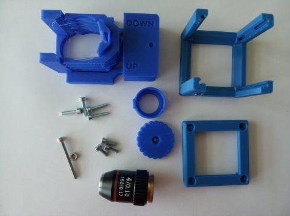

2. Insert the M3 nut into the gear.  

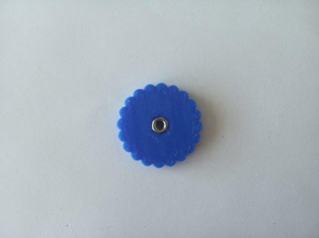

3.  Insert the gear into the slot in the focussing insert. Depending on your 3D printer and material you might need to file the inside of the slot a little, in order to achieve smooth movement of the gear.

4.  Align the gear with the holes in the insert so that the screw can get through.

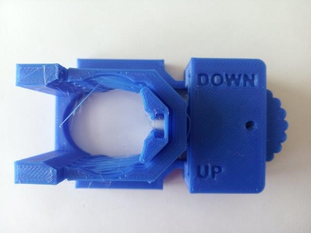

5. By pressing on the top part of the insert, move the level of the focussing mechanism downwards. Place the head of the M3×30 screw into the slot at the end of the lever. The end of the screw goes into the hole above the lever, to the gear.

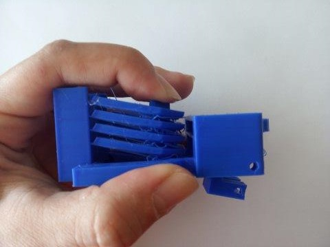
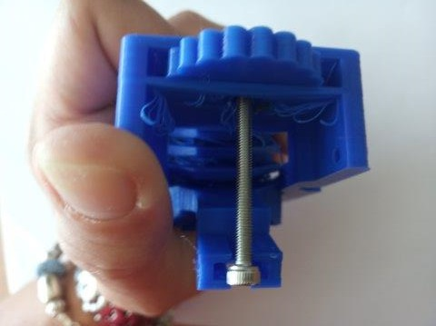

6. Using a hex key, screw the M3×30 screw through the gear and the plates that hold it. Keep the head of the screw in the lever!

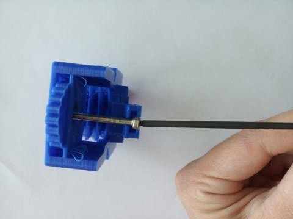

7. Leave the screw pushing the lever a little under the level of the insert. That way you will be able to fix the head of the screw easily.

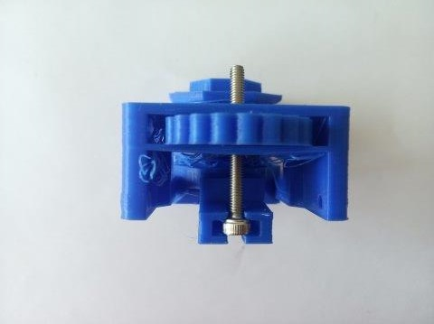

8. In order to pull and push the lever, the head of the M3×30 screw has to be fixed in it. Fix it using two M3×8 screws from both sides. Firstly insert one screw.

9. Then add the screw from the opposite side. Tighten both screws equally. The M3×30 must not rotate.

10. Do not overtighten the screws, you might break the lever. This should be the result:

11. The focussing mechanism for fine movement is now assembled.

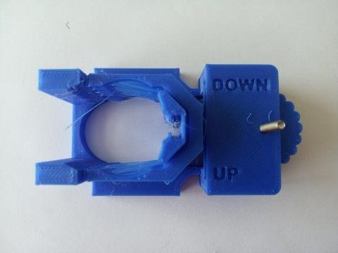

12. Place the insert inside the cube. For optimal use, the lid of the cube should be sideways from the insert, as shown in the picture. Close the cube using four M3×12 screws.

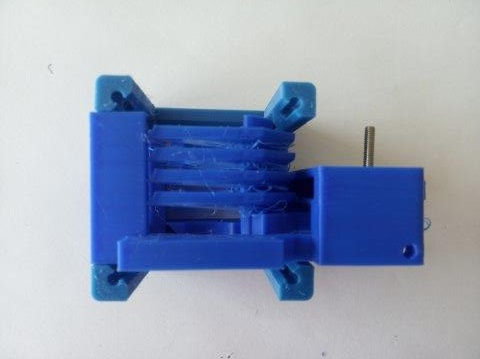

13. Insert a M3×8 screw in the objective mount as shown in the picture. Don't screw it all the way in but leave roughly 1 mm between the head of the screw and the flat side of the objective mount. **Note:** The latest version of the objective mount has two M3×8 screws for better stability of the objective.

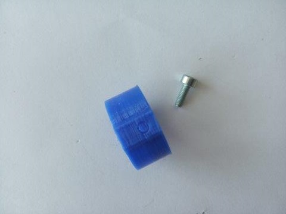

14. Insert the objective lens into its mount.

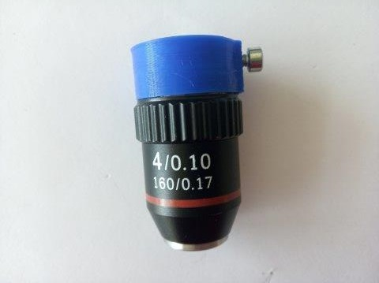

15. Insert the objective mount into the focussing insert. The head of the M3×8 screw goes into the slot in the insert. In case the screw is too tighten to the objective mount, it won't go into the slot - loosen the screw a little. In case the head of the screw is too far from the objective mount, it won't hold in the slot but fall through - tighten the screw a little.

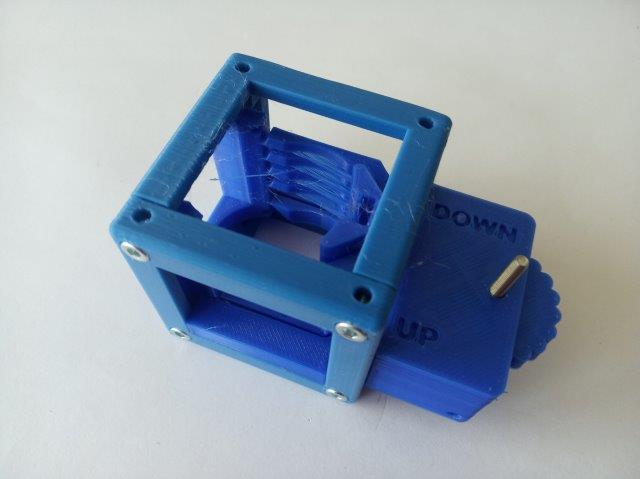
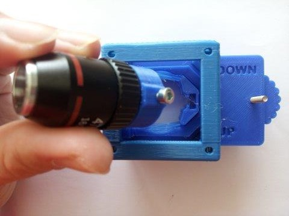

16. Done!

## Safety
Be careful!
