# Z-Stage (Objective) Cube
This is the repository for the Z-Stage (Objective) Cube. It moves the objective with respect to a fixed sample.

To acquire the STL-files use the [UC2-Configurator](https://uc2configurator.netlify.app/). The files themselves are in the [RAW](../RAW/STL) folder. The module can be built using injection-moulded (IM) or 3D-printed (3DP) cubes.

## Purpose
In microscopy one often needs the ability to move the objective along the optical axis in order to refocus a given 3D sample.
In order to automate this, we designed a very simple z-stage itself relying on flexure bearings also known from Bowman's flexurescope.

**The mechanism is the following:**

**Course movement:** The objective is mounted on a ring which has a screw on one side and the screw head is inserted in a slot in the focussing insert. The movement range for this is 35 mm - the full length of the slot.

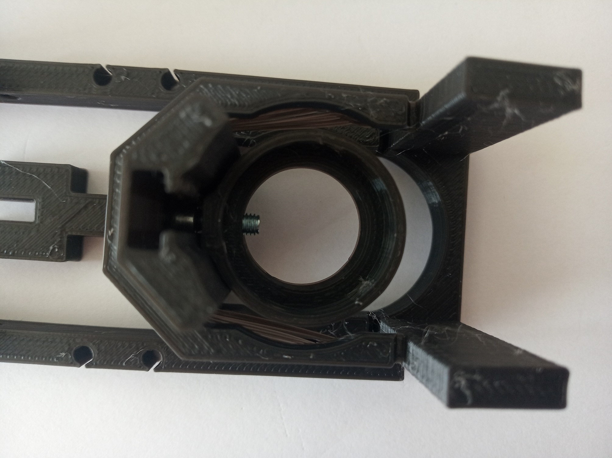

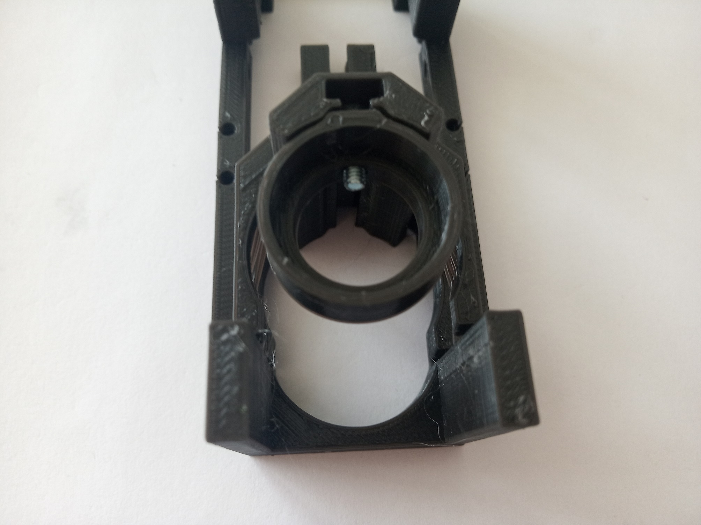

**Fine movement:** For fine focussing the linearbearing lever is moved by (in this case) a step-motor. When the screw pushes or pulls the lever, due to a rotation of the motor, the objective mount moves with it.

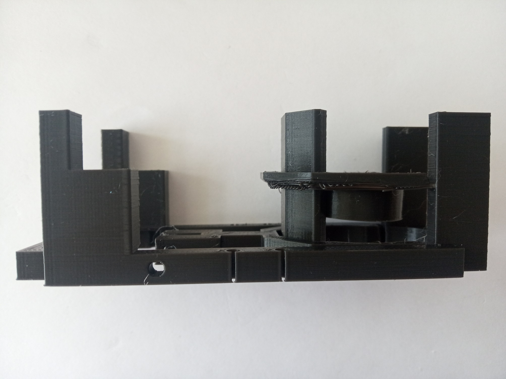

### Properties
* theoretically no play due to the use of flexure bearings
* moving range
	* fine: around +/- 6 mm
	* coarse: around 30 mm (shifting the objective lens inside the slot)
* very low cost by relying on off-the-shelf components

## Parts
The [Bill of Materials](https://docs.google.com/spreadsheets/d/1U1MndGKRCs0LKE5W8VGreCv9DJbQVQv7O6kgLlB6ZmE/edit?usp=sharing) is always the most up-to-date version!

###  3D printing parts
* No support needed in all designs
* Carefully remove all support structures (if applicable)

The Cube consists of the following components.

#### Default:
* **IM Cube** which houses the insert and adapts it into a UC2 setup.
* **The Z-Stage and Motor Holder** which moves the objective and holds the stepper motor ([20_focus_inlet_linearflexure_motorized_small_v3.stl](../RAW/STL))
* **The M3 to Motor Adapter (mech. Coupling)** which connects the Motor directly to an M3 screw which acts as a wormdrive ([30_Coupling_Screw_28BYJ_M3.stl](../RAW/STL))
* **The Objective Lens Mount** which holds the objective and allows for coarse movement (RMS thread) ([20_focus_inlet_objective_mount_v8.stl](../RAW/STL))

#### Alternatives:
* **3DP Cube** which will be screwed to the Lid. Here all the functions (i.e. Mirrors, LED's etc.) find their place ([10_Cube_1x1_v3.stl](../RAW/STL)) and **3DP Lid** which closes the Cube ([10_Lid_1x1_v3.stl](../RAW/STL)) - find the details in [ASSEMBLY_CUBE_Base](../ASSEMBLY_CUBE_Base)

###  Additional parts
* Check out the [RESOURCES](../../TUTORIALS/RESOURCES) for more information!
* 2× DIN912 M3×12 screws (galvanized steel) [🢂](https://eshop.wuerth.de/Zylinderschraube-mit-Innensechskant-SHR-ZYL-ISO4762-88-IS25-A2K-M3X12/00843%20%2012.sku/de/DE/EUR/)
* 6× DIN912 M3×8 screws (galvanized steel)
* 1× M3 Nut
* 1× M3 Screw, 20-30 mm (non-magnetic)
* 1× 28-BYJ stepper motor with 1x Driving electronic [🢂](https://www.amazon.de/Elegoo-Stepper-Schrittmotor-28BYJ-48-Treiberplatine/dp/B01MEGIHLF/ref=sr_1_1_sspa?__mk_de_DE=%C3%85M%C3%85%C5%BD%C3%95%C3%91&keywords=stepper+arduino&qid=1565008205&s=gateway&sr=8-1-spons&psc=1)
* 1× ESP32 for controlling the motor [🢂](https://www.amazon.de/AZDelivery-NodeMCU-Development-Nachfolgermodell-ESP8266/dp/B074RGW2VQ/ref=sr_1_3?__mk_de_DE=%C3%85M%C3%85%C5%BD%C3%95%C3%91&keywords=esp32&qid=1565008313&s=gateway&sr=8-3)
* wires to connect everything; for example: 6× Female-Female Jumper Wire, 0.14 mm² [🢂](https://www.amazon.de/ZOORE-120pcs-Multicolored-Female-Breadboard/dp/B07P85V1G3/ref=sr_1_5?__mk_de_DE=%C3%85M%C3%85%C5%BD%C3%95%C3%91&keywords=jumper+male&qid=1565690543&s=industrial&sr=1-5)
* 1× USB Micro Cable [🢂](https://www.amazon.de/dp/B0778FV6K4/ref=sr_1_2?dchild=1&fst=as%3Aoff&qid=1586361990&refinements=p_89%3AGritin&rnid=669059031&s=computers&sr=1-2)

##  Assembly

### Tutorial with images (Z-Stage)
1. All parts for this model. The electronics comes later.

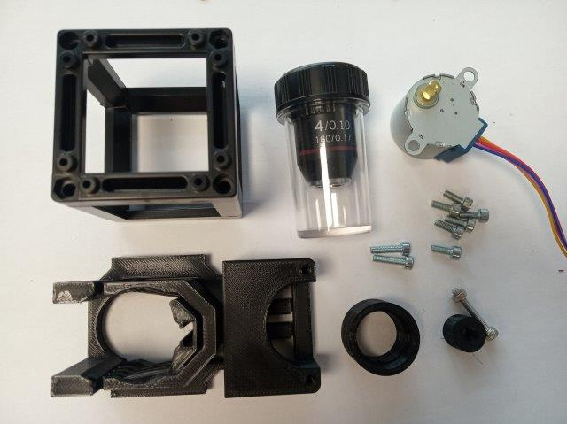

2. Insert the motor into the motor-screw-coupling adapter.

3. Insert the head of the M3×20 screw into the motor-screw-coupling adapter. Use pliers to press the screw inside.

4.  Fix the head of the M3 screw inside the adapter using two M3 worm screws (This can also be done later, in case the screw becomes too wobbly.) You may fix the motor-end the same way, if needed.

5.  The M3 nut goes into the level of the Z-stage. But first prepare the two M3×8 screws that will hold the nut in place. Firstly, insert one screw but only enough to not fall out for now. Use a hex key through the hole in the side of the Z-stage to tighten this screw or press the lever down to have better access.

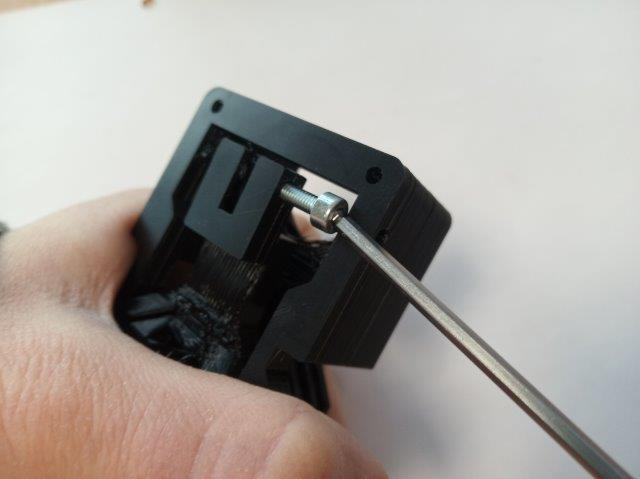
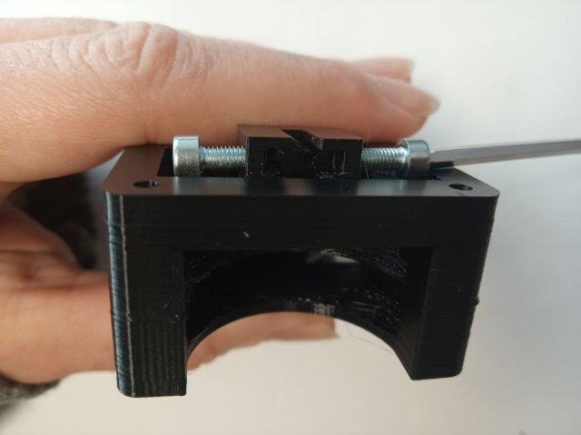

6. Tighten the screws to fix the nut. This is a bit of a precise-hands-exercise but it doesn't need to perfect now - we'll fix it completely once the nut is on the screw of the motor.

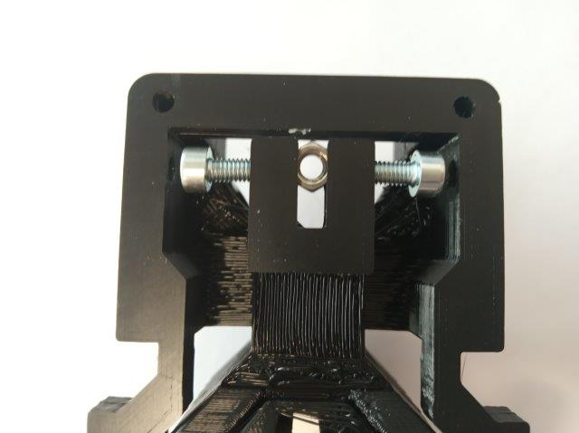

7. With the nut inserted in the lever, screw the screw into it. If you didn't manage to fix the nut nicely in the previous step, you can also just hold it with pliers now. In the end, the motor should land on the surface of the Z-stage, with the wires going away from it. It should neither push nor pull the lever.

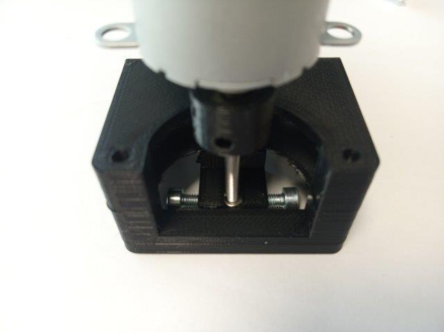
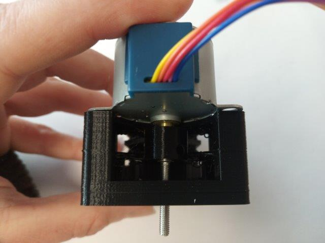

8. Using two M3×8 screws, fix the motor to the Z-stage.

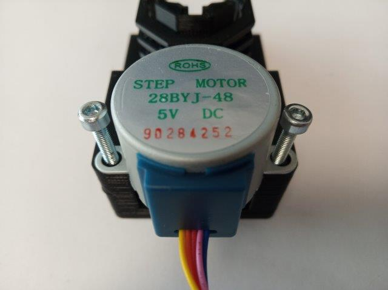
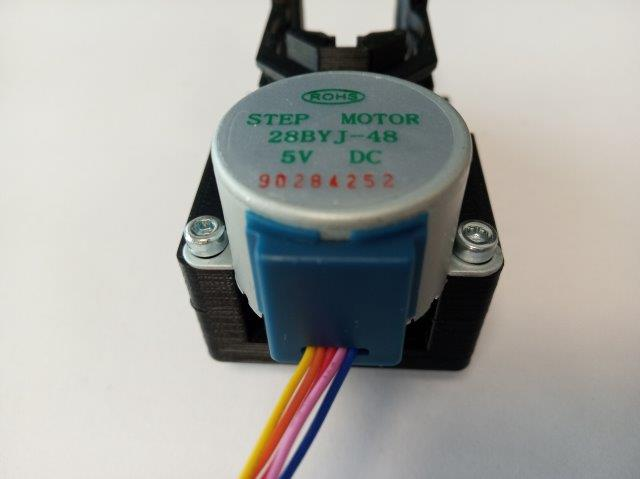

9. Now it's time to fix the nut. Tighten the two M3×8 screws to fix the nut in the centre. The screw from the motor mustn't be bent by this - it must go straight down from the motor. Use a hex key through the hole in the side of the Z-stage to tighten this screw.

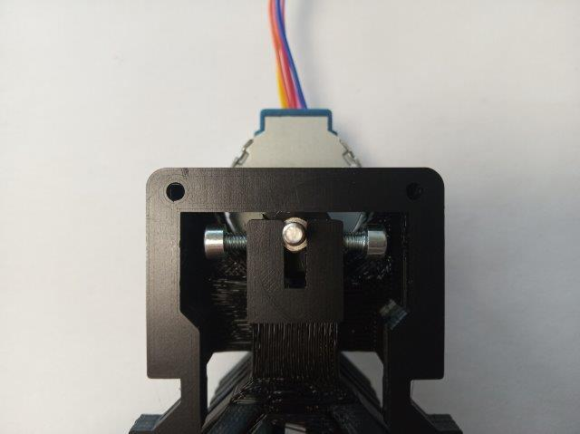
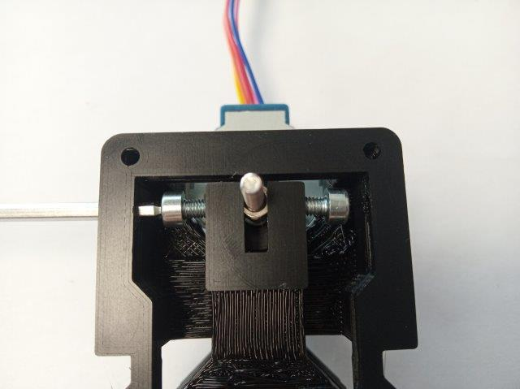

10. Assemble the objective mount - insert two M3×8 screws into it, so that the distance between the outer wall of the printed part and the heads of the screws is ~5 mm. You can adjust this later.

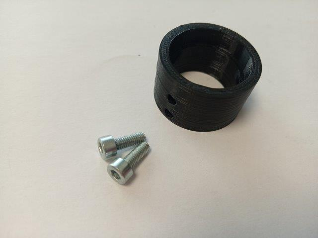

11. Insert the objective mount into the Z-stage. Adjust the two screws so that the objective mount almost touches the stage but can be moved freely.

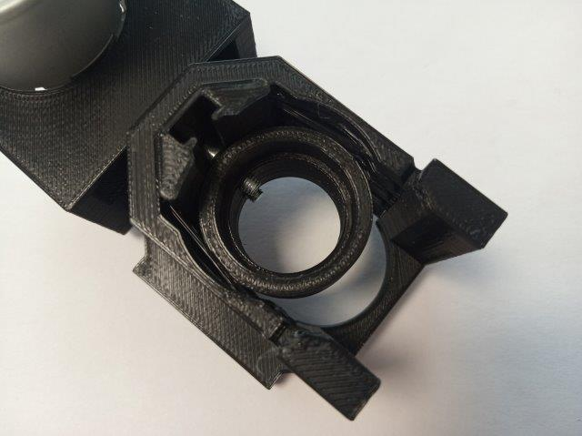

12. Place the insert inside the Cube and close it.

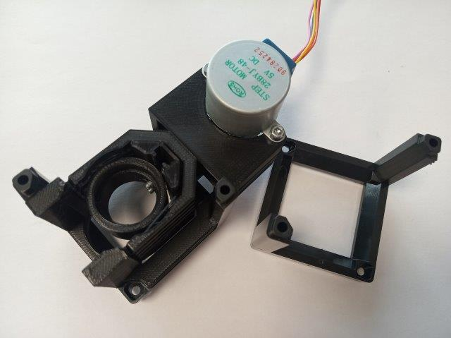
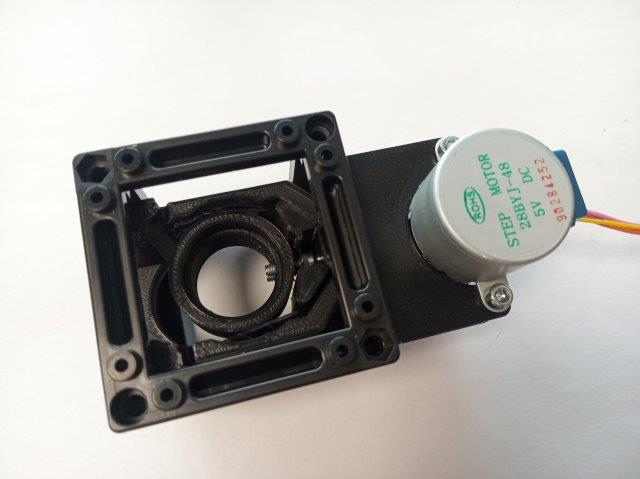

13. Time for adding electronics.

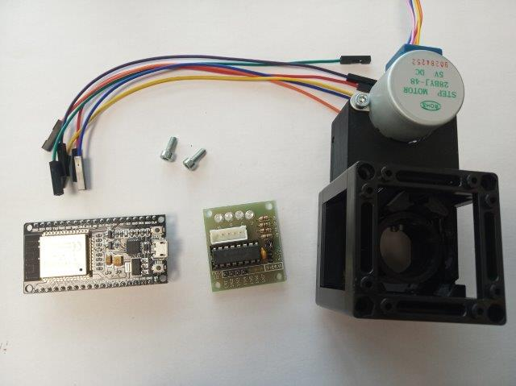

14. Using two M3×8 screws attach the driver board to the insert. Do not overtighten the screws and be careful - don't damage the driver board!

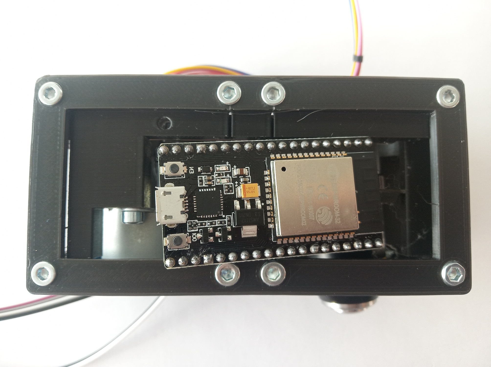

15. Connect the electronics according to the [instructions](../../ELECTRONICS) in the Electronics section.

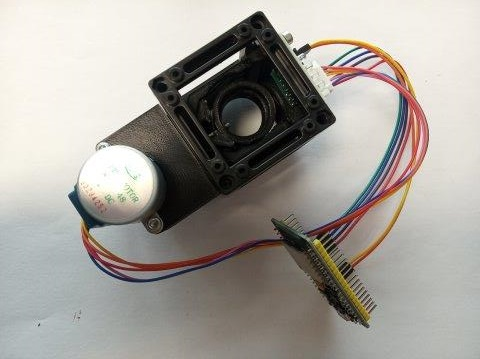

16. Insert the objective into its mount if you're ready to use the stage. Never leave objective laying around, because they get dusty - store them in their cases. 

17. Where next? [🢂 Software!](https://github.com/bionanoimaging/UC2-Software-GIT) Do not plug anything in the power supply, unless you are sure everything is correctly connected.

## Safety
Be careful!
