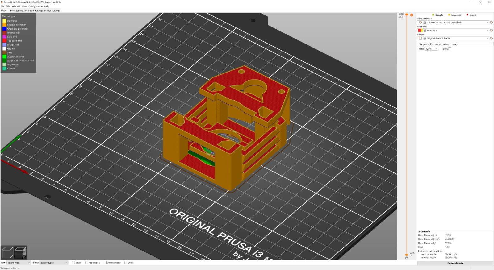
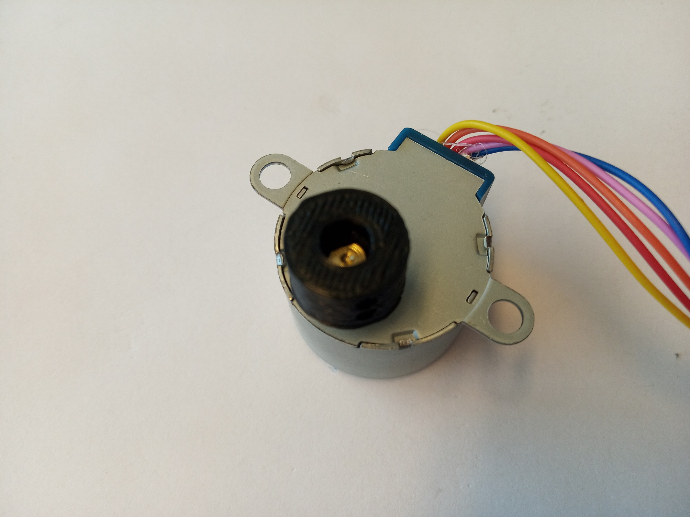
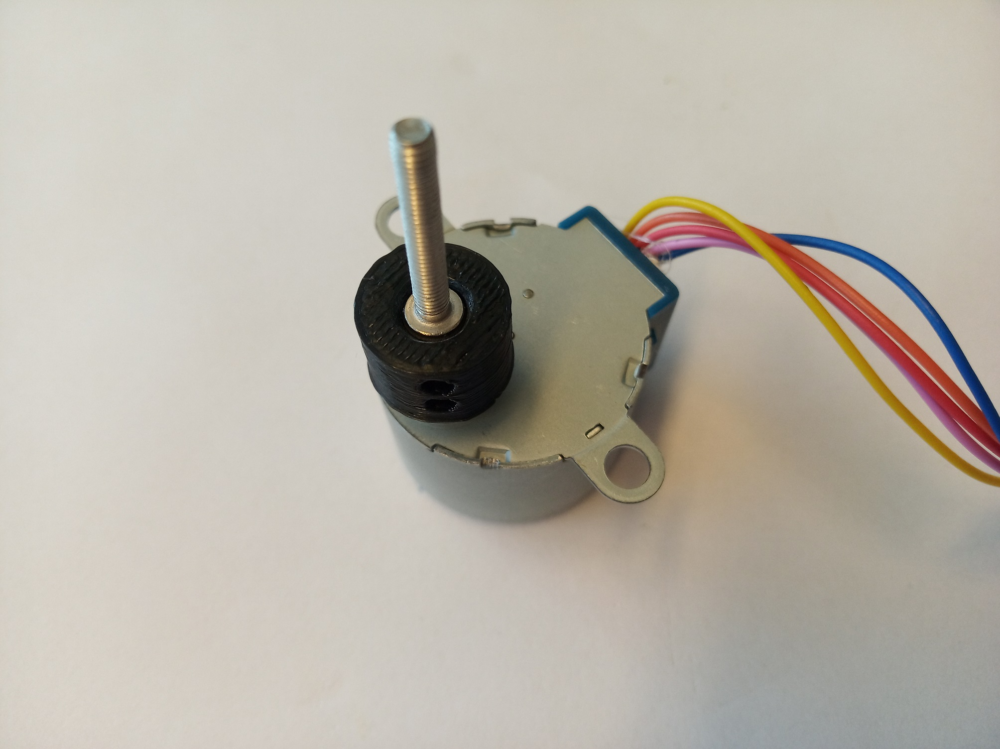
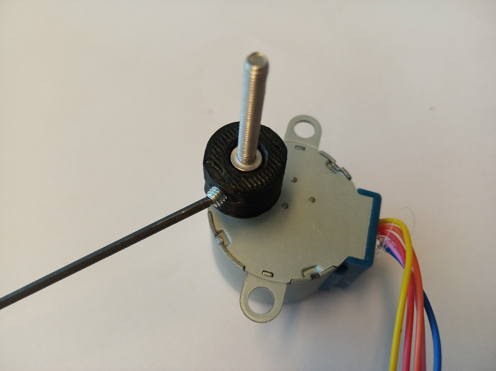
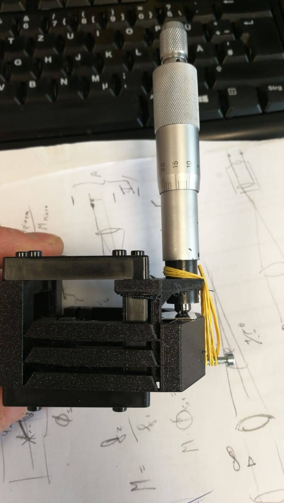
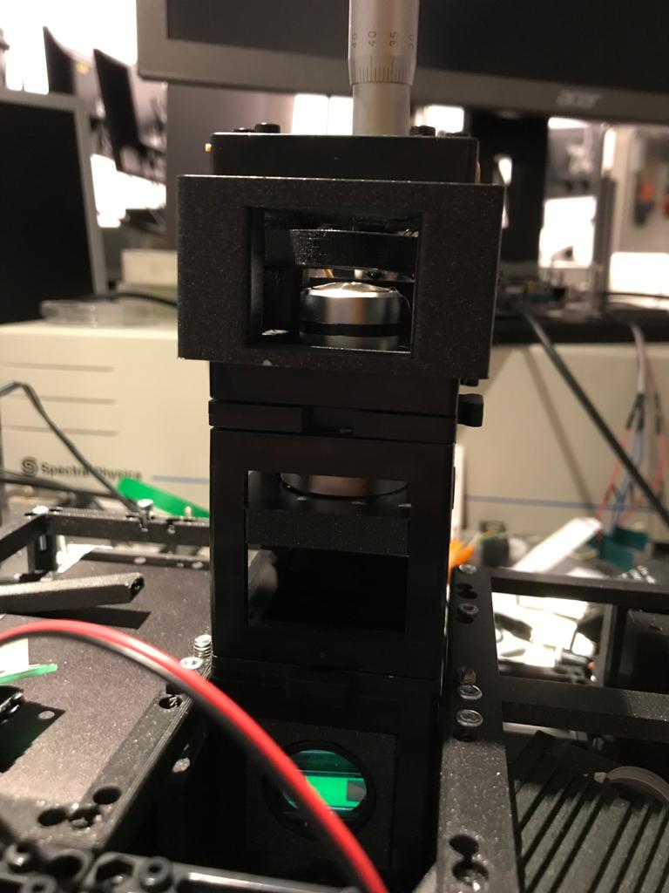

# Z-Stage (Objective) Cube
This is the repository for the Z-Stage (Objective) Cube.

To acquire the STL-files use the [UC2-Configurator](). The files themselves are in the [RAW](../RAW/STL) folder. The module can be built using injection-moulded (IM) or 3D-printed (3DP) cubes.

## Purpose
In microscopy one often needs the ability to move the objective along the optical axis in order to refocus a given 3D sample.
In order to automate this, we designed a very simple z-stage itself relying on flexure bearings also known from Bowman's flexurescope.

### Properties
* theoretically no play due to the use of flexure bearings
* moving range +/-2mm
* very low cost by relying on off-the-shelf components
* motorized with a stepper motor

## Parts
The [Bill of Materials](https://docs.google.com/spreadsheets/d/1U1MndGKRCs0LKE5W8VGreCv9DJbQVQv7O6kgLlB6ZmE/edit?usp=sharing) is always the most up-to-date version!

###  3D printing parts
* No support needed in all designs
* Carefully remove all support structures (if applicable)

The Cube consists of the following components.

#### Default:
* **IM Cube** which houses the insert and adapts it into a UC2 setup.
* **The Z-Stage and Motor Holder** which moves the sample and holds the stepper motor ([UC2_v3_20_Cube_Insert_Z-Focus_single_motorized_v3.stl](../RAW/STL))
* **The M3 to Motor Adapter (mech. Coupling)** which connects the Motor directly to an M3 screw which acts as a wormdrive ([UC2_v3_30_Coupling_Screw_28BYJ_M3.stl](../RAW/STL))
* **The Insert for the RMS/25mm objective** With this you can slide in the objective lens inside the lower cube ([UC2_v3_20_Cube_Insert_Lens_holder_RMS_63x.stl](../RAW/STL))

**Hint:** 3D printing parts

* Inside the Prusaslicer we add a support enforcer (green part)
* Have 80-100% infill
* Layerheight: 200µm
* Remove the thin piece which is designed to support the motor holding bit

#### Alternatives:
* **3DP Cube** which will be screwed to the Lid. Here all the functions (i.e. Mirrors, LED's etc.) find their place ([10_Cube_1x1_v3.stl](../RAW/STL)) and **3DP Lid** which closes the Cube ([10_Lid_1x1_v3.stl](../RAW/STL)) - find the details in [ASSEMBLY_CUBE_Base](../ASSEMBLY_CUBE_Base)

###  Additional parts
* Check out the [RESOURCES](../../TUTORIALS/RESOURCES) for more information!
* 2× DIN912 M3×12 screws (galvanized steel) [🢂](https://eshop.wuerth.de/Zylinderschraube-mit-Innensechskant-SHR-ZYL-ISO4762-88-IS25-A2K-M3X12/00843%20%2012.sku/de/DE/EUR/)
* 1× M3 Nut
* 1× M3 Screw, 30 mm or longer (non-magnetic)
* 1× 28-BYJ stepper motor with 1x Driving electronic [🢂](https://www.amazon.de/Elegoo-Stepper-Schrittmotor-28BYJ-48-Treiberplatine/dp/B01MEGIHLF/ref=sr_1_1_sspa?__mk_de_DE=%C3%85M%C3%85%C5%BD%C3%95%C3%91&keywords=stepper+arduino&qid=1565008205&s=gateway&sr=8-1-spons&psc=1)
* 1× ESP32 for controlling the motor [🢂](https://www.amazon.de/AZDelivery-NodeMCU-Development-Nachfolgermodell-ESP8266/dp/B074RGW2VQ/ref=sr_1_3?__mk_de_DE=%C3%85M%C3%85%C5%BD%C3%95%C3%91&keywords=esp32&qid=1565008313&s=gateway&sr=8-3)
* wires to connect everything; for example: 6× Female-Female Jumper Wire, 0.14 mm² [🢂](https://www.amazon.de/ZOORE-120pcs-Multicolored-Female-Breadboard/dp/B07P85V1G3/ref=sr_1_5?__mk_de_DE=%C3%85M%C3%85%C5%BD%C3%95%C3%91&keywords=jumper+male&qid=1565690543&s=industrial&sr=1-5)
* 1× USB Micro Cable [🢂](https://www.amazon.de/dp/B0778FV6K4/ref=sr_1_2?dchild=1&fst=as%3Aoff&qid=1586361990&refinements=p_89%3AGritin&rnid=669059031&s=computers&sr=1-2)

##  Assembly

### Tutorial with images (Z-Stage)
    This tutorial needs a update!

1. Insert the motor into the motor-screw-coupling adapter.

2. Insert the head of the M3×20 screw into the motor-screw-coupling adapter. Use pliers to press the screw inside.

3.  Fix the head of the M3 screw inside the adapter using two M3 worm screws (This can also be done later, in case the screw becomes too wobbly.) You may fix the motor-end the same way, if needed.

4.  That is how it looks like without the motor. The Z-stage will "wrap" around the Cube

## Fully assembled

## Safety
Be careful!
