# Z-Stage (Objective) Cube
This is the repository for the Z-Stage (Objective) Cube.

The stl-files can be found in the folder [STL](./STL).

### Purpose
In microscopy one often needs the ability to move the objective along the optical axis in order to refocus a given 3D sample.
In order to automate this, we designed a very simple z-stage itself reyling on flexure bearings also knwon from Bowman's flexurescope. The main difference here is, that we rely on a spiral-design which avoids the parallel-shift of the objective lens and makes the entire design very robust.

***The mechanism is as follows***: A stepper motor (28-BYJ) drives a small gearbox which rotates a screw. On the screw, there is a nut which acts as a worm-drive. The conversion of the rotational into linear movement pushes/pulls a small level-arm which is connected to the spiral spring-like linear actuator. It can thus move up-and down around the resting position.
Another spiral-like spring can hold an objective lens with varying sizes. It also allows coarse z-focussing.  

## Properties
* theoretically no play due to the use of flexure berings
* moving range
	* fine: around +/- 8mm
	* coarse: around +/- 20 mm (shifting the objective lens inside the spiral-like spring
* very low cost by relying on off-the-shelf components

## Parts

### 3D printing parts
The Part consists of the following components.

* **The Lid (2x1)** where the Arduino + Electronics finds its place ([LID](./STL/10_Lid_el_2x1_v2.stl))
* **The Cube (2x1)** which will be screwed to the Lid. Here all the functions (i.e. Mirrors, LED's etc.) find their place ([BASE](./STL/10_Cube_2x1_v2.stl))
* **The Z-Stage and Motor Holder** which moves the objective and holds the stepper motor ([INSERT](./STL/20_focus_inlet_triangle_spiral_v6.stl))
* **The M4 to Motor Adapter (mech. Coupling)** which connects the Motor directly to an M4 screw which acts as a wormdrive ([SCREW](./STL/30_Coupling_Screw_28BYJ_M4.stl))
* **The Objective Lens Thread Fixer** Kind of a retain ring which pushes the spiral arms closer to the objective lens ([FIXER](./STL/30_focus_inlet_triangle_spiral_fixingring.stl))

For Fluomodule:
* **The Fluomodule** where the LEDs finds their place ([FLUOMODULE](./STL/30_Z_Stage_Fluomodule_12.stl))
* **The Adapterplate** which goes on top and where the slides are placed ([ADAPTERPLATE](./STL/30_Z_Stage_Adapterplate_11.stl))
* **The Clamp for microscope slides** which can fix the slide ([CLAMP](./STL/40_XY_Stage_Clamp_Slide_9.stl))

### Additional parts
* 16x DIN912 M3*12 screws (non stainless steel)
* 1x M4 Nut
* 1x M4 Screw, Hex Head, 26mm
* 1x 28-BYJ stepper motor
* 1x Driving electronic
* 1x ESP32 for controlling the motor
* cables to connect everything

## Remarks and Tips
### 3D Printing:
* No support required in all designs except the sprial focussing mechanism (use sparse support!)
* Carefully remove all support structures (if applicable)

## Assembly
* Detailed description coming soon
* Add motor and small gear, fix it with M4 screw
* Add the M4 nut in the dedicted hole close to the moving stage
* Add M4x26mm screw with mounted large gear at one end and insert it into the hole.
* rotate the M4x26 screw so that it pushes the moving z-stage
* Wire the motor, test it
* Done!

### Tutorial with images (Z-Stage)
This is the assembly guide for the Z-Stage.

1. All parts for this model

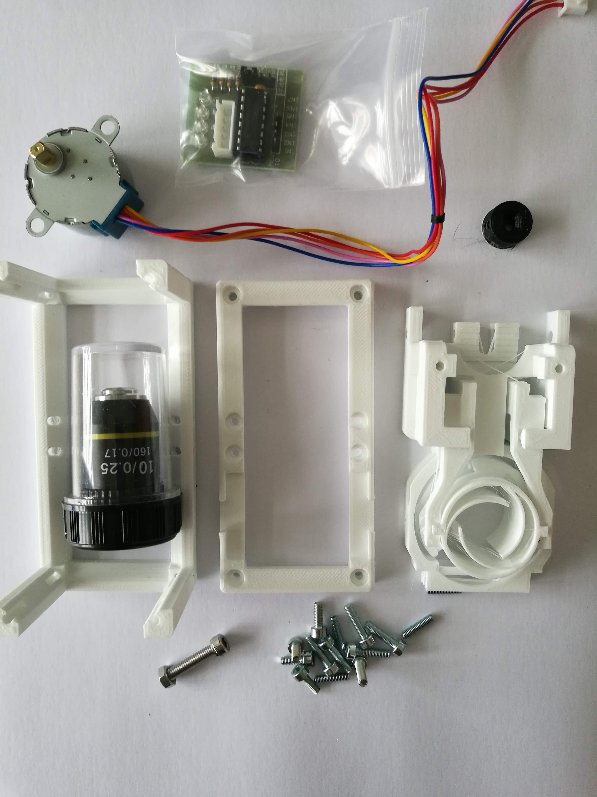

2. Use pliers to put the M4 nut in the place. Be careful, easy to break here!

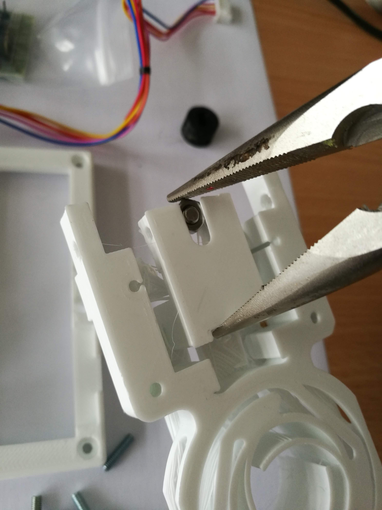

3. Fix the nut using two M3 worm screws (This can also be done later, in case the nut becomes too wobbly.)

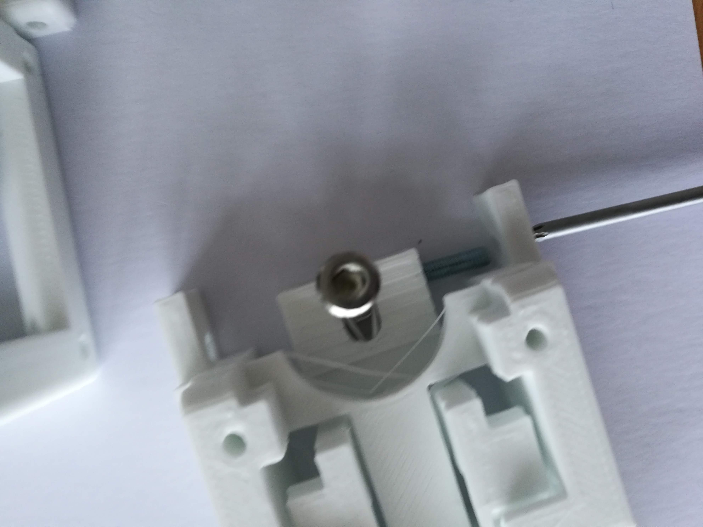

4.  Put one end of the M4 screw inside the motor coupling thing- use pliers

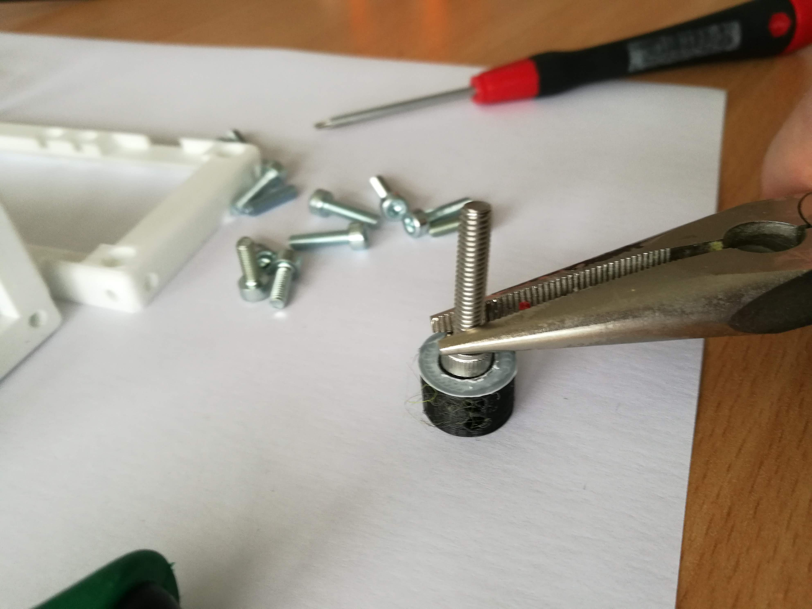

5.  It should look like this

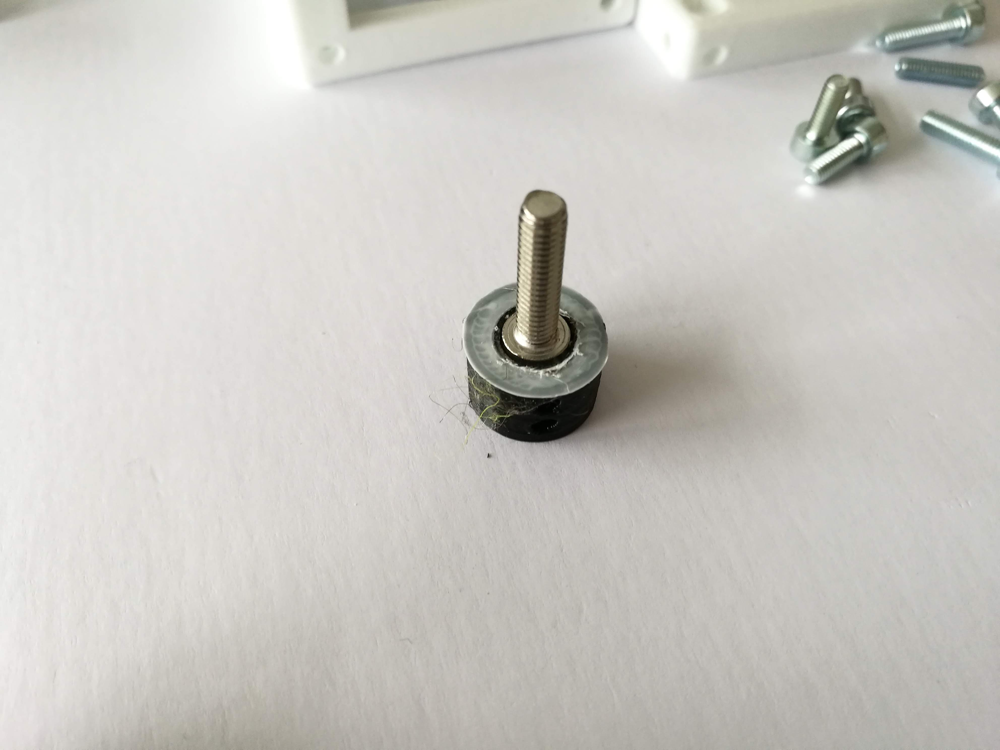

7. Add the other side of the coupling thing to the motor

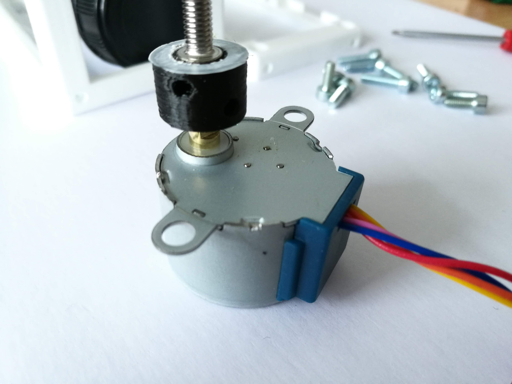

8. Mount the motor to the Z-Stage after putting the M4 screw through the nut (rotate it)

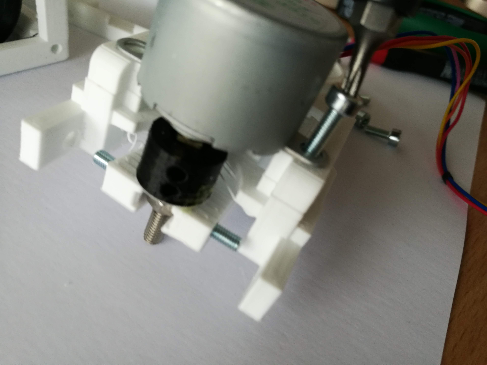

9. Fix the Z-Stage within the 2x1 cube using headless M3 screws

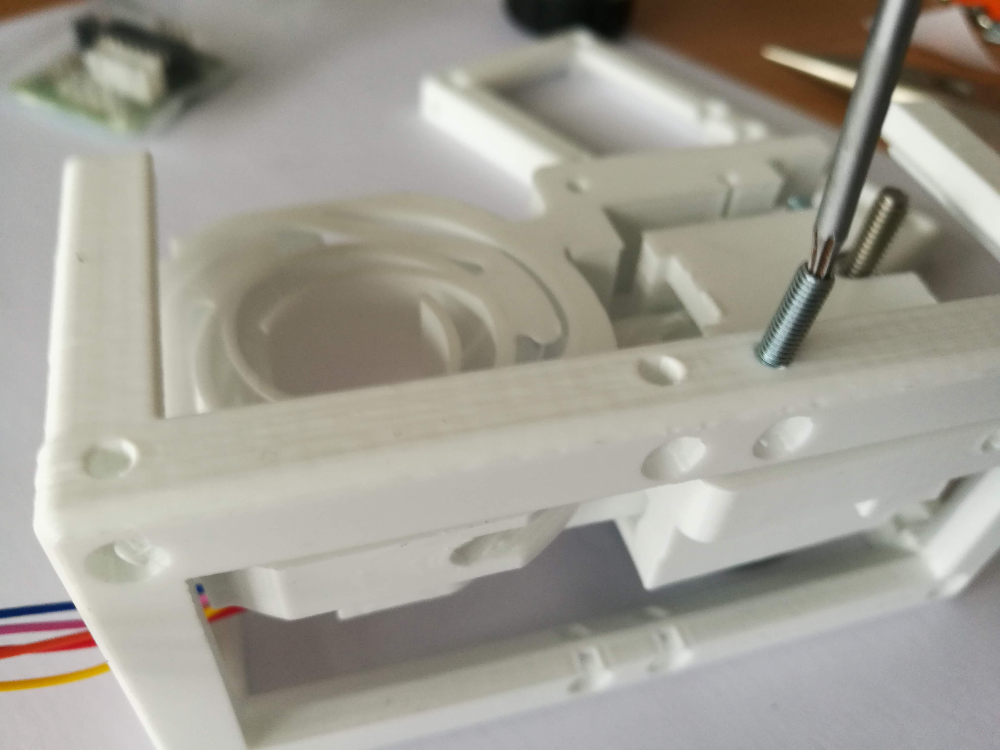

10. Mount the lid

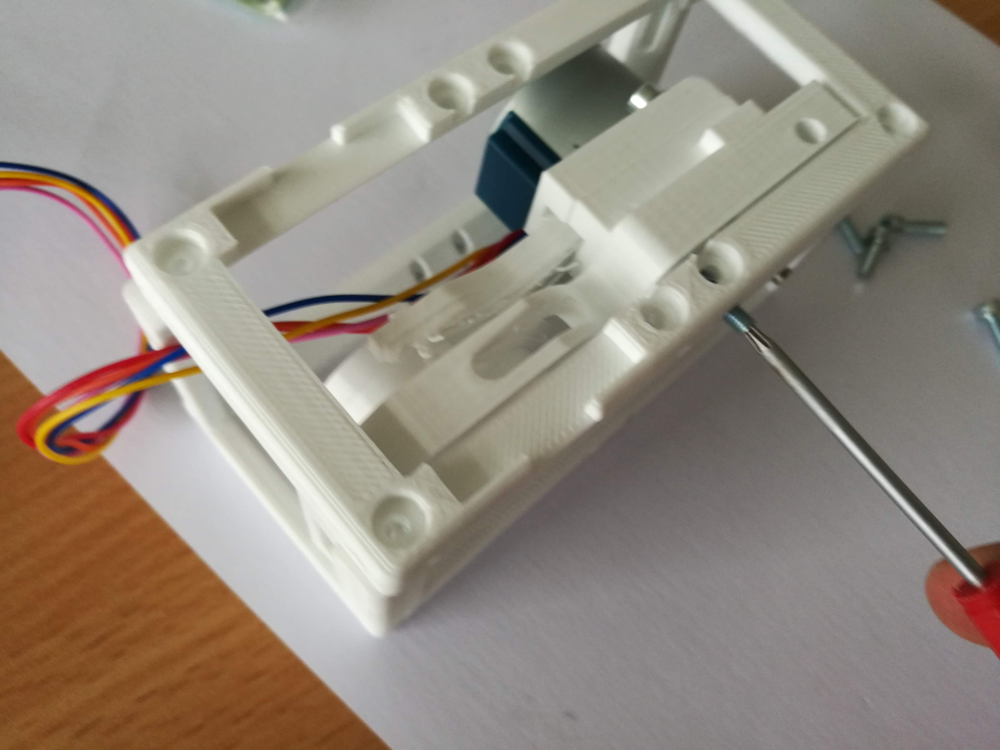

11. Start adding the wires

12. Mount the control electronics of the Motor to the Z-stage module

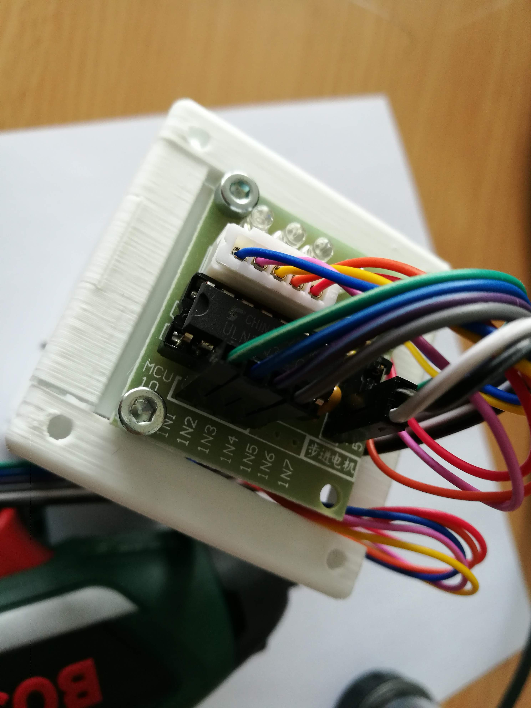

13. Screw the lid

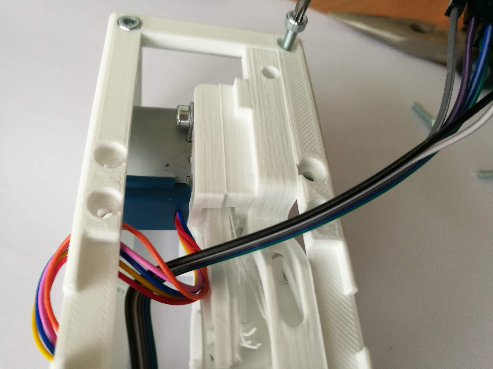

14. Add the objective lens - optional: Add the ring to fix it permanently

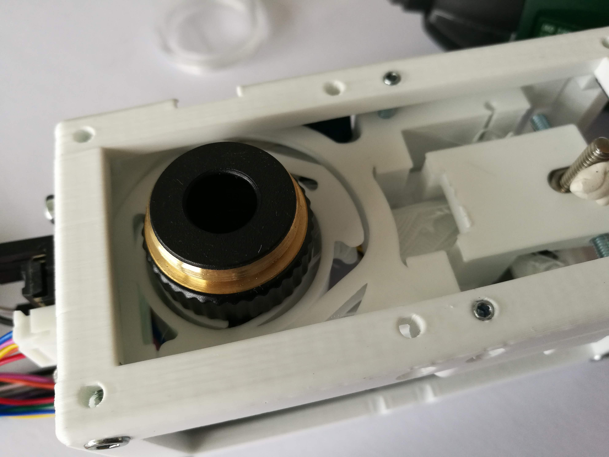

15. Add as many screws as possible - Done!

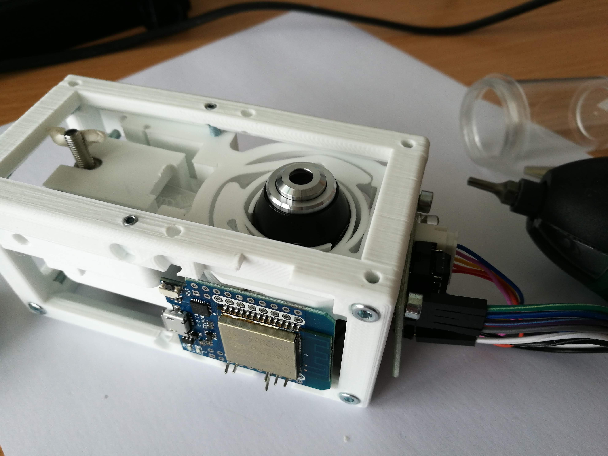

### Tutorial with images (Fluomodule+Sample Insert)
This is the assembly guide for the Fluomodule+Sample Insert.
It's tought to work as a darkfield illumination. This reduces any scattering light (e.g. 0th order of the illumination).

1. All parts for this model

2. Solder the LEDs to the Transistor; The base of the transistor goes to the ouput of the ESP32, the 5V and GND as well; LEDs are connected in parallel; No resistor necessary. BD809 is connected to the LED in series

3. Cut the LEDs and add them to the Fluomodule using either Glue or Blutek

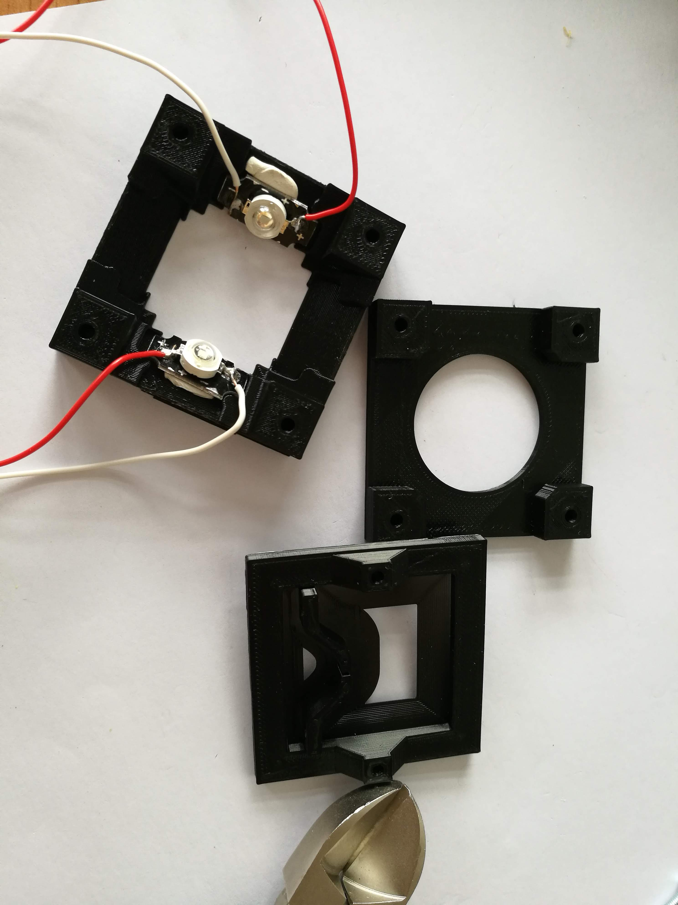

4. Sandwich the parts using long M3 screws; Add tape to the Transistor to isolate the wires/open contacts

5. Put the Fluomodule to the Z-Stage and cleanup the wires.

## Fluorescent Module

The wiring of the fluoresceent module can be found [here](../CUBE_INSERT_Fluomodule). 
## Safety
Be careful!

