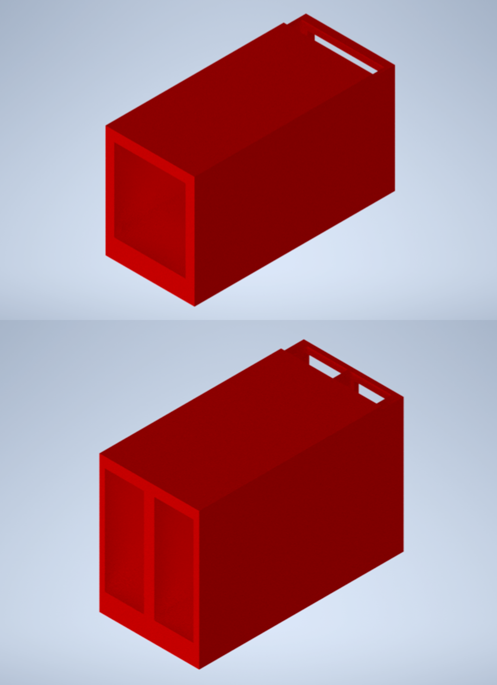
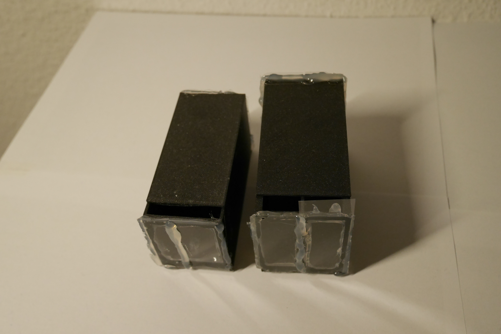
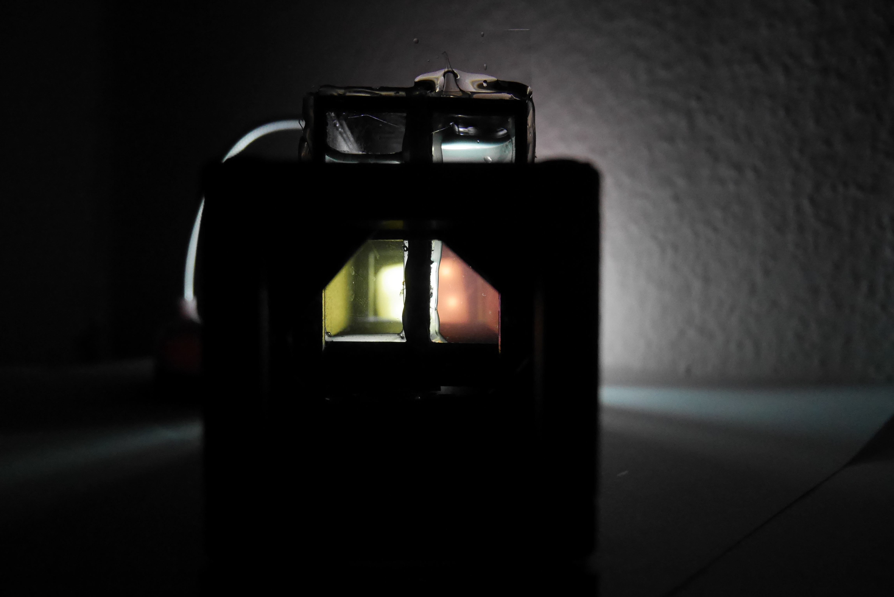

# Active Solution Chamber Module

This is the repository for the Active Solution Chamber Modules.

The stl-files can be found in the folder [STL](./STL).
The design files can be found in the folder [INVENTOR](./INVENTOR)

## Purpose

The module is designed to carry active solutions during the [Active Solution Polarization](../../../APPLICATIONS/APP_POL_Polarization_using_optically_active_solution) experiment.

### Properties

There are two design alternatives. One of them has only one chamber to hold only one type of solution, sugar-water mixture in our experiment. The other design has two chambers to hold two different mixture in the same time to demonstrate the differences of their polarization properties simultaneously.

## Design

The original design files are in the [INVENTOR](./INVENTOR) folder. These files were generated using Autodesk Inventor 2021 Student Version.

.STL files for 3D printer are in the [STL](./STL) folder.

### Parts to print

* 1 × [Cube Lid 2x1](./STL/10_Lid_el_2x1_v2.stl)
* 1 x [Active Solution Chamber - Alternative 1 with Two Sections](./STL/10_POL_Active_Solution_Chamber_90long_40High_Double_TOP.stl)
* 1 x [Active Solution Chamber - Alternative 2 with One Sections](./STL/10_POL_Active_Solution_Chamber_90long_40High_TOP.stl)    

###  3D printing parts
* No support needed in all designs
* Carefully remove all support structures (if applicable)

The Cube consists of the following components.
* **The Lid** where the chambers are connected on ([LID](./STL/10_Lid_el_2x1_v2.stl))
* **The Chamber Inserts** which holds the sugar-water mixture between the glass walls ([INSERT](./STL/10_POL_Active_Solution_Chamber_90long_40High_Double_TOP.stl)) or ([INSERT](./STL/./STL/10_POL_Active_Solution_Chamber_90long_40High_TOP.stl)).

###  Additional parts
* Check out the [RESOURCES](../../TUTORIALS/RESOURCES) for more information!
* 4× DIN912 M3×12 mm screws (galvanized steel) [🢂](https://eshop.wuerth.de/Zylinderschraube-mit-Innensechskant-SHR-ZYL-ISO4762-88-IS25-A2K-M3X12/00843%20%2012.sku/de/DE/EUR/)
* 8 × 5 mm Ball magnets [🢂](https://www.magnetmax.de/Neodym-Kugelmagnete/Magnetkugel-Kugelmagnet-O-5-0-mm-Neodym-vernickelt-N40-haelt-400-g::158.html)
* 2 x metal plates
* 4x Microscope Rectangular Coverslips (or more depends on the size of the walls) [🢂](https://www.ebay.de/itm/223260964391?hash=item33fb63f627:g:pukAAOSwsGpb%7E14N)
* Silicon gun with silicon glue for gluing the microscope slides on the chamber walls.

##  Assembly
* Add the magnets on the bottom part of the chamber inserts.

* Glue the Coverslips or microscope slides on the left and right sidewalls of the 3D-printed chamber inserts using glue material. Be sure that there is no any gap in the glued part because of the preventing the unwished liquid flow from the holders.

* Glue the metal plates on the 2 in 1 lid parts and be sure the chamber magnets are matched with metal parts when they are inserted to each other and stay stable to prevent any unbalance problem during the experiment.
* Prepare the solution and insert the chambers.

* Done!

## Results

The assembled and ready-to-use chambers can be seen from up in the first image:

And the holders are seen from the wall side the image below:

The module can be used in the demonstration of the [polarization properties of the optically active solutions](../../../APPLICATIONS/APP_POL_Polarization_using_optically_active_solution)

## Safety
Don't touch the mirror surface!
