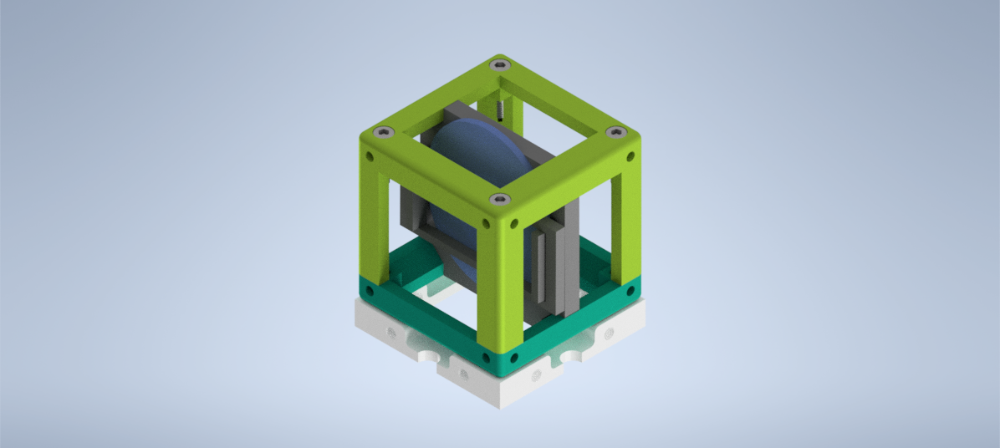
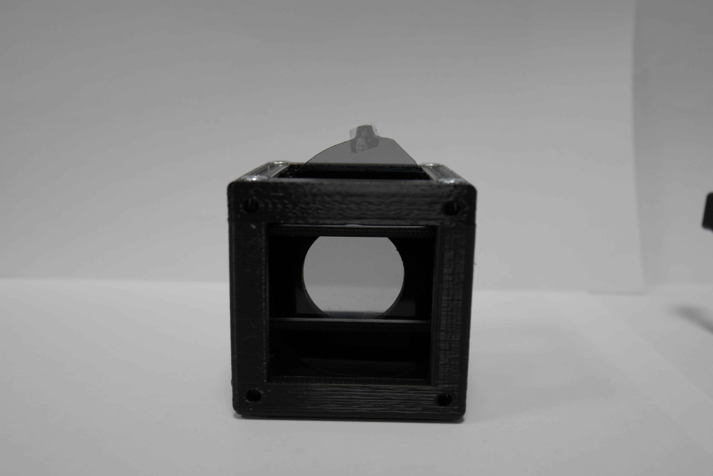

# Circular Polarizer Cube
This is the repository for the Circular Polarizer Cube.

The stl-files can be found in the folder [STL](./STL).
The design files can be found in the folder [INVENTOR](./INVENTOR).

## Purpose

The module is designed to carry [the quarter wave plate](http://hyperphysics.phy-astr.gsu.edu/hbase/phyopt/quarwv.html) for the demonstration of the circularly polarized light in the [Circular Polarization](../../../APPLICATIONS/APP_POL_Circular_Polarizer) experiment.

### Properties

It holds the waveplate from the 3D cinema goggles.

## Design
The original design files are in the [INVENTOR](./INVENTOR) folder. These files were generated using Autodesk Inventor 2021 Student Version.

.STL files for §D printer are in the [STL](./STL) folder.
The design files can be found in the folder [INVENTOR](./INVENTOR).

###  3D printing parts
* No support needed in all designs
* Carefully remove all support structures (if applicable)

The Cube consists of the following components.

* **The Lid** where the holder finds its place ([LID](./STL/10_Lid_1x1_v2.stl))
* **The Cube** which will be screwed to the Lid ([BASE](./STL/10_Cube_1x1_v2.stl))
* **The Circular Polarizer Insert** which holds the quarter wave plate from the 3D cinema goggles ([INSERT](./STL/20_POL_Circular_Polarizer_holder.stl)) and holder clamp ([CLAMP](./STL/20_POL_Circular_Polarizer_clamp.stl))

###  Additional parts
* Check out the [RESOURCES](../../TUTORIALS/RESOURCES) for more information!
* 4× DIN912 M3×12 mm screws (galvanized steel) [🢂](https://eshop.wuerth.de/Zylinderschraube-mit-Innensechskant-SHR-ZYL-ISO4762-88-IS25-A2K-M3X12/00843%20%2012.sku/de/DE/EUR/)
* 4 × 5 mm Ball magnets [🢂](https://www.magnetmax.de/Neodym-Kugelmagnete/Magnetkugel-Kugelmagnet-O-5-0-mm-Neodym-vernickelt-N40-haelt-400-g::158.html)
* 1 x 3D cinema googles [🢂](https://www.amazon.de/-/en/Circular-Polarized-Passive-Glasses-Special/dp/B08SHWPVCM/ref=sr_1_3?keywords=polarisierte+3d+kino+brille&qid=1668693530&sr=8-3)  

##  Assembly
* Take the quarter wave plate out from the 3D cinema goggles. Remember the direction of the holder should from the inner part to the outer part of the goggle. We can create circularly polarized light from the incoming light wave.  
* Add the clamp on the insert.
* Insert the holder into the Cube Base and then add the Lid part the obtain base cube.
* Add the screws to the Cube.
* Done!

### Results

The ready-to-use module is shown in the following images from front and left side.

The module can be used in the [Circular Polarization](../../../APPLICATIONS/APP_POL_Circular_Polarizer) experiment using the [linear polarizer module](../../CAD/ASSEMBLY_POL_Linear_Polarizer). The polarization direction of light before the circular polarizer changes with turning the wheel of the linear polarizer and changing its orientation.

## Safety
Don't touch the mirror surface!
