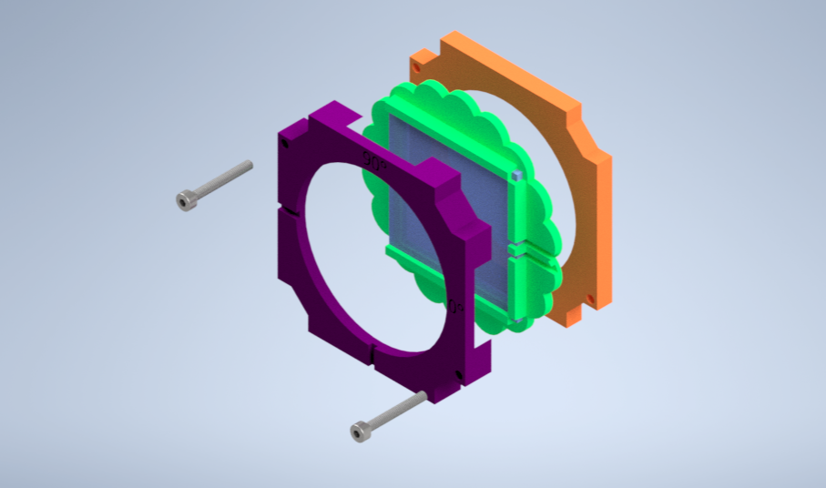

# Polarizer Cube
This is the repository for the Adjustable Linear Polarizer Cube.

The stl-files can be found in the folder [STL](./STL).
The design files can be found in the folder [INVENTOR](./INVENTOR).

## Purpose

The module holds the linear polarizer filter and the orientation of the filter respect to the optical axis can be easily changed by rotating the filter in 360-degrees.

### Properties

It holds the filter part and can adjust its rotation angle by wheel system.

## Design
The original design files are in the [INVENTOR](./INVENTOR) folder. These files were generated using Autodesk Inventor 2021 Student Version.

.STL files for §D printer are in the [STL](./STL) folder.

###  3D printing parts
* No support needed in all designs
* Carefully remove all support structures (if applicable)

The Cube consists of the following components.

* **The Lid** where the holder finds its place ([LID](./STL/10_Lid_1x1_v2.stl))
* **The Cube** which will be screwed to the Lid ([BASE](./STL/10_Cube_1x1_v2.stl))
* **The Polarizer Insert** which holds a linear polarization film from Amazon with ([INSERT GUIDE](./STL/20_Cube_Insert_Polarizer_Guide.stl)), ([INSERT LID](./STL/20_Cube_Insert_Polarizer_Lid.stl)) and ([INSERT WHEEL](./STL/20_Cube_Insert_Polarizer_Wheel.stl)).

###  Additional parts
* Check out the [RESOURCES](../../TUTORIALS/RESOURCES) for more information!
* 2 x Screws DIN912 ISO 4762 - M3×12 mm (galvanized steel) [🢂](https://eshop.wuerth.de/Zylinderschraube-mit-Innensechskant-SHR-ZYL-ISO4762-88-IS25-A2K-M3X12/00843%20%2012.sku/de/DE/EUR/)
* 4 x Screws DIN912 ISO 4762 M2×16 mm (galvanized steel) [🢂](https://www.amazon.de/Edelstahl-Sechskopf-Knopf-Schrauben-Unterlegscheiben-Sortiment-Aufbewahrung/dp/B073SS7D8J/ref=sr_1_fkmr0_1?__mk_de_DE=%C3%85M%C3%85%C5%BD%C3%95%C3%91&keywords=zylinderkopfschrauben+set+galvanisiert&qid=1565007371&s=diy&sr=1-1-fkmr0)
* 1 × Linear Polarizing Sheet [🢂](https://amazon.de/-/en/Polarizing-A4-Sheet-Polarizer-Educational-Polarized/dp/B06XWXRB75/ref=pd_sbs_421_3/262-2115536-7173904?_encoding=UTF8&pd_rd_i=B06XWXRB75&pd_rd_r=b88e7340-b061-4e0b-8daa-8ec533fd7c71&pd_rd_w=qlkAY&pd_rd_wg=At9EZ&pf_rd_p=a03ac387-6e4d-4f6b-96b6-1853da0bb37b&pf_rd_r=49HX2Z4Q5KRZSQ2FWRQR&psc=1&refRID=49HX2Z4Q5KRZSQ2FWRQR)

##  Assembly
* Cut the filter with the matched sizes for the holder wheel part ~34 x 34 mm^2.

* Insert the filter into the wheel part and assemble the wheel part between the Guide and Lid parts.
* Check the wheel part can rotate easily in 360-degrees between the guide and lid parts.  
* Add the screws to the holder.

* Insert the holder into the base cube module and connect the cube base and lid parts using M3 screws.
* Done!

## Results

The module can be used in the [Crossed Polarizer]((../../../APPLICATIONS/APP_POL_Crossed_Polarizers)
) or [Three Polarizers]((../../../APPLICATIONS/APP_POL_Three_Polarizers)
) experiments directly without any extra module need. The direct effect of the angle between two linear polarizers in the video below. The intensity of passing light through crossed polarizers changes when the direction angle of the polarization filter changes 360 degrees.

## Safety
Don't touch the mirror surface!
