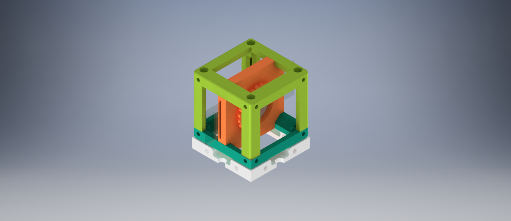
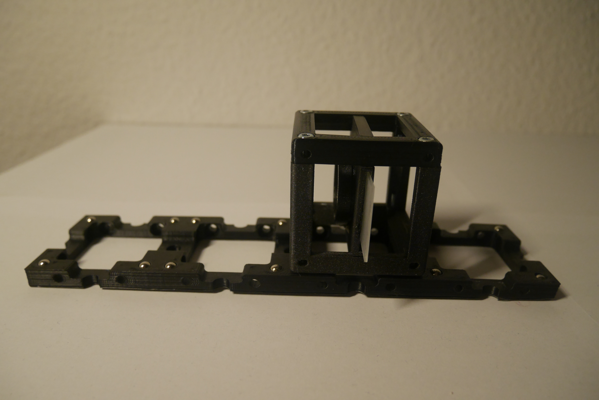

# Newton's Rings Module

This is the repository for the combined holder of the plano-convex lens and the microscope slide.

The stl-files can be found in the folder [STL](./STL).
The design files can be found in the folder [INVENTOR](./INVENTOR)

## Purpose

The holder is used the obtaining of Newton's ring in the [Newton's Rings](../../../APPLICATIONS/APP_POL_Newtons_Rings_Experiment) experiment.

### Properties

## Design

The original design files are in the [INVENTOR](./INVENTOR) folder. These files were generated using Autodesk Inventor 2019 Student Version.

.STL files for §D printer are in the [STL](./STL) folder.
The design files can be found in the folder [INVENTOR](./INVENTOR)

###  3D printing parts
* No support needed in all designs
* Carefully remove all support structures (if applicable)

The Cube consists of the following components.

* **The Lid** where the Arduino + Electronics finds its place ([LID](./STL/10_Lid_1x1_v2.stl))
* **The Cube** which will be screwed to the Lid. Here all the functions (i.e. Mirrors, LED's etc.) find their place ([BASE](./STL/10_Cube_1x1_v2.stl))
* **The Newton's Rings Insert** which holds a plano convex lens and microscope slide as attached to each other only in one point ([INSERT](./STL/20_POL_Cube_Insert_Newtons_Rings_LensHolder.stl))  and ([CLAMP](./STL/20_POL_Cube_Insert_Newtons_Rings_Lens_Clamp.stl)).

###  Additional parts
* Check out the [RESOURCES](../../TUTORIALS/RESOURCES) for more information!
* 4× DIN912 M3×12 mm screws (galvanized steel) [🢂](https://eshop.wuerth.de/Zylinderschraube-mit-Innensechskant-SHR-ZYL-ISO4762-88-IS25-A2K-M3X12/00843%20%2012.sku/de/DE/EUR/)
* 1 x Microscope Rectangular Coverslips [🢂](https://www.ebay.de/itm/223260964391?hash=item33fb63f627:g:pukAAOSwsGpb%7E14N)
* 1 x Plano-Convex Lens [🢂](https://www.comaroptics.com/components/lenses/simple-convex-lenses/plastic-lenses)

##  Assembly

* Add the plano-convex lens to the Insert and insert the clamp.
* Add the microscope coverslip into the Insert. The top of the convex side of the lens and microscope glass slide should touch to each other in the one point.
* Add the screws to the Cube.
* Done!

## Results

## Safety
Don't touch the mirror surface!
